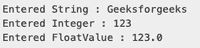

# 如何在 Java 中获取用户输入？

> 原文:[https://www . geesforgeks . org/如何从 java 用户那里获取输入/](https://www.geeksforgeeks.org/how-to-take-input-from-user-in-java/)

[Java](https://www.geeksforgeeks.org/java/) 带来了各种流及其 I/O 包，帮助用户执行所有的输入输出操作。这些流支持所有类型的对象、数据类型、字符、文件等，以完全执行输入/输出操作。有两种方式**我们可以从用户或文件中获取输入**

*   缓冲恐惧者类
*   扫描仪类

### 1.缓冲恐惧者

这是一个简单的类，用于读取一系列字符。它有一个读取字符的简单函数，另一个读取字符的函数，一个字符数组，和一个读取一行的 readLine()函数。

InputStreamReader()是一个将输入字节流转换为字符流的函数，这样就可以像 BufferedReader 期望的字符流那样读取。

缓冲恐惧者可以抛出选中的异常

## Java 语言(一种计算机语言，尤用于创建网站)

```java
// Java Program For BufferedReader Class
import.java.io.*;

public class BufferedReader

{

  // Main Method
  public static void main(String [] args)
  {
    // Creating BufferedReader Object
    // InputStreamReader converts bytes to
    // stream of character
    BufferedReader BufferedReader_Name = new
      BufferedReader(new InputStreamReader(System.in));

      // Asking for input from user
      System.out.println("Enter String : ");
      System.out.println("Enter Integer : ");

      // String reading internally
      String String_name = BufferedReader_Name.readLine();

      // Integer reading internally
      int Integer_value =
      Integer.parseInt(BufferedReader_name.readLine());

      // Printing String
      System.out.println("Entered String : "+ String_name);

      //Printing Integer              
      System.out.println("Entered Integer : "+ Integer_value); 

    }

  }
```

**输出:**


### 2.扫描仪

它是 BufferedReader 的高级版本，是在 Java 的更高版本中添加的。扫描仪可以读取格式化的输入。它对于不同类型的数据类型有不同的功能。

*   扫描仪更容易阅读，因为我们不需要写抛出，因为它没有抛出异常。
*   它是在后来的 Java 版本中添加的
*   它包含预定义的函数来读取整数、字符和其他数据类型。

**扫描仪语法**

```java
Scanner Scanner_name = new Scanner(System.in);
```

**导入扫描仪类的语法:**要使用扫描仪，我们需要导入扫描仪类

```java
import java.util.Scanner ;  
```

**内置扫描仪功能如下**

*   整数: [nextInt()](https://www.geeksforgeeks.org/scanner-nextint-method-in-java-with-examples/)
*   浮法: [nextFloat()](https://www.geeksforgeeks.org/scanner-nextfloat-method-in-java-with-examples/)
*   字符串: [readLine()](https://www.geeksforgeeks.org/bufferedreader-readline-method-in-java-with-examples/)

因此，在扫描器中的整数和字符串的情况下，我们不需要像在 BufferedReader 中那样进行解析。

## Java 语言(一种计算机语言，尤用于创建网站)

```java
// Java Program to show how to take
// input from user using Scanner Class

import java.util.Scanner;

class Scanner {

  public static void main( String[] args )
  {

    // Scanner definition
    Scanner Scanner_name= new Scanner(System.in);

    // input is a string read
    // by readLine() function
    String str= str.readLine();

    // print string
    System.out.ptintln("Entered String : "+ str);

    // input is an Integer
    // read by nextInt() function
    int x= Scanner_name.nextInt();

    // print integer
    System.out.ptintln("Entered Integer : "+ x);

    // input is a floatingValue
    // read by nextFloat() function
    float f = Scanner_name.nextFloat();

    // print floating value
    System.out.ptintln("Entered FloatValue : "+ f);
  }
}
```

**输出:**



### **缓存器和扫描仪的区别**

*   BufferedReader 是一种非常基本的读取输入的方式，通常用于读取字符流。它比 Scanner 有优势，因为它比 Scanner 更快，因为 Scanner 要对输入进行大量的后处理；如 nextInt()，nextFloat()所示
*   BufferedReader 更灵活，因为我们可以指定要读取的流输入的大小。(一般来说，BufferedReader 读取的输入比 Scanner 大)
*   当我们阅读更大的输入时，这两个因素会起作用。一般来说，扫描仪类提供输入。
*   BufferedReader 是首选的，因为它是同步的。当处理多个线程时，它是首选的。
*   为体面的输入，容易可读性。扫描仪比缓存器更受欢迎。