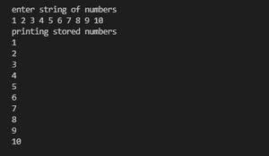
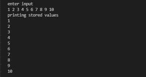

# 如何在 Java 中获取用户用空格分隔的输入？

> 原文:[https://www . geeksforgeeks . org/如何从用户处获取输入-用 java 空格分隔/](https://www.geeksforgeeks.org/how-to-take-input-from-user-separated-by-space-in-java/)

有两种从用户处获取输入的方法，用空格隔开，如下所示:

1.  使用缓冲存储类，然后拆分和解析每个值
2.  使用 Scanner 类的 nextInt()方法

让我们逐一讨论这两种方法，以便通过实现相同的干净 java 程序来更好地理解。

**方法 1:**

使用 BufferedReader 类，然后拆分和解析每个值。

**程序:**

1.  使用 BufferedReader 的 [*readline()方法*](https://www.geeksforgeeks.org/console-readline-method-in-java-with-examples/) ，扫描整个字符串。
2.  分割此字符串以进行字符串分割(" ")
3.  迭代以上数组，并使用 Integer.parseInt()解析每个整数值。

**例**

## Java 语言(一种计算机语言，尤用于创建网站)

```java
// Java Program to Take Input from User Separated by Space
// Using BufferedReader class

// Importing required classes
import java.io.BufferedReader;
import java.io.IOException;
import java.io.InputStreamReader;

// Main class
// BufferedReaderTest
class GFG {

    // Main driver method
    public static void main(String[] args)
        throws IOException
    {

        // Creating an object of BufferedReader class
        BufferedReader bi = new BufferedReader(
            new InputStreamReader(System.in));

        // Custom integer array of size 10
        int num[] = new int[10];
        // Array of string type to store input
        String[] strNums;

        // Display message
        System.out.println("enter string of numbers");

        // Reading input a string
        strNums = bi.readLine().split(" ");

        for (int i = 0; i < strNums.length; i++) {
            num[i] = Integer.parseInt(strNums[i]);
        }

        // Display message
        System.out.println("printing stored numbers ");

        // Printing the stored numbers using for loop
        for (int i = 0; i < strNums.length; i++) {
            System.out.println(num[i]);
        }
    }
}
```

**输出:**



图=方法 1 的输出

**方法二:**使用扫描仪类的 [*nextInt()方法*](https://www.geeksforgeeks.org/scanner-nextint-method-in-java-with-examples/) 。

**程序:**

1.  使用 Scanner 类的[*【next int】()方法*](https://www.geeksforgeeks.org/scanner-nextint-method-in-java-with-examples/) 进行扫描输入。
2.  使用 for 循环将输入存储在数组中。
3.  迭代上述数组，并使用 sc.nextInt()解析每个整数

**例**

## Java 语言(一种计算机语言，尤用于创建网站)

```java
// Java Program to Take Input from User Separated by Space
// Using Scanner class

// Importing required classes
import java.io.IOException;
import java.util.Scanner;

// Main class
// Scanner class
class GFG {

    // Main driver method
    public static void main(String[] args)
        throws IOException
    {

        // Display message for better readability
        System.out.println("enter input ");

        // Creating an object of Scanner class
        Scanner sc = new Scanner(System.in);

        // Declaring and initializing an array of size 10
        int[] nums = new int[10];
        int i;

        // Loop to store input values in nums array
        for (i = 0; i < nums.length; i++) {
            nums[i] = sc.nextInt();
        }

        //  Display message
        System.out.println("printing stored values");

        // Printing stored values
        for (i = 0; i < nums.length; i++) {
            System.out.println(nums[i] + " ");
        }
    }
}
```

**输出:**



图=方法 2 的输出

> **注意:**第一种方法使用 Bufferedreader 类，然后拆分解析每个值，比使用 Scanner 类的倪星()方法要快得多。它比第二个快近 2 倍。贝尔；现在我们提供了如何使用纳米时间方法计算这两种方法的时间消耗

```java
// Initializing variables
long startTime, endTime;

// Start time
startTime = System.nanoTime(); {

// Insert code here
// Method 1 or method 2 code
}

// End time
endTime = System.nanoTime();
```