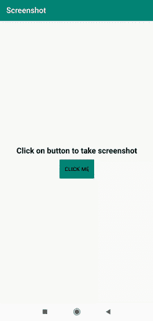

# 如何在安卓中编程截图？

> 原文:[https://www . geeksforgeeks . org/如何在安卓中以编程方式截图/](https://www.geeksforgeeks.org/how-to-take-screenshot-programmatically-in-android/)

在每一款安卓手机中，我们都有截屏功能。在本文中，我们将解释如何以编程方式拍摄截图。下面给出了一个 GIF 示例，来了解一下在本文中要做什么。请注意，我们将使用 **Java** 语言来实现这个项目。



### **分步实施**

**第一步:创建新项目**

要在安卓工作室创建新项目，请参考[如何在安卓工作室创建/启动新项目](https://www.geeksforgeeks.org/android-how-to-create-start-a-new-project-in-android-studio/)。注意选择 **Java** 作为编程语言。

**第二步:向 AndroidManifest.xml 文件**添加权限

将以下权限添加到 **AndroidManifest.xml** 文件中

**步骤 3:使用 activity_main.xml 文件**

导航到**应用程序> res >布局> activity_main.xml** 并将下面的代码添加到该文件中。下面是 **activity_main.xml** 文件的代码。

## 可扩展标记语言

```
<?xml version="1.0" encoding="utf-8"?>
<LinearLayout
    xmlns:android="http://schemas.android.com/apk/res/android"
    xmlns:tools="http://schemas.android.com/tools"
    android:layout_width="match_parent"
    android:layout_height="match_parent"
    android:gravity="center"
    android:orientation="vertical"
    tools:context=".MainActivity">

    <TextView
        android:layout_width="wrap_content"
        android:layout_height="wrap_content"
        android:text="Click on button to take screenshot"
        android:textColor="#000"
        android:textSize="20dp"
        android:textStyle="bold" />

    <Button
        android:id="@+id/clickme"
        android:layout_width="wrap_content"
        android:layout_height="wrap_content"
        android:layout_marginTop="10dp"
        android:background="@color/colorPrimary"
        android:text="Click Me" />

</LinearLayout>
```

**第四步:将音频文件添加到 Raw 文件夹**

请参考安卓工作室 中的 [资源原始文件夹，并在原始文件夹中添加音频文件。](https://www.geeksforgeeks.org/resource-raw-folder-in-android-studio/)

**第五步:使用****MainActivity.java 文件**

转到**MainActivity.java**文件，参考以下代码。以下是**MainActivity.java**文件的代码。代码中添加了注释，以更详细地理解代码。

## Java 语言(一种计算机语言，尤用于创建网站)

```
import android.Manifest;
import android.app.Activity;
import android.content.pm.PackageManager;
import android.graphics.Bitmap;
import android.media.MediaPlayer;
import android.os.Bundle;
import android.os.Environment;
import android.view.View;
import android.widget.Button;
import android.widget.Toast;

import androidx.appcompat.app.AppCompatActivity;
import androidx.core.app.ActivityCompat;

import java.io.File;
import java.io.FileNotFoundException;
import java.io.FileOutputStream;
import java.io.IOException;
import java.util.Date;

public class MainActivity extends AppCompatActivity {

    Button click;
    private static final int REQUEST_EXTERNAL_STORAGe = 1;
    private static String[] permissionstorage = {Manifest.permission.WRITE_EXTERNAL_STORAGE, Manifest.permission.READ_EXTERNAL_STORAGE};

    @Override
    protected void onCreate(Bundle savedInstanceState) {
        super.onCreate(savedInstanceState);
        setContentView(R.layout.activity_main);
        click = findViewById(R.id.clickme);
        verifystoragepermissions(this);

        // adding beep sound
        final MediaPlayer mediaPlayer = MediaPlayer.create(this, R.raw.beep);
        click.setOnClickListener(new View.OnClickListener() {
            @Override
            public void onClick(View v) {
                Toast.makeText(MainActivity.this, "You just Captured a Screenshot," +
                        " Open Gallery/ File Storage to view your captured Screenshot", Toast.LENGTH_SHORT).show();
                screenshot(getWindow().getDecorView().getRootView(), "result");

                mediaPlayer.start();
            }
        });
    }

    protected static File screenshot(View view, String filename) {
        Date date = new Date();

        // Here we are initialising the format of our image name
        CharSequence format = android.text.format.DateFormat.format("yyyy-MM-dd_hh:mm:ss", date);
        try {
            // Initialising the directory of storage
            String dirpath = Environment.getExternalStorageDirectory() + "";
            File file = new File(dirpath);
            if (!file.exists()) {
                boolean mkdir = file.mkdir();
            }

            // File name
            String path = dirpath + "/" + filename + "-" + format + ".jpeg";
            view.setDrawingCacheEnabled(true);
            Bitmap bitmap = Bitmap.createBitmap(view.getDrawingCache());
            view.setDrawingCacheEnabled(false);
            File imageurl = new File(path);
            FileOutputStream outputStream = new FileOutputStream(imageurl);
            bitmap.compress(Bitmap.CompressFormat.JPEG, 50, outputStream);
            outputStream.flush();
            outputStream.close();
            return imageurl;

        } catch (FileNotFoundException io) {
            io.printStackTrace();
        } catch (IOException e) {
            e.printStackTrace();
        }
        return null;
    }

    // verifying if storage permission is given or not
    public static void verifystoragepermissions(Activity activity) {

        int permissions = ActivityCompat.checkSelfPermission(activity, Manifest.permission.WRITE_EXTERNAL_STORAGE);

        // If storage permission is not given then request for External Storage Permission
        if (permissions != PackageManager.PERMISSION_GRANTED) {
            ActivityCompat.requestPermissions(activity, permissionstorage, REQUEST_EXTERNAL_STORAGe);
        }
    }
}
```

### **输出:**

<video class="wp-video-shortcode" id="video-564806-1" width="640" height="360" preload="metadata" controls=""><source type="video/mp4" src="https://media.geeksforgeeks.org/wp-content/uploads/20210226140239/screenshot.mp4?_=1">[https://media.geeksforgeeks.org/wp-content/uploads/20210226140239/screenshot.mp4](https://media.geeksforgeeks.org/wp-content/uploads/20210226140239/screenshot.mp4)</video>