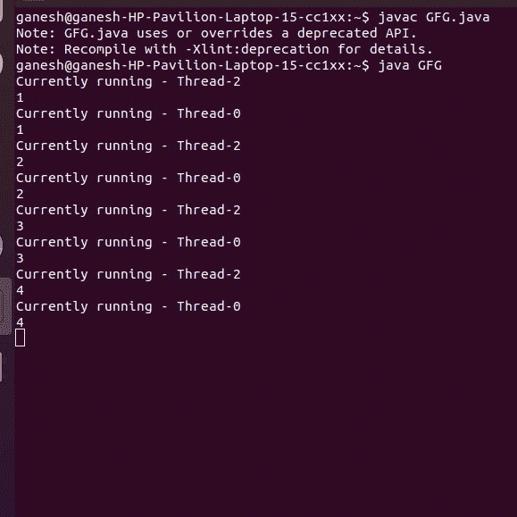

# 如何在 Java 中暂时停止一个线程？

> 原文:[https://www . geesforgeks . org/如何暂时停止 java 线程/](https://www.geeksforgeeks.org/how-to-temporarily-stop-a-thread-in-java/)

[线程](https://www.google.com/url?client=internal-element-cse&cx=009682134359037907028:tj6eafkv_be&q=https://www.geeksforgeeks.org/java-lang-thread-class-java/&sa=U&ved=2ahUKEwixzY-rwpDtAhUtzjgGHQ8FBe4QFjAAegQIABAC&usg=AOvVaw180xgX5pxRXKVFdwnOzsdj)类的 **suspend()** 方法将线程从运行状态置于等待状态。如果您想阻止线程执行，并在特定事件发生时重新开始执行，则使用此方法。此方法允许线程暂时停止执行。挂起的线程通常使用 resume()方法恢复。如果当前线程不能修改目标线程，那么它将抛出安全异常。

**注意:** suspend()方法在最新的 Java 版本中被弃用。

**语法**

```java
public final void suspend()
```

**返回:**不返回任何值。

**异常:**如果当前线程不能修改线程，抛出**安全异常**。

**示例:**

## Java 语言(一种计算机语言，尤用于创建网站)

```java
// Java program to demonstrate suspend() method
// of Thread class

import java.io.*;

class GFG extends Thread {
    public void run()
    {
        for (int i = 1; i < 5; i++) {
            try {

                // thread to sleep for 500 milliseconds
                sleep(5);
                System.out.println(
                    "Currently running - "
                    + Thread.currentThread().getName());
            }
            catch (InterruptedException e) {
                System.out.println(e);
            }
            System.out.println(i);
        }
    }
    public static void main(String args[])
    {
        // creating three threads
        GFG t1 = new GFG();
        GFG t2 = new GFG();
        GFG t3 = new GFG();

        // call run() method
        t1.start();
        t2.start();

        // suspend t2 thread
        t2.suspend();

        // call run() method
        t3.start();
    }
}
```

**输出**



**注意:**螺纹 **t2** 可以通过**恢复()**方法恢复。

```java
t2.resume() 
```