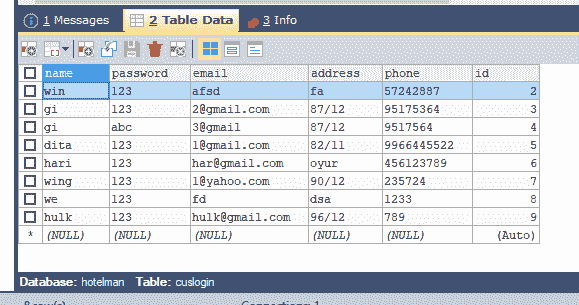
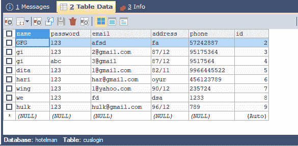

# 如何使用 JDBC 连接更新表格的内容？

> 原文:[https://www . geeksforgeeks . org/如何使用 jdbc 连接更新表的内容/](https://www.geeksforgeeks.org/how-to-update-contents-of-a-table-using-jdbc-connection/)

[JDBC](https://www.geeksforgeeks.org/establishing-jdbc-connection-in-java/)(Java Database Connectivity)基本上是 Java 编程语言和各种数据库如 Oracle、 [SQL](https://www.geeksforgeeks.org/sql-tutorial/) 、PostgreSQL 等之间的标准 API(应用程序接口)。它连接前端(用于与用户交互)和后端(用于存储数据)。

### 使用 JDBC 更新表格内容的步骤

**1。创建数据库:**可以使用 **SQLyog** 创建一个数据库，并在其中创建一些表，并在其中填充数据，以便更新表的内容。这里比如我的数据库名称是**霍特曼**，表名是 **cuslogin** 和 **adminlogin** 。我们将以 **cuslogin** 表为例。

 

**2。创建连接:**打开 Netbeans 并创建一个新包。在包中，打开一个新的 java 文件，键入下面的 JDBC 连接代码，并用 connection.java 保存文件名。

## Java 语言(一种计算机语言，尤用于创建网站)

```java
// Java program to create a connection to a database

import java.sql.*;

public class connection {

    // Connection instance
    Connection con = null;

    public static Connection connectDB()
    {
        try {
            Class.forName("com.mysql.jdbc.Driver");

            Connection con = DriverManager.getConnection(
                "jdbc:mysql://localhost:3306/hotelman",
                "root", "1234");

            // here,root is the username and 1234 is the
            // password,you can set your own username and
            // password.
            return con;
        }
        catch (SQLException e) {

            System.out.println(e);
        }
    }
}
```

**3。更新表中的内容:**假设我们想从 id 为 2 的 **cuslogin** 表中更新客户名称。

用 SQL 查询初始化一个字符串，如下所示

```java
String sql="update  cuslogin set name='GFG' where id=2";
```

初始化 Connection 类、PreparedStatement 类(jdbc 需要)的以下对象，并按如下方式连接数据库

```java
Connection con=null;
PreparedStatement p=null;
con=connection.connectDB();
```

现在，在 prepareStatement 中添加上面给出的 SQL 查询，并按如下方式执行

```java
p =con.prepareStatement(sql);
p.execute();
```

在同一个包中打开一个新的 java 文件(这里是 result.java)，输入完整的代码(如下所示)来更新 id 为 2 的客户的名字，来自表 **cuslogin** 。

**注意:**两个文件即 result.java 和 connection.java 应该在同一个包中，否则程序不会给出想要的输出！！

## Java 语言(一种计算机语言，尤用于创建网站)

```java
// Java Program to Update contents in a table

import java.sql.*;
public class result {

    public static void main(String[] args)
    {
        Connection con = null;
        PreparedStatement p = null;
        con = connection.connectDB();
        try {
            String sql
                = "update cuslogin set name='GFG' where id=2";
            p = con.prepareStatement(sql);
            p.execute();
        }
        catch (SQLException e) {
            System.out.println(e);
        }
    }
}
```

运行**result.java**后，输出可以在 SQLyog 中看到如下:



我们可以看到，id 为 2 的客户，现在的名字是 **GFG** 。