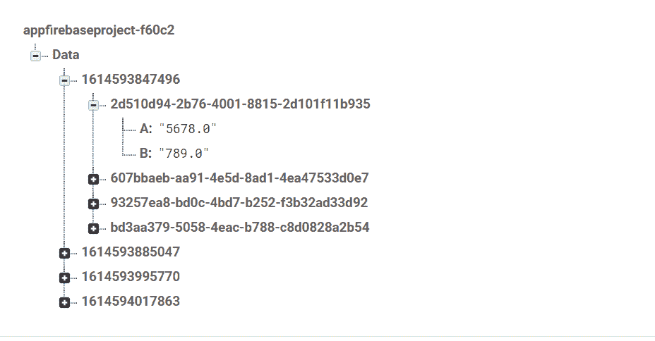

# 如何在安卓系统中将 Excel 表单数据上传到 Firebase 实时数据库？

> 原文:[https://www . geesforgeks . org/如何上传-excel-sheet-data-to-firebase-real-database-in-Android/](https://www.geeksforgeeks.org/how-to-upload-excel-sheet-data-to-firebase-realtime-database-in-android/)

[**<u>Firebase 实时数据库</u>**](https://www.geeksforgeeks.org/firebase-realtime-database-with-operations-in-android-with-examples/) 是由谷歌提供的后端服务，用于为你的安卓应用、IOS 应用以及你的网站处理后端任务。它提供了许多服务，如存储、数据库等等。[<u>Firebase</u>](https://www.geeksforgeeks.org/firebase-introduction/)以其 Firebase 实时数据库而闻名。通过在应用程序中使用 Firebase 实时数据库，您可以向用户提供实时数据更新，而无需实际刷新应用程序。在本文中，我们将把 Excel 工作表数据上传到 [firebase 实时数据库](https://www.geeksforgeeks.org/firebase-realtime-database-with-operations-in-android-with-examples/)中。这在你创建一个需要上传大量问题的问答应用程序时非常有用。在这种情况下，您可以使用 excel 工作表上传数据。

### 我们将在本文中构建什么？

我们将构建一个简单的应用程序，使用 excel Sheet 将数据上传到 **firebase 实时数据库**中。首先，我们将选择一个 excel 文件，然后将它上传到 firebase，获取行和列的总数，然后将生成一个随机 id，其中将存储行数据。请注意，我们将使用 **Java** 语言来实现这个项目。

### **分步实施**

**第一步:创建新项目**

要在安卓工作室创建新项目，请参考[如何在安卓工作室创建/启动新项目](https://www.geeksforgeeks.org/android-how-to-create-start-a-new-project-in-android-studio/)。注意选择 **Java** 作为编程语言。

**步骤 2:使用 AndroidManifest.xml 文件**

为了向 Firebase 添加数据，我们应该授予访问互联网的权限。要添加这些权限，请导航到应用程序>安卓清单. xml，并在该文件中添加以下权限。

**步骤 3:使用 build.gradle(app)文件**

将这些实现添加到其中

> 实现文件树(dir: 'libs '，包括:['*。罐子'])
> 
> 实现' com . Google . firebase:firebase-数据库:16.0.4 '
> 
> 实现文件(' libs/poi-3.12-android-a.jar ')

**第 4 步:使用 activity_main.xml 文件**

导航到**应用程序> res >布局> activity_main.xml** 并将下面的代码添加到该文件中。下面是 **activity_main.xml** 文件的代码。

## 可扩展标记语言

```java
<?xml version="1.0" encoding="utf-8"?>
<LinearLayout
    xmlns:android="http://schemas.android.com/apk/res/android"
    xmlns:tools="http://schemas.android.com/tools"
    android:layout_width="match_parent"
    android:layout_height="match_parent"
    android:gravity="center"
    tools:context=".MainActivity">

    <Button
        android:id="@+id/excel"
        android:layout_width="wrap_content"
        android:layout_height="wrap_content"
        android:text="Click Here to upload excel Sheet" />

</LinearLayout>
```

**第五步:使用****MainActivity.java 文件**

在类内打开 MainActivity.java 文件，首先创建 Button 类的对象。

```java
public static final int cellCount=2;
Button excel;
```

其次，在 onCreate()方法中，我们必须将这些对象与我们给出的它们各自的标识联系起来。XML 文件。

```java
excel = findViewById(R.id.excel);
```

正在检查从电话存储器访问 excel 文件的权限

```java
if(requestCode == 101){
            if(grantResults[0] == PackageManager.PERMISSION_GRANTED){
                // if permission granted them select file
                selectfile();
            } else {
                Toast.makeText(MainActivity.this, "Permission Not granted",Toast.LENGTH_LONG).show();
       }
 }
```

从电话中选择 excel 文件

```java
Intent intent = new Intent(Intent.ACTION_OPEN_DOCUMENT);
        intent.setType("*/*");
        intent.addCategory(Intent.CATEGORY_OPENABLE);

        // file is selected now start activity function to proceed
        startActivityForResult(Intent.createChooser(intent, "Select File"),102);
```

获取一个 excel 工作表，检查行和列的总数，并将这些值添加到数据库中。

```java
XSSFSheet sheet=workbook.getSheetAt(0);
FormulaEvaluator formulaEvaluator=workbook.getCreationHelper().createFormulaEvaluator();
int rowscount=sheet.getPhysicalNumberOfRows();
if(rowscount > 0){                                      
     // check row wise data
     for (int r=0;r<rowscount;r++){                   
            Row row=sheet.getRow(r);
            if(row.getPhysicalNumberOfCells()==cellCount) {
                      // get cell data
                      String A = getCellData(row,0,formulaEvaluator);
                      String B = getCellData(row,1,formulaEvaluator);            
              }
             else {
                   Toast.makeText(MainActivity.this,"row no. "+(r+1)+" has incorrect data",Toast.LENGTH_LONG).show();
                   return;                                   
         }
}                                                             
```

## Java 语言(一种计算机语言，尤用于创建网站)

```java
import android.Manifest;
import android.app.ProgressDialog;
import android.content.Intent;
import android.content.pm.PackageManager;
import android.net.Uri;
import android.os.AsyncTask;
import android.os.Bundle;
import android.view.View;
import android.widget.Button;
import android.widget.Toast;

import androidx.annotation.NonNull;
import androidx.annotation.Nullable;
import androidx.appcompat.app.AppCompatActivity;
import androidx.core.app.ActivityCompat;

import com.google.android.gms.tasks.OnCompleteListener;
import com.google.android.gms.tasks.Task;
import com.google.firebase.database.FirebaseDatabase;

import org.apache.poi.ss.usermodel.Cell;
import org.apache.poi.ss.usermodel.FormulaEvaluator;
import org.apache.poi.ss.usermodel.Row;
import org.apache.poi.xssf.usermodel.XSSFSheet;
import org.apache.poi.xssf.usermodel.XSSFWorkbook;

import java.io.FileNotFoundException;
import java.io.IOException;
import java.io.InputStream;
import java.util.HashMap;
import java.util.UUID;

public class MainActivity extends AppCompatActivity {

    // initialising the cell count as 2
    public static final int cellCount = 2;
    Button excel;

    @Override
    protected void onCreate(Bundle savedInstanceState) {
        super.onCreate(savedInstanceState);
        setContentView(R.layout.activity_main);

        excel = findViewById(R.id.excel);

        // click on excel to select a file
        excel.setOnClickListener(new View.OnClickListener() {
            @Override
            public void onClick(View v) {
                if (ActivityCompat.checkSelfPermission(MainActivity.this, Manifest.permission.READ_EXTERNAL_STORAGE) == PackageManager.PERMISSION_GRANTED) {
                    selectfile();
                } else {
                    ActivityCompat.requestPermissions(MainActivity.this, new String[]{Manifest.permission.READ_EXTERNAL_STORAGE}, 101);
                }
            }
        });
    }

    // request for storage permission if not given
    @Override
    public void onRequestPermissionsResult(int requestCode, @NonNull String[] permissions, @NonNull int[] grantResults) {
        super.onRequestPermissionsResult(requestCode, permissions, grantResults);
        if (requestCode == 101) {
            if (grantResults[0] == PackageManager.PERMISSION_GRANTED) {
                selectfile();
            } else {
                Toast.makeText(MainActivity.this, "Permission Not granted", Toast.LENGTH_LONG).show();
            }
        }
    }

    private void selectfile() {
        // select the file from the file storage
        Intent intent = new Intent(Intent.ACTION_OPEN_DOCUMENT);
        intent.setType("*/*");
        intent.addCategory(Intent.CATEGORY_OPENABLE);
        startActivityForResult(Intent.createChooser(intent, "Select File"), 102);
    }

    protected void onActivityResult(int requestCode, int resultCode, @Nullable Intent data) {
        super.onActivityResult(requestCode, resultCode, data);
        if (requestCode == 102) {
            if (resultCode == RESULT_OK) {
                String filepath = data.getData().getPath();
                // If excel file then only select the file
                if (filepath.endsWith(".xlsx") || filepath.endsWith(".xls")) {
                    readfile(data.getData());
                }
                // else show the error
                else {
                    Toast.makeText(this, "Please Select an Excel file to upload", Toast.LENGTH_LONG).show();
                }
            }
        }
    }

    ProgressDialog dialog;

    private void readfile(final Uri file) {
        dialog = new ProgressDialog(this);
        dialog.setMessage("Uploading");
        dialog.setCanceledOnTouchOutside(false);
        dialog.show();
        AsyncTask.execute(new Runnable() {
            @Override
            public void run() {

                final HashMap<String, Object> parentmap = new HashMap<>();

                try {
                    XSSFWorkbook workbook;

                    // check for the input from the excel file
                    try (InputStream inputStream = getContentResolver().openInputStream(file)) {
                        workbook = new XSSFWorkbook(inputStream);
                    }
                    final String timestamp = "" + System.currentTimeMillis();
                    XSSFSheet sheet = workbook.getSheetAt(0);
                    FormulaEvaluator formulaEvaluator = workbook.getCreationHelper().createFormulaEvaluator();
                    int rowscount = sheet.getPhysicalNumberOfRows();
                    if (rowscount > 0) {
                        // check row wise data
                        for (int r = 0; r < rowscount; r++) {
                            Row row = sheet.getRow(r);
                            if (row.getPhysicalNumberOfCells() == cellCount) {

                                // get cell data
                                String A = getCellData(row, 0, formulaEvaluator);
                                String B = getCellData(row, 1, formulaEvaluator);

                                // initialise the hash map and put value of a and b into it
                                HashMap<String, Object> quetionmap = new HashMap<>();
                                quetionmap.put("A", A);
                                quetionmap.put("B", B);
                                String id = UUID.randomUUID().toString();
                                parentmap.put(id, quetionmap);
                            } else {
                                dialog.dismiss();
                                Toast.makeText(MainActivity.this, "row no. " + (r + 1) + " has incorrect data", Toast.LENGTH_LONG).show();
                                return;
                            }
                        }
                        // add the data in firebase if everything is correct
                        runOnUiThread(new Runnable() {
                            @Override
                            public void run() {
                                // add the data according to timestamp
                                FirebaseDatabase.getInstance().getReference().child("Data").
                                        child(timestamp).updateChildren(parentmap).addOnCompleteListener(new OnCompleteListener<Void>() {
                                    @Override
                                    public void onComplete(@NonNull Task<Void> task) {
                                        if (task.isSuccessful()) {
                                            dialog.dismiss();
                                            Toast.makeText(MainActivity.this, "Uploaded Successfully", Toast.LENGTH_LONG).show();
                                        } else {
                                            dialog.dismiss();
                                            Toast.makeText(MainActivity.this, "Something went wrong", Toast.LENGTH_LONG).show();
                                        }
                                    }
                                });
                            }
                        });
                    }
                    // show the error if file is empty
                    else {
                        runOnUiThread(new Runnable() {
                            @Override
                            public void run() {
                                dialog.dismiss();
                                Toast.makeText(MainActivity.this, "File is empty", Toast.LENGTH_LONG).show();
                            }
                        });
                        return;
                    }
                }
                // show the error message if failed
                // due to file not found
                catch (final FileNotFoundException e) {
                    e.printStackTrace();
                    runOnUiThread(new Runnable() {
                        @Override
                        public void run() {
                            Toast.makeText(MainActivity.this, e.getMessage(), Toast.LENGTH_LONG).show();
                        }
                    });
                }
                // show the error message if there 
                // is error in input output
                catch (final IOException e) {
                    e.printStackTrace();
                    runOnUiThread(new Runnable() {
                        @Override
                        public void run() {
                            Toast.makeText(MainActivity.this, e.getMessage(), Toast.LENGTH_LONG).show();
                        }
                    });
                }
            }
        });
    }

    private String getCellData(Row row, int cellposition, FormulaEvaluator formulaEvaluator) {

        String value = "";

        // get cell fom excel sheet
        Cell cell = row.getCell(cellposition);
        switch (cell.getCellType()) {
            case Cell.CELL_TYPE_BOOLEAN:
                return value + cell.getBooleanCellValue();
            case Cell.CELL_TYPE_NUMERIC:
                return value + cell.getNumericCellValue();
            case Cell.CELL_TYPE_STRING:
                return value + cell.getStringCellValue();
            default:
                return value;
        }
    }
}
```

**输出:**

<video class="wp-video-shortcode" id="video-569553-1" width="640" height="360" preload="metadata" controls=""><source type="video/mp4" src="https://media.geeksforgeeks.org/wp-content/uploads/20210301155303/uploadingexceldata.mp4?_=1">[https://media.geeksforgeeks.org/wp-content/uploads/20210301155303/uploadingexceldata.mp4](https://media.geeksforgeeks.org/wp-content/uploads/20210301155303/uploadingexceldata.mp4)</video>

数据以这种方式保存在数据库中



**github link:**[https://github . com/anni 1123/uploaddataexcelsheet](https://github.com/Anni1123/UploadDataExcelSheet)