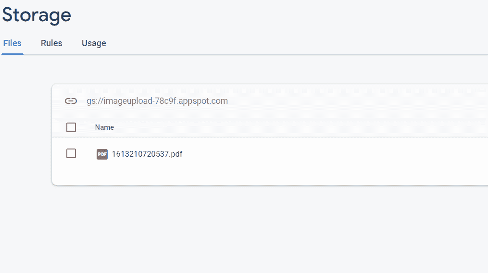

# 如何在安卓中上传 Firebase Storage 中的 PDF 文件？

> 原文:[https://www . geesforgeks . org/how-upload-pdf-files-in-firebase-storage-in-Android/](https://www.geeksforgeeks.org/how-to-upload-pdf-files-in-firebase-storage-in-android/)

[Firebase](https://www.geeksforgeeks.org/firebase-introduction/) 是一个移动和 web 应用开发平台。它提供 web 应用程序或移动应用程序可能需要的服务。Firebase 为 Firebase 应用程序提供安全的文件上传和下载。本文介绍了如何构建一个安卓应用程序，该应用程序能够从手机中选择 pdf 并将该 pdf 上传到 **Firebase Storage** 。

### **分步实施**

**第一步:创建新项目**

要在安卓工作室创建新项目，请参考[如何在安卓工作室创建/启动新项目](https://www.geeksforgeeks.org/android-how-to-create-start-a-new-project-in-android-studio/)。注意选择 **Java** 作为编程语言。并且在你的项目中加入 firebase，或者你可以参考[在安卓应用中加入 Firebase](https://www.geeksforgeeks.org/adding-firebase-to-android-app/)。

**第二步:在 build.gradle (Module : app)文件**中添加依赖项

导航到**渐变脚本>构建.渐变(模块:应用)**，并在依赖项部分添加以下依赖项。

> 实现' com . Google . firebase:firebase-storage:16 . 0 . 4 '
> 
> 实现文件树(dir: 'libs '，包括:['*。罐子'])

添加这个依赖项后，同步您的项目，现在我们将开始实现它。

**步骤 3:使用 activity_main.xml 文件**

导航到**应用程序> res >布局> activity_main.xml** 并将下面的代码添加到该文件中。下面是 **activity_main.xml** 文件的代码。

## 可扩展标记语言

```
<?xml version="1.0" encoding="utf-8"?>
<LinearLayout 
    xmlns:android="http://schemas.android.com/apk/res/android"
    xmlns:tools="http://schemas.android.com/tools"
    android:layout_width="match_parent"
    android:layout_height="match_parent"
    android:gravity="center"
    android:orientation="vertical"
    tools:context=".MainActivity">

    <ImageView
        android:id="@+id/uploadpdf"
        android:layout_width="200dp"
        android:layout_height="200dp"
        android:src="@drawable/ic_picture_as_pdf_black_24dp" />

    <TextView
        android:layout_width="wrap_content"
        android:layout_height="wrap_content"
        android:text="Upload A Pdf"
        android:textSize="22sp"
        android:textStyle="bold" />

</LinearLayout>
```

**第四步:使用****MainActivity.java 文件**

转到**MainActivity.java**文件，参考以下代码。以下是**MainActivity.java**文件的代码。代码中添加了注释，以更详细地理解代码。

## Java 语言(一种计算机语言，尤用于创建网站)

```
import android.app.ProgressDialog;
import android.content.Intent;
import android.net.Uri;
import android.os.Bundle;
import android.view.View;
import android.widget.ImageView;
import android.widget.Toast;

import androidx.annotation.NonNull;
import androidx.annotation.Nullable;
import androidx.appcompat.app.AppCompatActivity;

import com.google.android.gms.tasks.Continuation;
import com.google.android.gms.tasks.OnCompleteListener;
import com.google.android.gms.tasks.Task;
import com.google.firebase.storage.FirebaseStorage;
import com.google.firebase.storage.StorageReference;

public class MainActivity extends AppCompatActivity {

    ImageView upload;
    Uri imageuri = null;

    @Override
    protected void onCreate(Bundle savedInstanceState) {
        super.onCreate(savedInstanceState);
        setContentView(R.layout.activity_main);
        upload = findViewById(R.id.uploadpdf);

        // After Clicking on this we will be
        // redirected to choose pdf
        upload.setOnClickListener(new View.OnClickListener() {
            @Override
            public void onClick(View v) {
                Intent galleryIntent = new Intent();
                galleryIntent.setAction(Intent.ACTION_GET_CONTENT);

                // We will be redirected to choose pdf
                galleryIntent.setType("application/pdf");
                startActivityForResult(galleryIntent, 1);
            }
        });
    }

    ProgressDialog dialog;

    @Override
    protected void onActivityResult(int requestCode, int resultCode, @Nullable Intent data) {
        super.onActivityResult(requestCode, resultCode, data);
        if (resultCode == RESULT_OK) {

            // Here we are initialising the progress dialog box
            dialog = new ProgressDialog(this);
            dialog.setMessage("Uploading");

            // this will show message uploading
            // while pdf is uploading
            dialog.show();
            imageuri = data.getData();
            final String timestamp = "" + System.currentTimeMillis();
            StorageReference storageReference = FirebaseStorage.getInstance().getReference();
            final String messagePushID = timestamp;
            Toast.makeText(MainActivity.this, imageuri.toString(), Toast.LENGTH_SHORT).show();

            // Here we are uploading the pdf in firebase storage with the name of current time
            final StorageReference filepath = storageReference.child(messagePushID + "." + "pdf");
            Toast.makeText(MainActivity.this, filepath.getName(), Toast.LENGTH_SHORT).show();
            filepath.putFile(imageuri).continueWithTask(new Continuation() {
                        @Override
                        public Object then(@NonNull Task task) throws Exception {
                            if (!task.isSuccessful()) {
                                throw task.getException();
                            }
                            return filepath.getDownloadUrl();
                        }
                    }).addOnCompleteListener(new OnCompleteListener<Uri>() {
                @Override
                public void onComplete(@NonNull Task<Uri> task) {
                    if (task.isSuccessful()) {
                        // After uploading is done it progress
                        // dialog box will be dismissed
                        dialog.dismiss();
                        Uri uri = task.getResult();
                        String myurl;
                        myurl = uri.toString();
                        Toast.makeText(MainActivity.this, "Uploaded Successfully", Toast.LENGTH_SHORT).show();
                    } else {
                        dialog.dismiss();
                        Toast.makeText(MainActivity.this, "UploadedFailed", Toast.LENGTH_SHORT).show();
                    }
                }
            });
        }
    }
}
```

### 输出:

<video class="wp-video-shortcode" id="video-560985-1" width="640" height="360" preload="metadata" controls=""><source type="video/mp4" src="https://media.geeksforgeeks.org/wp-content/uploads/20210213163144/WhatsApp-Video-2021-02-13-at-3.52.47-PM.mp4?_=1">[https://media.geeksforgeeks.org/wp-content/uploads/20210213163144/WhatsApp-Video-2021-02-13-at-3.52.47-PM.mp4](https://media.geeksforgeeks.org/wp-content/uploads/20210213163144/WhatsApp-Video-2021-02-13-at-3.52.47-PM.mp4)</video>

**火炉储存:**



github link。