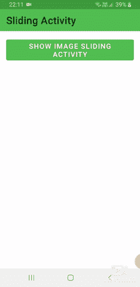

# 如何在安卓 App 中使用安卓滑动活动库？

> 原文:[https://www . geeksforgeeks . org/使用方法-安卓-滑动-活动-安卓中库-app/](https://www.geeksforgeeks.org/how-to-use-android-sliding-activity-library-in-android-app/)

滑动活动允许您轻松地将标题内容、菜单和数据设置到可滑动的屏幕上。轻松创建可在屏幕上垂直滑动的活动，并很好地适应材料设计时代。我们可以为滑动活动设置标题图像。我们还可以自定义影响标题和状态栏的颜色。我们还可以禁用标题，只显示可读的内容。下面给出了一个 GIF 示例，来了解一下我们将在本文中做什么。注意，我们将使用 **Java** 语言来实现这个项目。



### 逐步实施

**第一步:创建新项目**

要在安卓工作室创建新项目，请参考[如何在安卓工作室创建/启动新项目](https://www.geeksforgeeks.org/android-how-to-create-start-a-new-project-in-android-studio/)。注意选择 **Java** 作为编程语言。

**第二步:添加依赖关系**

导航到**渐变脚本>构建.渐变(模块:应用)**，并在依赖项部分添加以下依赖项。

> 编译' com . klinkrapps:sliding-activity:1 . 5 . 2 '

**步骤 3:为滑块活动创建 XML。这将在滑块活动**中显示为内容

## 可扩展标记语言

```java
<TextView 
    xmlns:android="http://schemas.android.com/apk/res/android"
    android:layout_width="match_parent"
    android:layout_height="match_parent"
    android:paddingLeft="@dimen/activity_horizontal_margin"
    android:paddingRight="@dimen/activity_horizontal_margin"
    android:paddingTop="@dimen/activity_vertical_margin"
    android:paddingBottom="@dimen/activity_vertical_margin"
    android:text="@string/placeholder"/>
```

**步骤 4:为主活动创建 XML。这包含一个按钮。点击后滑块活动将打开**

## 可扩展标记语言

```java
<RelativeLayout 
    xmlns:android="http://schemas.android.com/apk/res/android"
    android:layout_width="match_parent"
    android:layout_height="match_parent">

    <View android:layout_height="100dp"
        android:layout_width="match_parent"
        android:layout_centerInParent="true"
        android:id="@+id/expansion_view"
        android:layout_marginLeft="16dp"
        android:layout_marginRight="16dp"/>

    <ScrollView
        android:layout_width="match_parent"
        android:layout_height="match_parent">

        <LinearLayout xmlns:tools="http://schemas.android.com/tools"
            android:layout_width="match_parent"
            android:layout_height="wrap_content"
            android:orientation="vertical"
            android:paddingLeft="@dimen/activity_horizontal_margin"
            android:paddingTop="@dimen/activity_vertical_margin"
            android:paddingRight="@dimen/activity_horizontal_margin"
            android:paddingBottom="@dimen/activity_vertical_margin"
            tools:context="com.klinker.android.sliding.sample.SampleActivity">

            <Button
                android:id="@+id/show_image"
                android:layout_width="match_parent"
                android:layout_height="wrap_content"
                android:text="@string/show_image_activity" />

        </LinearLayout>

    </ScrollView>

</RelativeLayout>
```

**第五步:我们将使用 init()方法，而不是使用** **onCreate()方法。**

**A)** 创建一个名为**图像活动**的活动。使用**设置图像配置图像；**

**B)****expandFromPoints(Arg1，Arg2，Arg3，Arg4)** 方法用于在活动开启时创建动画。

## Java 语言(一种计算机语言，尤用于创建网站)

```java
import android.content.Intent;
import android.os.Bundle;
import android.os.Handler;

import com.klinker.android.sliding.SlidingActivity;

public class ImageActivity extends SlidingActivity {
    @Override
    public void init(Bundle savedInstanceState) {
        setTitle(R.string.image_activity);
        setContent(R.layout.activity_content);

        // no need to set a color here, palette
          // will generate colors for us to be set
        setImage(R.drawable.profile_picture);

         // if we wanted to set some manually instead,
           // do this after setting the image
         setPrimaryColors(
                 getResources().getColor(R.color.image_activity_primary),
                 getResources().getColor(R.color.image_activity_primary_dark)
         );

         // if we want the image to animate in, then set it after
           // the activity has been created
         // NOTE: this will not change the activity's colors using palette,
           // so make sure you call
         // setPrimaryColors() first
         new Handler().postDelayed(new Runnable() {
             @Override
             public void run() {
                 setImage(R.drawable.profile_picture);
             }
         }, 500);

        Intent intent = getIntent();
        if (intent.getBooleanExtra(MainActivity.ARG_USE_EXPANSION, false)) {
            expandFromPoints(
                    intent.getIntExtra(MainActivity.ARG_EXPANSION_LEFT_OFFSET, 0),
                    intent.getIntExtra(MainActivity.ARG_EXPANSION_TOP_OFFSET, 0),
                    intent.getIntExtra(MainActivity.ARG_EXPANSION_VIEW_WIDTH, 0),
                    intent.getIntExtra(MainActivity.ARG_EXPANSION_VIEW_HEIGHT, 0)
            );
        }
    }
}
```

**第 6 步:创建按钮对象。点击监听器注册。onClick()方法内部开始滑块活动。(ImageActivity.class)**

## Java 语言(一种计算机语言，尤用于创建网站)

```java
import androidx.appcompat.app.AppCompatActivity;

import android.content.Intent;
import android.os.Bundle;
import android.view.View;
import android.widget.CheckBox;

public class MainActivity extends AppCompatActivity {

    public static final String ARG_USE_EXPANSION = "arg_use_expansion";
    public static final String ARG_EXPANSION_LEFT_OFFSET = "arg_left_offset";
    public static final String ARG_EXPANSION_TOP_OFFSET = "arg_top_offset";
    public static final String ARG_EXPANSION_VIEW_WIDTH = "arg_view_width";
    public static final String ARG_EXPANSION_VIEW_HEIGHT = "arg_view_height";

    @Override
    protected void onCreate(Bundle savedInstanceState) {
        super.onCreate(savedInstanceState);

        setContentView(R.layout.activity_main);

        // registering click event
        findViewById(R.id.show_image).setOnClickListener(new View.OnClickListener() {
            @Override
            public void onClick(View v) {
                startActivity(new Intent(getApplicationContext(), ImageActivity.class));
            }
        });
    }
}
```

**输出:**

<video class="wp-video-shortcode" id="video-670105-1" width="640" height="360" preload="metadata" controls=""><source type="video/mp4" src="https://media.geeksforgeeks.org/wp-content/uploads/20210812231405/20210812-221103-720x1480.mp4?_=1">[https://media.geeksforgeeks.org/wp-content/uploads/20210812231405/20210812-221103-720x1480.mp4](https://media.geeksforgeeks.org/wp-content/uploads/20210812231405/20210812-221103-720x1480.mp4)</video>

**项目链接:** [点击此处](https://media.geeksforgeeks.org/wp-content/cdn-uploads/20210827003326/GfgSliding-main.zip)