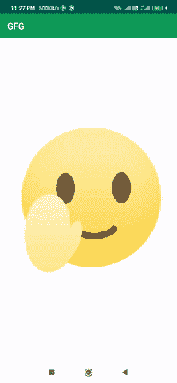

# 如何在安卓 App 中使用动画 GIF？

> 原文:[https://www . geesforgeks . org/如何使用-动画-gif-in-android-app/](https://www.geeksforgeeks.org/how-to-use-animated-gif-in-android-app/)

在本文中，我们将使用一个库在我们的项目中展示一个动画 gif。有许多方法可以显示 gif。我们也可以使用 WebView 显示一个 gif。在这里，我们将使用这个库来显示 gif。所以在这里，我们将学习如何实现这个特性。下面给出了一个示例 GIF，以了解我们将在本文中做什么。注意，我们将使用 **Java** 语言来实现这个项目。



### **分步实施**

### **方法 1**

**第一步:创建新项目**

要在安卓工作室创建新项目，请参考[如何在安卓工作室创建/启动新项目](https://www.geeksforgeeks.org/android-how-to-create-start-a-new-project-in-android-studio/)。注意选择 **Java** 作为编程语言。

**第二步:插入以下依赖项来构建项目的. gradle 文件**

导航到**渐变脚本>构建.渐变(模块:应用)**，并在依赖项部分添加以下依赖项。

> 实现' pl . droidsonroids . gif:Android-gif-drawing able:1 . 2 . 22 '

请注意，Maven 中央存储库应该像这样在顶层 build.gradle 中定义:

> buildscript {
> 
> 存储库{
> 
> mavenuentral _)
> 
> }
> 
> }

> 所有项目{
> 
> 存储库{
> 
> mavenuentral _)
> 
> }
> 
> }

**步骤 3:使用 activity_main.xml 文件**

导航到**应用程序> res >布局> activity_main.xml** 并将下面的代码添加到该文件中。下面是 **activity_main.xml** 文件的代码。

## 可扩展标记语言

```
<?xml version="1.0" encoding="utf-8"?>
<LinearLayout
    xmlns:android="http://schemas.android.com/apk/res/android"
    xmlns:tools="http://schemas.android.com/tools"
    android:layout_width="match_parent"
    android:layout_height="match_parent"
    tools:context=".MainActivity">

    <pl.droidsonroids.gif.GifImageView
        android:layout_width="match_parent"
        android:layout_height="match_parent"
        android:background="#fff"
        android:src="@drawable/android" />

</LinearLayout>
```

**步骤 4:** **处理 MainActivity.java 文件**

与**MainActivity.java**文件无关。

### **方法二**

这里我们使用[图像视图](https://www.geeksforgeeks.org/imageview-in-android-with-example/)和[滑动库](https://www.geeksforgeeks.org/image-loading-caching-library-android-set-2/)加载 gif。将以下依赖项插入到项目的 [build.gradle](https://www.geeksforgeeks.org/android-build-gradle/) 文件中。

> 实现' com . github . bumptech . glide:glide:4 . 9 . 0 '

**步骤 1:使用 activity_main.xml 文件**

导航到**应用程序> res >布局> activity_main.xml** 并将下面的代码添加到该文件中。下面是 **activity_main.xml** 文件的代码。

## 可扩展标记语言

```
<?xml version="1.0" encoding="utf-8"?>
<androidx.constraintlayout.widget.ConstraintLayout
    xmlns:android="http://schemas.android.com/apk/res/android"
    xmlns:app="http://schemas.android.com/apk/res-auto"
    xmlns:tools="http://schemas.android.com/tools"
    android:layout_width="match_parent"
    android:layout_height="match_parent"
    tools:context=".MainActivity">

    <ImageView
        android:id="@+id/imageview"
        android:layout_width="match_parent"
        android:layout_height="match_parent"
        app:layout_constraintBottom_toBottomOf="parent"
        app:layout_constraintLeft_toLeftOf="parent"
        app:layout_constraintRight_toRightOf="parent"
        app:layout_constraintTop_toTopOf="parent" />

</androidx.constraintlayout.widget.ConstraintLayout>
```

**第二步:使用****MainActivity.java 文件**

转到**MainActivity.java**文件，参考以下代码。以下是**MainActivity.java**文件的代码。代码中添加了注释，以更详细地理解代码。

## Java 语言(一种计算机语言，尤用于创建网站)

```
import android.os.Bundle;
import android.widget.ImageView;

import androidx.appcompat.app.AppCompatActivity;

import com.bumptech.glide.Glide;

public class MainActivity extends AppCompatActivity {

    ImageView imageView;

    @Override
    protected void onCreate(Bundle savedInstanceState) {
        super.onCreate(savedInstanceState);
        setContentView(R.layout.activity_main);
        imageView = findViewById(R.id.imageview);

        // Adding the gif here using glide library
        Glide.with(this).load(R.drawable.android).into(imageView);
    }
}
```

### 方法 3

这里我们使用[网络视图](https://www.geeksforgeeks.org/how-to-use-webview-in-android/)加载 gif。

**步骤 1:使用 activity_main.xml 文件**

导航到**应用程序> res >布局> activity_main.xml** 并将下面的代码添加到该文件中。下面是 **activity_main.xml** 文件的代码。我们将在这个文件中创建一个简单的网络视图。

## 可扩展标记语言

```
<?xml version="1.0" encoding="utf-8"?>
<LinearLayout
    xmlns:android="http://schemas.android.com/apk/res/android"
    xmlns:tools="http://schemas.android.com/tools"
    android:layout_width="match_parent"
    android:layout_height="match_parent"
    android:orientation="vertical"
    tools:context=".MainActivity">

    <WebView
        android:id="@+id/webvidew"
        android:layout_width="match_parent"
        android:layout_height="match_parent" />

</LinearLayout>
```

**第二步:使用****MainActivity.java 文件**

转到**MainActivity.java**文件，参考以下代码。以下是**MainActivity.java**文件的代码。代码中添加了注释，以更详细地理解代码。

## Java 语言(一种计算机语言，尤用于创建网站)

```
import android.os.Bundle;
import android.webkit.WebView;
import android.webkit.WebViewClient;

import androidx.appcompat.app.AppCompatActivity;

public class MainActivity extends AppCompatActivity {

    WebView webView;

    @Override
    protected void onCreate(Bundle savedInstanceState) {
        super.onCreate(savedInstanceState);
        setContentView(R.layout.activity_main);

        // initialise the layout
        webView = findViewById(R.id.webvidew);

        // enable the javascript to load the url
        webView.getSettings().setJavaScriptEnabled(true);
        webView.setWebViewClient(new WebViewClient());

        // add the url of gif
        webView.loadUrl("//Add the link of gif here");
    }
}
```

**输出:**

<video class="wp-video-shortcode" id="video-603686-1" width="640" height="360" preload="metadata" controls=""><source type="video/mp4" src="https://media.geeksforgeeks.org/wp-content/uploads/20210410232856/gif.mp4?_=1">[https://media.geeksforgeeks.org/wp-content/uploads/20210410232856/gif.mp4](https://media.geeksforgeeks.org/wp-content/uploads/20210410232856/gif.mp4)</video>