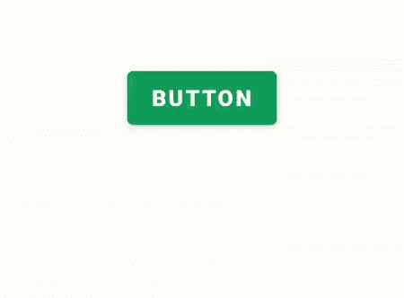

# 如何在安卓系统中使用气球库？

> 原文:[https://www . geeksforgeeks . org/如何使用安卓气球图书馆/](https://www.geeksforgeeks.org/how-to-use-balloon-library-in-android/)

**气球库**是另一个在大多数安卓应用中普遍使用的热门功能。您可以在大多数购物和消息应用程序中看到该功能。在这个功能的帮助下，你可以在任何应用程序中得到下一步该做什么的提示。在本文中，我们将看到如何在我们的安卓应用程序中实现气球视图。下面给出一个 GIF 示例，了解一下我们在本文中要做什么。注意，我们将使用 **Java** 语言来实现这个项目。



### 气球库的应用

*   气球库可以用来以一种吸引人的方式显示消息应用程序的编辑文本提示。
*   它可以用来在安卓应用程序中显示祝酒信息。
*   帮助用户了解下一步在安卓应用中如何显示提示文本。

### **气球库的属性**

<figure class="table">

| 

属性

 | 

描述

 |
| --- | --- |
| **。setwid 色雷斯()** | 用于根据水平屏幕大小的比例显示弹出窗口的宽度。 |
| **。showAlignBottom()** | 用于在底部显示弹出窗口。 |
| **。辞退()** | 用于在弹出窗口显示后关闭它。 |
| **.setMargin（）** | 用于从各个方面给与利润。 |
| **。setisisiblearrow()** | 用于显示箭头。 |
| **。设置箭头位置()** | 用于设置弹出窗口的箭头位置。 |
| **。世田〔t1〕** | 用于设置弹出窗口的方向。 |
| **.setText（）** | 用于显示文本。 |
| **.setTextColor（）** | 用于显示文本颜色。 |
| **。set height()** | 用于给出弹出的高度。 |
| **。set local radius()** | 用于使弹出窗口从四周变圆。 |
| **。set 气球动画()** | 用于使动画弹出。 |

</figure>

### 逐步实施

**第一步:创建新项目**

在安卓工作室创建新项目请参考 [如何在安卓工作室创建/启动新项目](https://www.geeksforgeeks.org/android-how-to-create-start-a-new-project-in-android-studio/) 。注意选择 **Java** 作为编程语言。

**第二步:在 build.gradle 文件**中添加气球库的依赖关系

然后导航到梯度脚本，然后导航到**构建.梯度(模块)**级别。在 dependencies 部分的 build.gradle 文件中添加以下行。

> 实现" com.github.skydoves:气球:1.2.9 "

现在点击立即同步，它将同步你在 **build.gradle()中的所有文件。**

**第三步:在你的 activity_main.xml 中创建一个新的气球视图**

转到**activity _ main . XML**文件，参考以下代码。下面是**activity _ main . XML**文件的代码。

## 可扩展标记语言

```
<?xml version="1.0" encoding="utf-8"?>
<RelativeLayout 
    xmlns:android="http://schemas.android.com/apk/res/android"
    xmlns:tools="http://schemas.android.com/tools"
    android:layout_width="match_parent"
    android:layout_height="match_parent"
    tools:context=".MainActivity">

    <!--Button for showing balloon view-->
    <Button
        android:id="@+id/button"
        android:layout_width="wrap_content"
        android:layout_height="wrap_content"
        android:layout_centerInParent="true"
        android:text="Button"
        android:textSize="15dp"
        android:textStyle="bold" />

</RelativeLayout>
```

**步骤 4:使用 MainActivity.java 文件**

转到**MainActivity.java**文件，参考以下代码。以下是**MainActivity.java**文件的代码。代码中添加了注释，以更详细地理解代码。

## Java 语言(一种计算机语言，尤用于创建网站)

```
import android.os.Bundle;
import android.os.Handler;
import android.view.View;
import android.widget.Button;

import androidx.appcompat.app.AppCompatActivity;
import androidx.core.content.ContextCompat;

import com.skydoves.balloon.ArrowOrientation;
import com.skydoves.balloon.Balloon;
import com.skydoves.balloon.BalloonAnimation;

public class MainActivity extends AppCompatActivity {

    Button button;
    Balloon balloon;

    @Override
    protected void onCreate(Bundle savedInstanceState) {
        super.onCreate(savedInstanceState);
        setContentView(R.layout.activity_main);

        // Id for the button
        button = findViewById(R.id.button);

        // Balloon view created here
        balloon = new Balloon.Builder(getApplicationContext())
                .setArrowSize(10)
                .setArrowOrientation(ArrowOrientation.TOP)
                .setIsVisibleArrow(true)
                .setArrowPosition(0.3f)
                .setWidthRatio(0.6f)
                .setHeight(65)
                .setTextSize(15f)
                .setCornerRadius(4f)
                .setAlpha(0.9f)
                .setText("Hi! Geeks for Geeks.")
                .setTextColor(ContextCompat.getColor(getApplicationContext(), R.color.design_default_color_secondary))
                .setBackgroundColor(ContextCompat.getColor(getApplicationContext(), R.color.design_default_color_secondary_variant))
                .setBalloonAnimation(BalloonAnimation.FADE)
                .build();

        button.setOnClickListener(new View.OnClickListener() {
            @Override
            public void onClick(View view) {
                balloon.showAlignBottom(button);
                new Handler().postDelayed(new Runnable() {
                    @Override
                    public void run() {
                        balloon.dismiss();
                    }
                }, 2000);
            }
        });
    }
}
```

### **输出:**

<video class="wp-video-shortcode" id="video-541832-1" width="640" height="360" preload="metadata" controls=""><source type="video/mp4" src="https://media.geeksforgeeks.org/wp-content/uploads/20210111111456/Screenrecorder-2021-01-11-10-40-01-326.mp4?_=1">[https://media.geeksforgeeks.org/wp-content/uploads/20210111111456/Screenrecorder-2021-01-11-10-40-01-326.mp4](https://media.geeksforgeeks.org/wp-content/uploads/20210111111456/Screenrecorder-2021-01-11-10-40-01-326.mp4)</video>