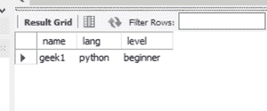

# 如何用 Java 中的 Callable 语句调用存储过程？

> 原文:[https://www . geesforgeks . org/如何使用 java 中的可调用语句来调用存储过程/](https://www.geeksforgeeks.org/how-to-use-callable-statement-in-java-to-call-stored-procedure/)

JDBC 应用编程接口的 CallableStatement 用于调用存储过程。可调用语句可以有输出参数和/或输入参数。连接接口的 prepareCall()方法将用于创建 CallableStatement 对象。

以下是在 Java 中使用可调用语句调用存储过程的步骤:

**1)加载 MySQL 驱动程序并创建数据库连接。**

> 导入 Java . SQL . *；
> 
> 公共类 JavaApplication1 {
> 
> 公共静态 void main(字符串[]参数)引发异常
> 
> {
> 
> class . FOrname(" com . MySQL . JDBC . driver ")；
> 
> connection con = drivermanager . getconnection(" JDBC:MySQL://localhost/root "、" geek "、" geek ")；
> 
> }
> 
> }

**2)创建一个 SQL 字符串**

我们需要将 SQL 查询存储在一个字符串中。

> String sql_string= "插入学生值(？,?,?)";

**3)创建调用状态对象**

连接接口的 prepareCall()方法将用于创建 CallableStatement 对象。sql_string 将作为参数传递给 prepareCall()方法。

> CallableStatement cs = con . prepare call(SQL _ string)；

**4)设置输入参数**

根据查询参数的数据类型，我们可以通过调用 setInt()或 setString()方法来设置输入参数。

> cs.setString(1，“geek 1”)；
> 
> cs.setString(2，" python ")；
> 
> cs.setString（3，"beginner"）;

**5)调用存储过程**

通过调用 CallableStatement 类的 Execute()方法来执行存储过程。

在 Java 中使用可调用语句调用存储过程的示例

## Java 语言(一种计算机语言，尤用于创建网站)

```
// Java program  to use Callable Statement
// in Java to call Stored Procedure

package javaapplication1;

import java.sql.*;

public class JavaApplication1 {

    public static void main(String[] args) throws Exception
    {
        Class.forName("com.mysql.jdbc.Driver");

        // Getting the connection
        Connection con = DriverManager.getConnection("jdbc:mysql://localhost/root", "acm", "acm");

        String sql_string = "insert into students values(?a,?,?)";

        // Preparing a CallableStateement
        CallableStatement cs = con.prepareCall(sql_string);

        cs.setString(1, "geek1");
        cs.setString(2, "python");
        cs.setString(3, "beginner");
        cs.execute();
        System.out.print("uploaded successfully\n");
    }
}
```

**输出:**



运行代码后的学生表