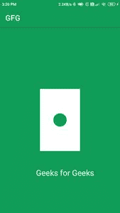

# 如何在安卓 app 中使用 Canvas API？

> 原文:[https://www . geesforgeks . org/如何使用-canvas-API-in-Android-apps/](https://www.geeksforgeeks.org/how-to-use-canvas-api-in-android-apps/)

Canvas API 也是安卓中使用最多的一个。API 本身的名字告诉我们，API 是用来在画板上画画的。在这个 API 的帮助下，我们可以绘制不同类型的形状，并创建 Android 中没有的自定义 UI 组件。在本文中，我们将看看 Canvas API，并在我们的应用程序中使用该 API 进行简单的设计。

### **什么是画布 API？**

画布应用编程接口是安卓系统中提供的一个绘图框架，在它的帮助下，我们可以在用户界面设计中创建像矩形、圆形等自定义形状。借助这个应用编程接口，我们可以为我们的应用程序绘制任何类型的形状。使用位图绘制不同的形状。

### **了解画布 API 的工作方式**

当使用这个应用编程接口时，用户设备的屏幕被称为画布，我们必须在上面绘制不同类型的形状和设计。有不同的方法用来在我们的画布上绘制不同的形状。以下是用于在画布上绘制形状的方法。

<figure class="table">

| 

方法

 | 

描述

 |
| --- | --- |
| onMeasure() | 这种方法是用来测量视图的大小以及该视图中孩子的在场情况。 |
| onDraw() | 这个方法是用来在我们的 Canvas 中绘制不同的视图的。用这种方法我们可以在画布上画出不同的形状。对于不同的形状有预定义的方法，比如 drawRect()，drawArc()，drawLine()等等。 |
| onLayout() | This method helps us set the size of the view. |

</figure>

### **分步实施**

**第一步:创建新项目**

要在安卓工作室创建新项目，请参考[如何在安卓工作室创建/启动新项目](https://www.geeksforgeeks.org/android-how-to-create-start-a-new-project-in-android-studio/)。注意选择 **Java** 作为编程语言。

**步骤 2:使用 activity_main.xml 文件**

导航到**应用程序> res >布局> activity_main.xml** 并将下面的代码添加到该文件中。下面是 **activity_main.xml** 文件的代码。

## 可扩展标记语言

```
<?xml version="1.0" encoding="utf-8"?>
<RelativeLayout 
    xmlns:android="http://schemas.android.com/apk/res/android"
    xmlns:tools="http://schemas.android.com/tools"
    android:id="@+id/idRLView"
    android:layout_width="match_parent"
    android:layout_height="match_parent"
    tools:context=".MainActivity">
</RelativeLayout>
```

**第三步:创建一个新的 Java 类来绘制我们的视图**

导航到**应用> java >你的应用的包名>右键点击它>新建> Java 类**并将其命名为**画图**并添加下面的代码。

## Java 语言(一种计算机语言，尤用于创建网站)

```
import android.annotation.SuppressLint;
import android.app.Activity;
import android.content.Context;
import android.graphics.Canvas;
import android.graphics.Color;
import android.graphics.Paint;
import android.util.DisplayMetrics;
import android.view.View;

public class PaintView extends View {

    // below we are creating variables for our paint
    Paint otherPaint, outerPaint, textPaint;

    // and a floating variable for our left arc.
    float arcLeft;

    @SuppressLint("ResourceAsColor")
    public PaintView(Context context) {
        super(context);

        // on below line we are initializing our paint variable for our text
        textPaint = new Paint(Paint.LINEAR_TEXT_FLAG | Paint.ANTI_ALIAS_FLAG);

        // on below line we are setting color to it.
        textPaint.setColor(Color.WHITE);

        // on below line we are setting text size to it.
        // In Paint we have to add text size using px so
        // we have created a method where we are converting dp to pixels.
        textPaint.setTextSize(pxFromDp(context, 24));

        // on below line we are initializing our outer paint
        outerPaint = new Paint();

        // on below line we are setting style to our paint.
        outerPaint.setStyle(Paint.Style.FILL);

        // on below line we are setting color to it.
        outerPaint.setColor(getResources().getColor(R.color.purple_200));

        // on below line we are creating a display metrics
        DisplayMetrics displayMetrics = new DisplayMetrics();

        // on below line we are getting display metrics.
        ((Activity) getContext()).getWindowManager()
                .getDefaultDisplay()
                .getMetrics(displayMetrics);

        // on below line we are assigning
        // the value to the arc left.
        arcLeft = pxFromDp(context, 20);

        // on below line we are creating 
        // a new variable for our paint
        otherPaint = new Paint();
    }

    // below method is use to generate px from DP.
    public static float pxFromDp(final Context context, final float dp) {
        return dp * context.getResources().getDisplayMetrics().density;
    }

    @Override
    protected void onDraw(Canvas canvas) {
        super.onDraw(canvas);

        // below four lines of code is use to add
        // back color to our screen which is green
        canvas.drawPaint(outerPaint);

        // on below line we are setting color to our paint.
        otherPaint.setColor(Color.WHITE);

        // on below line we are setting style to out paint.
        otherPaint.setStyle(Paint.Style.FILL);

        // below 4 lines of code is use to
        // create white rectangle of screen
        canvas.drawRect(
                getLeft() + (getRight() - getLeft()) / 3,
                getTop() + (getBottom() - getTop()) / 3,
                getRight() - (getRight() - getLeft()) / 3,
                getBottom() - (getBottom() - getTop()) / 3, otherPaint);

        // on below line we are changing the color for our paint.
        otherPaint.setColor(getResources().getColor(R.color.purple_200));

        // on below line we are drawing a circle and passing 
        // width, height, left arc and paint to add color.
        canvas.drawCircle(getWidth() / 2, getHeight() / 2, arcLeft, otherPaint);

        // on below line we are adding text using paint in our canvas.
        canvas.drawText("Geeks for Geeks", (float) (getWidth() * 0.3), (float) (getHeight() * 0.8), textPaint);
    }
}
```

**第四步:使用****MainActivity.java 文件**

转到**MainActivity.java**文件，参考以下代码。以下是**MainActivity.java**文件的代码。代码中添加了注释，以更详细地理解代码。

## Java 语言(一种计算机语言，尤用于创建网站)

```
import android.os.Bundle;
import android.widget.RelativeLayout;

import androidx.appcompat.app.AppCompatActivity;

public class MainActivity extends AppCompatActivity {

    // creating a variable for our relative layout
    private RelativeLayout relativeLayout;

    @Override
    protected void onCreate(Bundle savedInstanceState) {
        super.onCreate(savedInstanceState);
        setContentView(R.layout.activity_main);

        // initializing our view.
        relativeLayout = findViewById(R.id.idRLView);

        // calling our  paint view class and adding 
        // its view to our relative layout.
        PaintView paintView = new PaintView(this);
        relativeLayout.addView(paintView);
    }
}
```

现在运行您的应用程序，并查看应用程序的输出。

**输出:**

