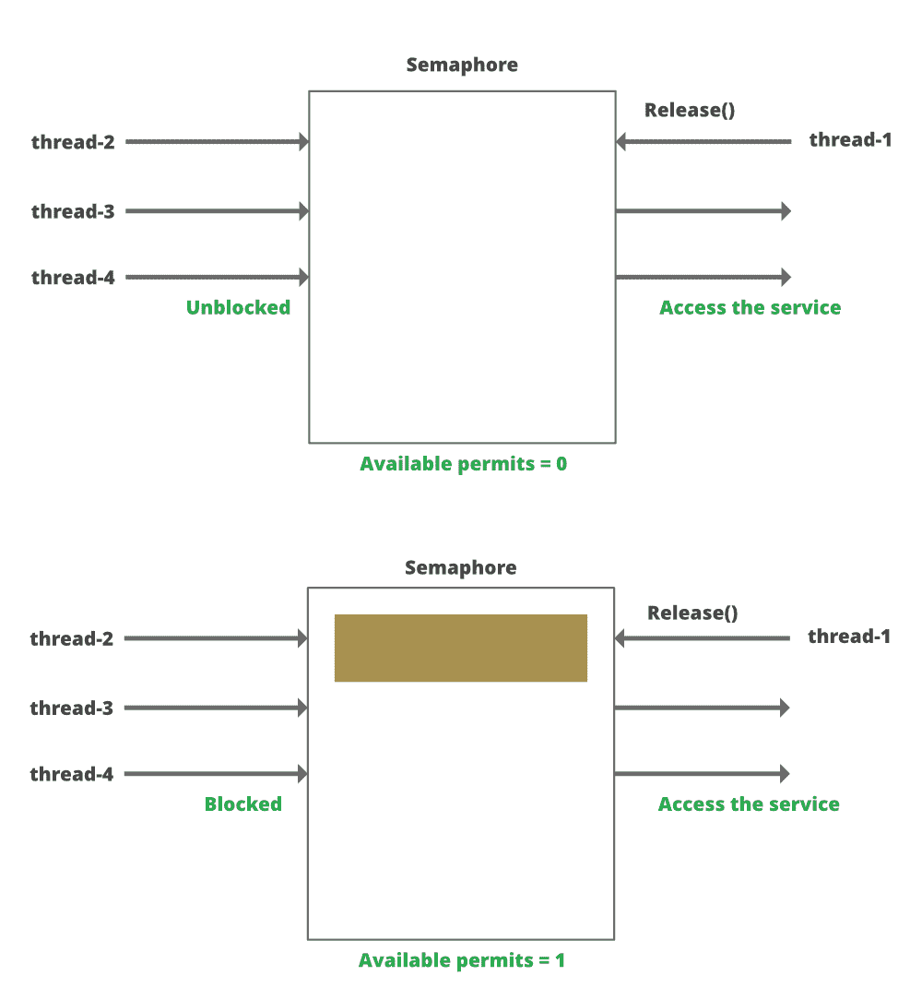

# 如何在并发 Java 应用中使用计数信号量？

> 原文:[https://www . geesforgeks . org/如何使用-计数-并发 java 中的信号量-应用/](https://www.geeksforgeeks.org/how-to-use-counting-semaphore-in-concurrent-java-application/)

Java [计数信号量](https://www.geeksforgeeks.org/semaphores-in-process-synchronization/)维护指定次数的传递或权限，当前[线程](https://www.geeksforgeeks.org/thread-in-operating-system/)必须获得访问共享资源的许可。如果除此之外的线程已经耗尽了一个许可，那么它可能会等待，直到由于不同线程释放了许可而使该许可变得可用。这个并发实用程序对于实现生产者-消费者设计模式或实现有限的资产池(如线程池、数据库连接池等)非常有用。类[*Java . util . Semaphore*](https://www.geeksforgeeks.org/java-util-concurrent-semaphore-class-java/)是一个计数信号量，用多个权限初始化。



***信号量提供两种主要的获取许可和释放许可的方法***

*   [*【获取】(*](https://www.geeksforgeeks.org/java-util-concurrent-semaphore-class-java/) ):此方法在有许可证的情况下获取许可证，并立即返回，将可用许可证的数量减少一个。如果当前线程在等待许可时被中断，则抛出[中断异常](https://www.geeksforgeeks.org/how-a-thread-can-interrupt-an-another-thread-in-java/)。
*   [*release()*](https://www.geeksforgeeks.org/java-util-concurrent-semaphore-class-java/)*:*此方法获取给定数量的许可(如果有)，并立即返回，将可用许可数量减少给定数量。如果当前线程在等待许可时被中断，则会引发中断异常。

**实施:**

二进制信号量被称为具有一个许可的计数信号量，因为它只有两个可用或不可用的状态许可。要执行互斥或只允许一个线程执行的关键部分，可以使用二进制信号量。线程等待获取()，直到线程通过在信号量上调用 release()允许在临界区内释放。下面是 java 信号量计数，其中二进制信号量用于提供对基本代码部分的共享独占访问

**示例:**

## Java 语言(一种计算机语言，尤用于创建网站)

```
// Java Program to illustrate use Counting Semaphore
// in Concurrent Java Application

import java.util.concurrent.Semaphore;

public class SemaphoreTest {

    // Initialize the semaphore with the number
    // of permits required

    // Here only 1 permit is allowed
    Semaphore binary = new Semaphore(1);

    // Main driver method
    public static void main(String args[])
    {

        final SemaphoreTest test = new SemaphoreTest();

        // Thread 1
        new Thread() {

            // Method that should be executed for thread1
            @Override public void run()
            {
                test.mutualExclusion();
            }
        }.start();

        // Thread 2
        new Thread() {

            // Method that should be executed for thread2
            @Override public void run()
            {
                test.mutualExclusion();
            }
        }.start();
    }

    // Method
    private void mutualExclusion()
    {

        // Try block to check for exceptions
        try {
            // acquire() acts as an input to semaphore
            // to check for available permits
            binary.acquire();

            // Mutual exclusive region

            System.out.println(
                Thread.currentThread().getName()
                + " inside mutual exclusive ");

            // sleep() method is used to hold thread for
            // sometime Parameter is nanoseconds to be
            // holded
            Thread.sleep(1000);
        }

        // Catch block to handle the exception

        // Handling exception if thread is interrupted
        // either before or during the activity
        catch (InterruptedException e) {

            // Print and display the line number where
            // exception occured
            e.printStackTrace();
        }

        finally {

            // release() method acts as output to semaphore
            // When thread operation is completed
            // release() method increase the permits
            // in the semaphore
            binary.release();

            // Printing the thread name
            // using the getName() method
            System.out.println(
                Thread.currentThread().getName()
                + " outside of mutual exclusive ");
        }
    }
}
```

**Output**

```
Thread-0 inside mutual exclusive 
Thread-1 inside mutual exclusive 
Thread-0 outside of mutual exclusive 
Thread-1 outside of mutual exclusive 
```