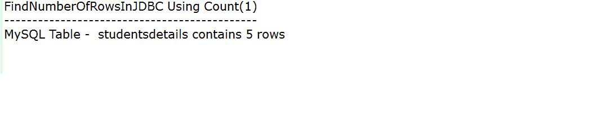
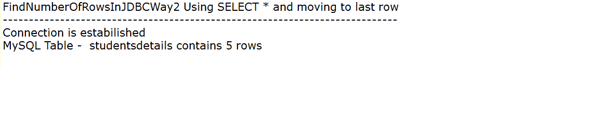

# 如何使用不同的行方法获取 JDBC 某表的行数？

> 原文:[https://www . geesforgeks . org/如何使用不同的行方法来获取 jdbc 中表的行数/](https://www.geeksforgeeks.org/how-to-use-different-row-methods-to-get-number-of-rows-in-a-table-in-jdbc/)

Java 支持许多数据库，对于每个数据库，我们需要将它们各自的 jar 文件放在构建路径中，以便进行 JDBC 连接。对于不同的数据库，导入不同的 jar 文件来建立下面给出的连接，或者为特定的数据库添加它们的构建路径。

*   数据库的类型
    *   SQL
        *   MySQL:MySQL-连接器-java-8.0.22
        *   一种数据库系统
        *   Oracle:odbc 14 . jar
        *   Microsoft SQL server
    *   [NoSQL](https://www.geeksforgeeks.org/introduction-to-nosql/)
        *   mongob:mongo Java 驱动程序-3.12.7
        *   大表格
        *   Redis
        *   进步
        *   [卡珊德拉](https://www.geeksforgeeks.org/features-of-cassandra/)
        *   CouchDB
        *   RavenDB

**说明:** SQL 和 Oracle 数据库多用于说明。这里考虑的是 SQL 数据库。这里表名是表名。在这里，它将接受所有的列并计算行数。

**输入:**表中现有数据如下图所示

*   使用的 SQL server:sqljdb C4 . jar
*   使用的 SQL 表


```
CREATE TABLE `studentsdetails` (
`id` int(6) unsigned NOT NULL,
`Name` varchar(50) NOT NULL,
`caste` varchar(10) NOT NULL,
`NeetMarks` int(11) NOT NULL,
`gender` varchar(10) DEFAULT NULL,
PRIMARY KEY (`id`)
) ENGINE=InnoDB DEFAULT CHARSET=latin1;
```

**接近:**

创建查询的效率较低的方法

```
select count(*) from Table_Name;
```

创建查询的更有效方法

```
select count(1) from Table_Name;
```

该查询将采用第一列并计算行数。因为主键通常是第一列，所以它足够理想，因为主键总是唯一且不为空。

<figure class="table">

| Example 1 | Example 2 |
| --- | --- |
| It will give only one row as the output with multiple rows. Therefore, "resultset" will be retained as the next one itself. | Select * will bring the whole resultset, and the cursor will be forced to move last. Finally, the' resultset. getrow ()' method will give the number of rows. |
| More efficient | The efficiency is relatively low |

</figure>

**示例 1:** 从“studentsdetails”中选择 count(1)来获取 JDBC 表中的行数，结果将为 5。

## Java 语言(一种计算机语言，尤用于创建网站)

```
/* Java Program to use different row methods
to get no of rows in a table in JDBC */

// Step 1: Importing database libraries
import java.sql.*;

// Only main class- GFG is shown
// connection class object is used
public class GFG {

    // Main driver method
    public static void main(String[] args)
    {

        // Initially connection is assigned Null valued
        Connection con = null;
        ResultSet res = null;

        // Try block to check exceptions
        try {

            /* Step 2: Load and register drivers or
               relevant jars in build path of project */

            // Here- 'mysql-connector-java-8.0.22'
            // is used using Class.forNmae() method
            Class.forName("com.mysql.cj.jdbc.Driver");

            /* Step 3: Establish a connection using
                       DriverManager method */
            con = DriverManager.getConnection(
                "jdbc:mysql://localhost:3306/test?serverTimezone=UTC",
                "root", "");

            // Try block to check exceptions
            try {
                Statement st = con.createStatement();
                /* This query will take first column and
                 count the rows. As mostly, Primary key is
                 the first column, it is ideal enough as
                 Primary key is always unique and not
                 null */

                /* Step 4: Create a statement */

                /* Alias name is used as NumberOfRows
                for COUNT(1) Moving the cursor to the
                last row */
                res = st.executeQuery(
                    "SELECT COUNT(1) as NumberOfRows FROM "
                    + "studentsdetails");

                /* Step 5: Execute the query */
                res.next();

                /* Step 6: Process the results */
                System.out.println(
                    "MySQL Table -  studentsdetails contains "
                    + res.getInt("NumberOfRows") + " rows");
            }

            // Catch block to handle exceptions
            catch (SQLException s) {
                // Message to be displayed if SQLException
                // occurs
                System.out.println(
                    "SQL statement is not executed!");
            }
        }
        catch (Exception e) {

            /* Displaying line where exception occured using
               method returning line number in code */
            e.printStackTrace();
        }

        finally {

            // Step 7: Closing the connection
            res = null;
            con = null;
        }
    }
}
```

**输出:**



**示例 2:** 获取 JDBC 表中的行数

## Java 语言(一种计算机语言，尤用于创建网站)

```
/* Step 1: Importing Database libraries */
import java.sql.*;

/* Only main class-GFG is shown
Connection class of JDBC is not shown.
Object of connection class is used */
public class GFG {

    // Main driver method
    public static void main(String[] args)
    {

        /* Objects are assigned null
          before any execution */

        // Connection class objects
        Connection con = null;
        ResultSet res = null;

        // Try block to check exceptions
        try {

            /* Step 2: Load and register drivers
            or relevant jars in build path of project */

            // Driver used- 'mysql-connector-java-8.0.22'

            // Loading and register drivers
            // using Class.forname() method
            Class.forName("com.mysql.cj.jdbc.Driver");

            /* Step 3: Create a connection */
            // using DriverManager
            con = DriverManager.getConnection(
                "jdbc:mysql://localhost:3306/test?serverTimezone=UTC",
                "root", "");

            // Display message when connection
            // is successfully established
            System.out.println(
                "Connection is established");

            // Try block to check exceptions
            try {

                /* In order to avoid Result set type is
                 TYPE_FORWARD_ONLY */

                Statement st = con.createStatement(
                    ResultSet.TYPE_SCROLL_SENSITIVE,
                    ResultSet.CONCUR_READ_ONLY);
                /* Query takes first column and
                 count the rows. As mostly, Primary key is
                  the first column, it is ideal enough as
                  Primary key is always unique & not null.
                 */

                /* Step 4: Creating the statement */
                res = st.executeQuery("SELECT *  FROM "
                                      + "studentsdetails");
                /* Step 5: Execute the statements */
                // Moving the cursor to the last row
                res.last();

                /* Step 6: Process the results */
                System.out.println(
                    "MySQL Table -  studentsdetails contains "
                    + res.getRow() + " rows");
            }

            // Catch block to handle exceptions
            catch (SQLException s) {

                // Exception handled if it is SQL based
                System.out.println(
                    "SQL statement is not executed!"
                    + s.getMessage());
            }
        }
        catch (Exception e) {

            // Exception handled here if it is generic
            // program based
            e.printStackTrace();
        }
        finally {

            // Step 7: Closing the connection
            res = null;
            con = null;
        }
    }
}
```

**输出:**

