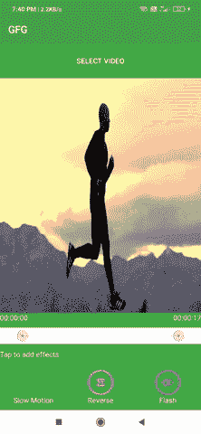

# 如何用示例在安卓系统中使用 FFmpeg？

> 原文:[https://www . geesforgeks . org/how-用法-ffmpeg-in-Android-with-example/](https://www.geeksforgeeks.org/how-to-use-ffmpeg-in-android-with-example/)

**FFmpeg，Fast-forward MPEG 的简称，是一个自由开源的多媒体框架，能够对迄今为止已经创建的各种多媒体文件进行解码、编码、转码、mux、demux、流式传输、过滤和公平播放。**还支持一些最老的格式。FFmpeg 编译并运行，跨各种操作系统，如 Linux、Mac OS X、微软视窗、BSDs、Solaris 等。在大量的构建环境、机器架构和配置中。FFmpeg 中使用的编程语言有 C 语言和汇编语言。我们可以使用 Ffmpeg 做很多有趣的事情，比如，**视频压缩，音频压缩，修剪视频，旋转视频，裁剪视频，给视频添加滤镜，反转视频，创建快速和慢速视频，淡入淡出，合并音频和视频，从图像创建视频，将视频从一种格式转换为另一种格式，从视频中提取图片或从视频中提取声音，Gifs 叠加等等。** FFmpeg 是其他数百个媒体相关软件项目工作流程的一部分，经常在幕后使用。而且，它是 VLC 媒体播放器、YouTube、Plex、iTunes、快捷方式、Blender、Kodi、手刹等软件的内部部分，它在谷歌 Chrome 和 Linux 版本的 Firefox 中处理视频和音频播放。FFmpeg 由大量的库和项目组成，用于处理视频、声音和其他多媒体文件和流。

## FFmpeg 库

*   **libavutil** 是一个帮助多功能媒体编程的实用程序库。它包含可移植的字符串函数、任意数字生成器、额外的算术能力、数据结构、加密和核心多媒体实用程序。
*   **libavcodec** 是一个为视频/音频编解码器、字幕流和多个比特流通道提供编码器和解码器的库。
*   **libavformat** 是一个为视频/音频编解码器、字幕流
*   **libavdevice** 是一个包含输入/输出设备的库，用于从众多多媒体输入/输出编程系统(包括 Video4Linux、ALSA 和 VfW)获取和向其传递信息。
*   **libavfilter** 库提供了一个包含多个过滤器和接收器的媒体过滤框架。
*   **libswscale** 库执行异常增强的图片缩放和像素格式转换任务。
*   **libswresample** 是一个执行高度优化但音频速率有损变化、通道布局变化(例如从立体声到单声道)和样本格式转换操作的库。

安卓没有高效、健壮的多媒体应用编程接口，无法提供像 FFmpeg 这样的功能。安卓唯一拥有的 API 是 MediaCodec API，但它比 FFmpeg 更快，因为它使用设备硬件进行视频处理。

## **使用 FFmpeg 在安卓工作室创建一个小视频编辑器应用**

**先决条件:**

在开始之前，我们需要设置一个环境来运行我们的 FFmpeg 命令。这样做有两种选择:

*   通过建造我们自己的图书馆
*   通过使用社区提供的任何编译源。安卓系统中有很多库可以用来执行 FFmpeg 操作。例如，
    *   书写数字
    *   虚张声势
    *   tanner/mobile ffmpeg
    *   yanjie 10930/EpMedia:这个库中有许多内置的功能，您可以从中剪辑、裁剪、旋转、添加徽标、添加自定义滤镜、合并不同的视频。

虽然强烈建议构建您的库，因为这将减少您的 apk 大小，但您可以添加第三方库，并可以根据需要随时更新库。但是，这个过程非常耗时，需要额外的技能。因此，作为初学者，您可以使用上面提到的一些库，如果您遇到一些问题，您可以在他们各自的 GitHub 存储库中提出这个问题。在下面的例子中，我将使用 **tanersener/mobile-ffmpeg，**，因为它支持安卓 10 范围的存储，也是互联网上最好的 FFmpeg mobile 库。下面给出了一个 GIF 示例，来了解一下我们将在本文中做什么。注意，我们将使用 **Java** 语言来实现这个项目。



### 逐步实施

**第一步:创建新项目**

要在安卓工作室创建新项目，请参考[如何在安卓工作室创建/启动新项目](https://www.geeksforgeeks.org/android-how-to-create-start-a-new-project-in-android-studio/)。注意选择 **Java** 作为编程语言。

**第 2 步:向 build.gradle 文件添加依赖关系**

我们将使用 tanersener/mobile-ffmpeg 库在我们的应用程序中实现 ffmpeg 功能。我们还需要一个 rangeseekbar 来选择视频的特定长度。所以在 [build.gradle](https://www.geeksforgeeks.org/android-build-gradle/) 文件中添加这些依赖项。

> *   实现 com。arthenica:mobile-ffmpeg-full:4.4 '
> *   实现组织。弗洛雷斯·库。安卓。rangeseekbar:rangeseekbar-库:0。3 .0'

**步骤 3:使用 colors.xml 文件**

下面是 **colors.xml** 文件的代码。

## 可扩展标记语言

```java
<?xml version="1.0" encoding="utf-8"?>
<resources>
    <color name="colorPrimary">#3F51B5</color>
    <color name="colorPost">#0091EA</color>
    <color name="colorPrimaryDark">#303F9F</color>
    <color name="colorAccent">#E25E14</color>
    <color name="colorAccentTrans">#BEE25E14</color>

    <color name="maincolor">#E25E14</color>

    <color name="yellow">#feeb3c</color>
    <color name="white">#fff</color>
    <color name="semitranswhitecolor">#00FFFFFF</color>
    <color name="colorwhite_50">#CCffffff</color>
    <color name="colorwhite_10">#1Affffff</color>
    <color name="colorwhite_30">#4Dffffff</color>
    <color name="black">#2F2F2F</color>
    <color name="graycolor">#D3D3D3</color>
    <color name="graycolor2">#C5C4C4</color>
    <color name="gainsboro">#DCDCDC</color>
    <color name="lightgraycolor">#f2f2f2</color>
    <color name="darkgray">#93959A</color>
    <color name="darkgraytrans">#9493959A</color>
    <color name="darkgraytransPost">#9BC5C6C9</color>
    <color name="dimgray">#696969</color>
    <color name="lightblack">#5d5d5d</color>

    <color name="delete_message_bg">#f2f2f2</color>
    <color name="delete_message_text">#b8b8b8</color>

    <color name="transparent">#00ffffff</color>
    <color name="fifty_transparent_black">#802F2F2F</color>

    <color name="redcolor">#ff0008</color>
    <color name="semitransredcolor">#93FF0008</color>
    <color name="semitransredcolornew">#918E8E</color>

    <color name="color_gray_alpha">#65b7b7b7</color>
    <color name="app_blue">#0e1f2f</color>
    <color name="text_color">#000000</color>
    <color name="seekbar_color">#3be3e3</color>
    <color name="line_color">#FF15FF00</color>
    <color name="shadow_color">#00000000</color>

    <color name="app_color">#c52127</color>

</resources>
```

**第 4 步:使用 activity_main.xml 文件**

转到 **activity_main.xml** 文件，参考以下代码。下面是 **activity_main.xml** 文件的代码。

## 可扩展标记语言

```java
<?xml version="1.0" encoding="utf-8"?>
<RelativeLayout
    xmlns:android="http://schemas.android.com/apk/res/android"
    xmlns:app="http://schemas.android.com/apk/res-auto"
    xmlns:tools="http://schemas.android.com/tools"
    android:layout_width="match_parent"
    android:layout_height="match_parent"
    android:background="#43AF47"
    tools:context=".MainActivity">

    <RelativeLayout
        android:id="@+id/relative1"
        android:layout_width="match_parent"
        android:layout_height="wrap_content"
        android:layout_alignParentTop="true"
        android:layout_margin="10dp">

        <Button
            android:id="@+id/cancel_button"
            android:layout_width="wrap_content"
            android:layout_height="wrap_content"
            android:layout_centerInParent="true"
            android:background="@color/transparent"
            android:text="Select Video"
            android:textColor="@color/white" />

    </RelativeLayout>

    <VideoView
        android:id="@+id/layout_movie_wrapper"
        android:layout_width="match_parent"
        android:layout_height="match_parent"
        android:layout_above="@+id/relative"
        android:layout_below="@+id/relative1" />

    <TextView
        android:id="@+id/progressbar"
        android:layout_width="wrap_content"
        android:layout_height="wrap_content"
        android:layout_centerInParent="true"
        android:paddingBottom="5dp" />

    <RelativeLayout
        android:id="@+id/imagelinear"
        android:layout_width="match_parent"
        android:layout_height="match_parent"
        android:layout_above="@+id/relative"
        android:layout_below="@+id/relative1"
        android:layout_centerInParent="true">

        <TextView
            android:id="@+id/overlaytextview"
            android:layout_width="wrap_content"
            android:layout_height="wrap_content"
            android:layout_centerInParent="true"
            android:text="Raghav"
            android:textAppearance="@style/TextAppearance.AppCompat.Medium"
            android:textColor="@color/white"
            android:textStyle="bold"
            android:visibility="gone" />

        <ImageView
            android:id="@+id/overlayimage"
            android:layout_width="match_parent"
            android:layout_height="match_parent"
            android:layout_centerInParent="true"
            android:scaleType="fitXY" />
    </RelativeLayout>

    <LinearLayout

        android:id="@+id/relative"
        android:layout_width="match_parent"
        android:layout_height="wrap_content"
        android:layout_alignParentBottom="true"
        android:orientation="vertical">

        <RelativeLayout
            android:layout_width="match_parent"
            android:layout_height="wrap_content">

            <TextView
                android:id="@+id/textleft"
                android:layout_width="wrap_content"
                android:layout_height="wrap_content"
                android:layout_alignParentStart="true"
                android:layout_marginBottom="10dp"
                android:text="00:00"
                android:textColor="@color/white" />

            <TextView
                android:id="@+id/textright"
                android:layout_width="wrap_content"
                android:layout_height="wrap_content"
                android:layout_alignParentEnd="true"
                android:layout_marginBottom="10dp"
                android:layout_weight="1"
                android:text="00:00"
                android:textAlignment="textEnd"
                android:textColor="@color/white" />
        </RelativeLayout>

        <RelativeLayout
            android:layout_width="match_parent"
            android:layout_height="wrap_content"
            android:background="@color/white">

            <org.florescu.android.rangeseekbar.RangeSeekBar

                android:id="@+id/rangeSeekBar"
                android:layout_width="match_parent"
                android:layout_height="wrap_content"
                app:activeColor="@color/white"
                app:alwaysActive="true"
                app:barHeight="2dp"
                app:showLabels="false"
                app:textAboveThumbsColor="#000000" />

        </RelativeLayout>

        <LinearLayout
            android:layout_width="match_parent"
            android:layout_height="10dp" />

        <RelativeLayout
            android:layout_width="match_parent"
            android:layout_height="wrap_content">

            <LinearLayout
                android:id="@+id/lineartime"
                android:layout_width="match_parent"
                android:layout_height="wrap_content"
                android:orientation="vertical">

                <TextView
                    android:id="@+id/text"
                    android:layout_width="wrap_content"
                    android:layout_height="wrap_content"
                    android:layout_marginBottom="10dp"
                    android:text=""
                    android:textColor="@color/semitransredcolornew" />

                <LinearLayout
                    android:layout_width="match_parent"
                    android:layout_height="wrap_content"
                    android:orientation="horizontal">

                    <LinearLayout
                        android:layout_width="wrap_content"
                        android:layout_height="wrap_content"
                        android:layout_margin="10dp"
                        android:layout_weight="1"
                        android:orientation="vertical">

                        <ImageButton

                            android:id="@+id/slow"
                            android:layout_width="50dp"
                            android:layout_height="50dp"
                            android:layout_gravity="center"
                            android:background="@color/transparent"
                            android:scaleType="fitXY"
                            android:src="@drawable/icon_effect_slow" />

                        <TextView
                            android:layout_width="match_parent"
                            android:layout_height="wrap_content"
                            android:text="Slow Motion"
                            android:textAlignment="center"
                            android:textColor="@color/white" />
                    </LinearLayout>

                    <LinearLayout
                        android:layout_width="wrap_content"
                        android:layout_height="wrap_content"
                        android:layout_margin="10dp"
                        android:layout_weight="1"
                        android:orientation="vertical">

                        <ImageButton
                            android:id="@+id/reverse"
                            android:layout_width="50dp"
                            android:layout_height="50dp"
                            android:layout_gravity="center"
                            android:background="@color/transparent"
                            android:scaleType="fitXY"
                            android:src="@drawable/icon_effect_time" />

                        <TextView
                            android:layout_width="match_parent"
                            android:layout_height="wrap_content"
                            android:text="Reverse"
                            android:textAlignment="center"
                            android:textColor="@color/white" />
                    </LinearLayout>

                    <LinearLayout
                        android:layout_width="wrap_content"
                        android:layout_height="wrap_content"
                        android:layout_margin="10dp"
                        android:layout_weight="1"
                        android:orientation="vertical">

                        <ImageButton
                            android:id="@+id/fast"
                            android:layout_width="50dp"
                            android:layout_height="50dp"
                            android:layout_gravity="center"
                            android:background="@color/transparent"
                            android:scaleType="fitXY"
                            android:src="@drawable/icon_effect_repeatedly" />

                        <TextView
                            android:layout_width="match_parent"
                            android:layout_height="wrap_content"
                            android:text="Flash"
                            android:textAlignment="center"
                            android:textColor="@color/white" />
                    </LinearLayout>

                </LinearLayout>
            </LinearLayout>

            <LinearLayout
                android:id="@+id/lineareffects"
                android:layout_width="match_parent"
                android:layout_height="wrap_content"
                android:orientation="vertical">

                <TextView
                    android:id="@+id/text2"
                    android:layout_width="wrap_content"
                    android:layout_height="wrap_content"
                    android:layout_marginBottom="10dp"
                    android:text="Tap to add effects"
                    android:textColor="@color/white" />
            </LinearLayout>

        </RelativeLayout>
    </LinearLayout>

</RelativeLayout>
```

**步骤 5:使用 MainActivity.java 文件**

转到**MainActivity.java**文件，参考以下代码。以下是**MainActivity.java**文件的代码。代码中添加了注释，以更详细地理解代码。

## Java 语言(一种计算机语言，尤用于创建网站)

```java
import android.app.ProgressDialog;
import android.content.ContentValues;
import android.content.Intent;
import android.media.MediaPlayer;
import android.net.Uri;
import android.os.Build;
import android.os.Bundle;
import android.os.Environment;
import android.os.Handler;
import android.provider.MediaStore;
import android.util.Log;
import android.view.View;
import android.widget.Button;
import android.widget.ImageButton;
import android.widget.TextView;
import android.widget.Toast;
import android.widget.VideoView;
import androidx.annotation.Nullable;
import androidx.appcompat.app.AppCompatActivity;
import com.arthenica.mobileffmpeg.Config;
import com.arthenica.mobileffmpeg.ExecuteCallback;
import com.arthenica.mobileffmpeg.FFmpeg;
import org.florescu.android.rangeseekbar.RangeSeekBar;
import java.io.File;
import static com.arthenica.mobileffmpeg.Config.RETURN_CODE_CANCEL;
import static com.arthenica.mobileffmpeg.Config.RETURN_CODE_SUCCESS;

public class MainActivity extends AppCompatActivity {

    private ImageButton reverse, slow, fast;
    private Button cancel;
    private TextView tvLeft, tvRight;
    private ProgressDialog progressDialog;
    private String video_url;
    private VideoView videoView;
    private Runnable r;
    private RangeSeekBar rangeSeekBar;
    private static final String root = Environment.getExternalStorageDirectory().toString();
    private static final String app_folder = root + "/GFG/";

    @Override
    protected void onCreate(Bundle savedInstanceState) {
        super.onCreate(savedInstanceState);
        setContentView(R.layout.activity_main);

        rangeSeekBar = (RangeSeekBar) findViewById(R.id.rangeSeekBar);
        tvLeft = (TextView) findViewById(R.id.textleft);
        tvRight = (TextView) findViewById(R.id.textright);
        slow = (ImageButton) findViewById(R.id.slow);
        reverse = (ImageButton) findViewById(R.id.reverse);
        fast = (ImageButton) findViewById(R.id.fast);
        cancel = (Button) findViewById(R.id.cancel_button);
        fast = (ImageButton) findViewById(R.id.fast);
        videoView = (VideoView) findViewById(R.id.layout_movie_wrapper);

        // creating the progress dialog
        progressDialog = new ProgressDialog(MainActivity.this);
        progressDialog.setMessage("Please wait..");
        progressDialog.setCancelable(false);
        progressDialog.setCanceledOnTouchOutside(false);

        // set up the onClickListeners
        cancel.setOnClickListener(new View.OnClickListener() {
            @Override
            public void onClick(View v) {
                // create an intent to retrieve the video
                // file from the device storage
                Intent intent = new Intent(
                        Intent.ACTION_PICK,
                        android.provider.MediaStore.Video.Media.EXTERNAL_CONTENT_URI);
                        intent.setType("video/*");
                startActivityForResult(intent, 123);
            }
        });

        slow.setOnClickListener(new View.OnClickListener() {
            @Override
            public void onClick(View v) {
                // check if the user has selected any video or not
                // In case a user hasn't selected any video and press the button,
                // we will show an warning, stating "Please upload the video"
                if (video_url != null) {
                    // a try-catch block to handle all necessary exceptions
                    // like File not found, IOException
                    try {
                        slowmotion(rangeSeekBar.getSelectedMinValue().intValue() * 1000, rangeSeekBar.getSelectedMaxValue().intValue() * 1000);
                    } catch (Exception e) {
                        Toast.makeText(MainActivity.this, e.toString(), Toast.LENGTH_SHORT).show();
                        e.printStackTrace();
                    }
                } else
                    Toast.makeText(MainActivity.this, "Please upload video", Toast.LENGTH_SHORT).show();
            }
        });
        fast.setOnClickListener(new View.OnClickListener() {
            @Override
            public void onClick(View v) {
                if (video_url != null) {

                    try {
                        fastforward(rangeSeekBar.getSelectedMinValue().intValue() * 1000, rangeSeekBar.getSelectedMaxValue().intValue() * 1000);
                    } catch (Exception e) {
                        e.printStackTrace();
                        Toast.makeText(MainActivity.this, e.toString(), Toast.LENGTH_SHORT).show();
                    }
                } else
                    Toast.makeText(MainActivity.this, "Please upload video", Toast.LENGTH_SHORT).show();
            }
        });
        reverse.setOnClickListener(new View.OnClickListener() {
            @Override
            public void onClick(View v) {
                if (video_url != null) {
                    try {
                        reverse(rangeSeekBar.getSelectedMinValue().intValue() * 1000, rangeSeekBar.getSelectedMaxValue().intValue() * 1000);
                    } catch (Exception e) {
                        e.printStackTrace();
                        Toast.makeText(MainActivity.this, e.toString(), Toast.LENGTH_SHORT).show();
                    }
                } else
                    Toast.makeText(MainActivity.this, "Please upload video", Toast.LENGTH_SHORT).show();
            }
        });

        // set up the VideoView.
        // We will be using VideoView to view our video
        videoView.setOnPreparedListener(new MediaPlayer.OnPreparedListener() {
            @Override
            public void onPrepared(MediaPlayer mp) {
                // get the duration of the video
                int duration = mp.getDuration() / 1000;

                // initially set the left TextView to "00:00:00"
                tvLeft.setText("00:00:00");

                // initially set the right Text-View to the video length
                // the getTime() method returns a formatted string in hh:mm:ss
                tvRight.setText(getTime(mp.getDuration() / 1000));

                // this will run he video in loop
                // i.e. the video won't stop
                // when it reaches its duration
                mp.setLooping(true);

                // set up the initial values of rangeSeekbar
                rangeSeekBar.setRangeValues(0, duration);
                rangeSeekBar.setSelectedMinValue(0);
                rangeSeekBar.setSelectedMaxValue(duration);
                rangeSeekBar.setEnabled(true);

                rangeSeekBar.setOnRangeSeekBarChangeListener(new RangeSeekBar.OnRangeSeekBarChangeListener() {
                    @Override
                    public void onRangeSeekBarValuesChanged(RangeSeekBar bar, Object minValue, Object maxValue) {
                        // we seek through the video when the user
                        // drags and adjusts the seekbar
                        videoView.seekTo((int) minValue * 1000);

                        // changing the left and right TextView according to
                        // the minValue and maxValue
                        tvLeft.setText(getTime((int) bar.getSelectedMinValue()));
                        tvRight.setText(getTime((int) bar.getSelectedMaxValue()));
                    }
                });

                // this method changes the right TextView every 1 second
                // as the video is being played
                // It works same as a time counter we see in any Video Player
                final Handler handler = new Handler();
                handler.postDelayed(r = new Runnable() {
                    @Override
                    public void run() {
                        if (videoView.getCurrentPosition() >= rangeSeekBar.getSelectedMaxValue().intValue() * 1000)
                            videoView.seekTo(rangeSeekBar.getSelectedMinValue().intValue() * 1000);
                        handler.postDelayed(r, 1000);
                    }
                }, 1000);
            }
        });
    }

    // Method for creating fast motion video
    private void fastforward(int startMs, int endMs) throws Exception {
        // startMs is the starting time, from where we have to apply the effect.
        // endMs is the ending time, till where we have to apply effect.
        // For example, we have a video of 5min and we only want to fast forward a part of video
        // say, from 1:00 min to 2:00min, then our startMs will be 1000ms and endMs will be 2000ms.
        // create a progress dialog and show it until this method executes.
        progressDialog.show();

        // creating a new file in storage
        final String filePath;
        String filePrefix = "fastforward";
        String fileExtn = ".mp4";
        if (Build.VERSION.SDK_INT >= Build.VERSION_CODES.Q) {
            // With introduction of scoped storage in Android Q the primitive method gives error
            // So, it is recommended to use the below method to create a video file in storage.
            ContentValues valuesvideos = new ContentValues();
            valuesvideos.put(MediaStore.Video.Media.RELATIVE_PATH, "Movies/" + "Folder");
            valuesvideos.put(MediaStore.Video.Media.TITLE, filePrefix + System.currentTimeMillis());
            valuesvideos.put(MediaStore.Video.Media.DISPLAY_NAME, filePrefix + System.currentTimeMillis() + fileExtn);
            valuesvideos.put(MediaStore.Video.Media.MIME_TYPE, "video/mp4");
            valuesvideos.put(MediaStore.Video.Media.DATE_ADDED, System.currentTimeMillis() / 1000);
            valuesvideos.put(MediaStore.Video.Media.DATE_TAKEN, System.currentTimeMillis());
            Uri uri = getContentResolver().insert(MediaStore.Video.Media.EXTERNAL_CONTENT_URI, valuesvideos);

            // get the path of the video file created in the storage.
            File file = FileUtils.getFileFromUri(this, uri);
            filePath = file.getAbsolutePath();

        } else {
            // This else statement will work for devices with Android version lower than 10
            // Here, "app_folder" is the path to your app's root directory in device storage
            File dest = new File(new File(app_folder), filePrefix + fileExtn);
            int fileNo = 0;
            // check if the file name previously exist. Since we don't want
            // to overwrite the video files
            while (dest.exists()) {
                fileNo++;
                dest = new File(new File(app_folder), filePrefix + fileNo + fileExtn);
            }
            // Get the filePath once the file is successfully created.
            filePath = dest.getAbsolutePath();
        }
        String exe;
        // the "exe" string contains the command to process video.The details of command are discussed later in this post.
        // "video_url" is the url of video which you want to edit. You can get this url from intent by selecting any video from gallery.
        exe = "-y -i " + video_url + " -filter_complex [0:v]trim=0:" + startMs / 1000 + ",setpts=PTS-STARTPTS[v1];[0:v]trim=" + startMs / 1000 + ":" + endMs / 1000 + ",setpts=0.5*(PTS-STARTPTS)[v2];[0:v]trim=" + (endMs / 1000) + ",setpts=PTS-STARTPTS[v3];[0:a]atrim=0:" + (startMs / 1000) + ",asetpts=PTS-STARTPTS[a1];[0:a]atrim=" + (startMs / 1000) + ":" + (endMs / 1000) + ",asetpts=PTS-STARTPTS,atempo=2[a2];[0:a]atrim=" + (endMs / 1000) + ",asetpts=PTS-STARTPTS[a3];[v1][a1][v2][a2][v3][a3]concat=n=3:v=1:a=1 " + "-b:v 2097k -vcodec mpeg4 -crf 0 -preset superfast " + filePath;

        // Here, we have used he Async task to execute our query because
        // if we use the regular method the progress dialog
        // won't be visible. This happens because the regular method and
        // progress dialog uses the same thread to execute
        // and as a result only one is a allowed to work at a time.
        // By using we Async task we create a different thread which resolves the issue.
        long executionId = FFmpeg.executeAsync(exe, new ExecuteCallback() {
            @Override
            public void apply(final long executionId, final int returnCode) {
                if (returnCode == RETURN_CODE_SUCCESS) {
                    // after successful execution of ffmpeg command,
                    // again set up the video Uri in VideoView
                    videoView.setVideoURI(Uri.parse(filePath));

                    // change the video_url to filePath, so that we could
                    // do more manipulations in the
                    // resultant video. By this we can apply as many effects
                    // as we want in a single video.
                    // Actually there are multiple videos being formed in
                    // storage but while using app it
                    // feels like we are doing manipulations in only one video
                    video_url = filePath;
                    // play the result video in VideoView
                    videoView.start();
                    // remove the progress dialog
                    progressDialog.dismiss();
                } else if (returnCode == RETURN_CODE_CANCEL) {
                    Log.i(Config.TAG, "Async command execution cancelled by user.");
                } else {
                    Log.i(Config.TAG, String.format("Async command execution failed with returnCode=%d.", returnCode));
                }
            }
        });
    }

    // Method for creating slow motion video for specific part of the video
    // The below code is same as above only the command in string "exe" is changed
    private void slowmotion(int startMs, int endMs) throws Exception {

        progressDialog.show();
        final String filePath;
        String filePrefix = "slowmotion";
        String fileExtn = ".mp4";
        if (Build.VERSION.SDK_INT >= Build.VERSION_CODES.Q) {

            ContentValues valuesvideos = new ContentValues();
            valuesvideos.put(MediaStore.Video.Media.RELATIVE_PATH, "Movies/" + "Folder");
            valuesvideos.put(MediaStore.Video.Media.TITLE, filePrefix + System.currentTimeMillis());
            valuesvideos.put(MediaStore.Video.Media.DISPLAY_NAME, filePrefix + System.currentTimeMillis() + fileExtn);
            valuesvideos.put(MediaStore.Video.Media.MIME_TYPE, "video/mp4");
            valuesvideos.put(MediaStore.Video.Media.DATE_ADDED, System.currentTimeMillis() / 1000);
            valuesvideos.put(MediaStore.Video.Media.DATE_TAKEN, System.currentTimeMillis());
            Uri uri = getContentResolver().insert(MediaStore.Video.Media.EXTERNAL_CONTENT_URI, valuesvideos);
            File file = FileUtils.getFileFromUri(this, uri);
            filePath = file.getAbsolutePath();

        } else {
            File dest = new File(new File(app_folder), filePrefix + fileExtn);
            int fileNo = 0;
            while (dest.exists()) {
                fileNo++;
                dest = new File(new File(app_folder), filePrefix + fileNo + fileExtn);
            }
            filePath = dest.getAbsolutePath();
        }
        String exe;
        exe = "-y -i " + video_url + " -filter_complex [0:v]trim=0:" + startMs / 1000 + ",setpts=PTS-STARTPTS[v1];[0:v]trim=" + startMs / 1000 + ":" + endMs / 1000 + ",setpts=2*(PTS-STARTPTS)[v2];[0:v]trim=" + (endMs / 1000) + ",setpts=PTS-STARTPTS[v3];[0:a]atrim=0:" + (startMs / 1000) + ",asetpts=PTS-STARTPTS[a1];[0:a]atrim=" + (startMs / 1000) + ":" + (endMs / 1000) + ",asetpts=PTS-STARTPTS,atempo=0.5[a2];[0:a]atrim=" + (endMs / 1000) + ",asetpts=PTS-STARTPTS[a3];[v1][a1][v2][a2][v3][a3]concat=n=3:v=1:a=1 " + "-b:v 2097k -vcodec mpeg4 -crf 0 -preset superfast " + filePath;

        long executionId = FFmpeg.executeAsync(exe, new ExecuteCallback() {

            @Override
            public void apply(final long executionId, final int returnCode) {
                if (returnCode == RETURN_CODE_SUCCESS) {

                    videoView.setVideoURI(Uri.parse(filePath));
                    video_url = filePath;
                    videoView.start();
                    progressDialog.dismiss();

                } else if (returnCode == RETURN_CODE_CANCEL) {
                    Log.i(Config.TAG, "Async command execution cancelled by user.");
                } else {
                    Log.i(Config.TAG, String.format("Async command execution failed with returnCode=%d.", returnCode));
                }
            }
        });
    }

    // Method for reversing the video
    // The below code is same as above only the command is changed.
    private void reverse(int startMs, int endMs) throws Exception {
        progressDialog.show();
        String filePrefix = "reverse";
        String fileExtn = ".mp4";

        final String filePath;
        if (Build.VERSION.SDK_INT >= Build.VERSION_CODES.Q) {

            ContentValues valuesvideos = new ContentValues();
            valuesvideos.put(MediaStore.Video.Media.RELATIVE_PATH, "Movies/" + "Folder");
            valuesvideos.put(MediaStore.Video.Media.TITLE, filePrefix + System.currentTimeMillis());
            valuesvideos.put(MediaStore.Video.Media.DISPLAY_NAME, filePrefix + System.currentTimeMillis() + fileExtn);
            valuesvideos.put(MediaStore.Video.Media.MIME_TYPE, "video/mp4");
            valuesvideos.put(MediaStore.Video.Media.DATE_ADDED, System.currentTimeMillis() / 1000);
            valuesvideos.put(MediaStore.Video.Media.DATE_TAKEN, System.currentTimeMillis());
            Uri uri = getContentResolver().insert(MediaStore.Video.Media.EXTERNAL_CONTENT_URI, valuesvideos);
            File file = FileUtils.getFileFromUri(this, uri);
            filePath = file.getAbsolutePath();

        } else {
            filePrefix = "reverse";
            fileExtn = ".mp4";
            File dest = new File(new File(app_folder), filePrefix + fileExtn);
            int fileNo = 0;
            while (dest.exists()) {
                fileNo++;
                dest = new File(new File(app_folder), filePrefix + fileNo + fileExtn);
            }
            filePath = dest.getAbsolutePath();
        }

        long executionId = FFmpeg.executeAsync("-y -i " + video_url + " -filter_complex [0:v]trim=0:" + endMs / 1000 + ",setpts=PTS-STARTPTS[v1];[0:v]trim=" + startMs / 1000 + ":" + endMs / 1000 + ",reverse,setpts=PTS-STARTPTS[v2];[0:v]trim=" + (startMs / 1000) + ",setpts=PTS-STARTPTS[v3];[v1][v2][v3]concat=n=3:v=1 " + "-b:v 2097k -vcodec mpeg4 -crf 0 -preset superfast " + filePath, new ExecuteCallback() {
            @Override
            public void apply(final long executionId, final int returnCode) {
                if (returnCode == RETURN_CODE_SUCCESS) {
                    videoView.setVideoURI(Uri.parse(filePath));
                    video_url = filePath;
                    videoView.start();
                    progressDialog.dismiss();
                } else if (returnCode == RETURN_CODE_CANCEL) {
                    Log.i(Config.TAG, "Async command execution cancelled by user.");
                } else {
                    Log.i(Config.TAG, String.format("Async command execution failed with returnCode=%d.", returnCode));
                }
            }
        });
    }

    // Overriding the method onActivityResult()
    // to get the video Uri form intent.
    @Override
    protected void onActivityResult(int requestCode, int resultCode, @Nullable Intent data) {
        super.onActivityResult(requestCode, resultCode, data);

        if (resultCode == RESULT_OK) {
            if (requestCode == 123) {
                if (data != null) {
                    // get the video Uri
                    Uri uri = data.getData();
                    try {
                        // get the file from the Uri using getFileFromUri() method present
                        // in FileUils.java
                        File video_file = FileUtils.getFileFromUri(this, uri);

                        // now set the video uri in the VideoView
                        videoView.setVideoURI(uri);

                        // after successful retrieval of the video and properly
                        // setting up the retried video uri in
                        // VideoView, Start the VideoView to play that video
                        videoView.start();

                        // get the absolute path of the video file. We will require
                        // this as an input argument in
                        // the ffmpeg command.
                        video_url = video_file.getAbsolutePath();
                    } catch (Exception e) {
                        Toast.makeText(this, "Error", Toast.LENGTH_SHORT).show();
                        e.printStackTrace();
                    }
                }
            }
        }
    }

    // This method returns the seconds in hh:mm:ss time format
    private String getTime(int seconds) {
        int hr = seconds / 3600;
        int rem = seconds % 3600;
        int mn = rem / 60;
        int sec = rem % 60;
        return String.format("%02d", hr) + ":" + String.format("%02d", mn) + ":" + String.format("%02d", sec);
    }
}
```

**第 6 步:创建新的 Java 类 FileUtils.java**

参考[如何在 Android Studio 中创建类](https://www.geeksforgeeks.org/how-to-create-classes-in-android-studio/)在 Android Studio 中创建新的 java 类。这是一个实用程序文件，有助于从 Uri 中检索文件。以下是**FileUtils.java**文件的代码。代码中添加了注释，以更详细地理解代码。

## Java 语言(一种计算机语言，尤用于创建网站)

```java
import android.content.ContentUris;
import android.content.Context;
import android.database.Cursor;
import android.net.Uri;
import android.os.Build;
import android.os.Environment;
import android.provider.DocumentsContract;
import android.provider.MediaStore;
import java.io.File;

public class FileUtils {

    // Get a file from a Uri.
    // Framework Documents, as well as the _data field for the MediaStore and
    // other file-based ContentProviders.
    // @param context The context.
    // @param uri     The Uri to query
    public static File getFileFromUri(final Context context, final Uri uri) throws Exception {

        String path = null;

        // DocumentProvider
        if (Build.VERSION.SDK_INT >= Build.VERSION_CODES.KITKAT) {
            if (DocumentsContract.isDocumentUri(context, uri)) { // TODO: 2015\. 11\. 17\. KITKAT

                // ExternalStorageProvider
                if (isExternalStorageDocument(uri)) {
                    final String docId = DocumentsContract.getDocumentId(uri);
                    final String[] split = docId.split(":");
                    final String type = split[0];

                    if ("primary".equalsIgnoreCase(type)) {
                        path = Environment.getExternalStorageDirectory() + "/" + split[1];
                    }

                    // TODO handle non-primary volumes

                } else if (isDownloadsDocument(uri)) { // DownloadsProvider
                    final String id = DocumentsContract.getDocumentId(uri);
                    final Uri contentUri = ContentUris.withAppendedId(Uri.parse("content://downloads/public_downloads"), Long.valueOf(id));
                    path = getDataColumn(context, contentUri, null, null);
                } else if (isMediaDocument(uri)) { // MediaProvider
                    final String docId = DocumentsContract.getDocumentId(uri);
                    final String[] split = docId.split(":");
                    final String type = split[0];

                    Uri contentUri = null;
                    if ("image".equals(type)) {
                        contentUri = MediaStore.Images.Media.EXTERNAL_CONTENT_URI;
                    } else if ("video".equals(type)) {
                        contentUri = MediaStore.Video.Media.EXTERNAL_CONTENT_URI;
                    } else if ("audio".equals(type)) {
                        contentUri = MediaStore.Audio.Media.EXTERNAL_CONTENT_URI;
                    }

                    final String selection = "_id=?";
                    final String[] selectionArgs = new String[]{
                            split[1]
                    };
                    path = getDataColumn(context, contentUri, selection, selectionArgs);
                }  // MediaStore (and general)
            } else if ("content".equalsIgnoreCase(uri.getScheme())) {
                path = getDataColumn(context, uri, null, null);
            }
            // File
            else if ("file".equalsIgnoreCase(uri.getScheme())) {
                path = uri.getPath();
            }
            return new File(path);
        } else {
            Cursor cursor = context.getContentResolver().query(uri, null, null, null, null);
            return new File(cursor.getString(cursor.getColumnIndex("_data")));
        }
    }

    // Get the value of the data column for this Uri. This is useful for
    // MediaStore Uris, and other file-based ContentProviders.
    // @param context       The context.
    // @param uri           The Uri to query.
    // @param selection     (Optional) Filter used in the query.
    // @param selectionArgs (Optional) Selection arguments used in the query.
    // @return The value of the _data column, which is typically a file path.
    public static String getDataColumn(Context context, Uri uri, String selection, String[] selectionArgs) {
        Cursor cursor = null;
        final String column = MediaStore.Images.Media.DATA;
        final String[] projection = {
                column
        };

        try {
            cursor = context.getContentResolver().query(uri, projection, selection, selectionArgs, null);
            if (cursor != null && cursor.moveToFirst()) {
                final int column_index = cursor.getColumnIndexOrThrow(column);
                return cursor.getString(column_index);
            }
        } finally {
            if (cursor != null)
                cursor.close();
        }
        return null;
    }

    // @param uri The Uri to check.
    // @return Whether the Uri authority is ExternalStorageProvide
    public static boolean isExternalStorageDocument(Uri uri) {
        return "com.android.externalstorage.documents".equals(uri.getAuthority());
    }

    // @param uri The Uri to check.
    // @return Whether the Uri authority is DownloadsProvider.
    public static boolean isDownloadsDocument(Uri uri) {
        return "com.android.providers.downloads.documents".equals(uri.getAuthority());
    }

    // @param uri The Uri to check.
    // @return Whether the Uri authority is MediaProvider.
    public static boolean isMediaDocument(Uri uri) {
        return "com.android.providers.media.documents".equals(uri.getAuthority());
    }
}
```

**输出:**

<video class="wp-video-shortcode" id="video-523888-1" width="640" height="360" preload="metadata" controls=""><source type="video/mp4" src="https://media.geeksforgeeks.org/wp-content/uploads/20201202235833/output.mp4?_=1">[https://media.geeksforgeeks.org/wp-content/uploads/20201202235833/output.mp4](https://media.geeksforgeeks.org/wp-content/uploads/20201202235833/output.mp4)</video>

**Github 项目链接:**[https://github . com/raghavtilak/video editor](https://github.com/raghavtilak/VideoEditor)

## 很少有可以使用的 FFmpeg 命令

> *   **Tandem videos with different frame rates. Mkv format:**
>     *   -I input 1 . MP4-I input 2 . MP4-filter _ complex[0:v:0][0:a:0][1:v:0][1:a:0]concat = n = 2:v = 1:a = 1[out v][out a]-map[out v]-map[out a]输出。mkv
> *   [T0】 concat video without sound/audio:
>     *   -y-I 输入. mp4-filter _ complex[0:0][0:v]微调=0:5,设定值= 0.5 *(PTS-STARTPTS)[v2]；[0:v]trim=5，设置 PTS = PTS-STARTPTS[v3]；[v1][v2][v3]concat = n = 3:v = 1:a = 0-b:v 2097k-vcodec mpeg 4-CRF 0-预设超高速 output.mp4
> *   **文字叠加:**
>     *   -y-I input . MP4-VF draw text = " font size = 30:font file =可爱。TTF:text = ' GFG ' ":x = w-tw-10:y = h-th-10-10(或)
>     *   -I input . MP4-I input image . png-filter _ complex overlay =(main _ w-overlay _ w)/2:(main _ h-overlay _ h)/2:enable = '介于(t，0，7)' -c:副本 output.mp4
> *   **Add subtitles to video files**
>     *   -I input.mp4-I 字幕。SRT-地图 0-地图 1-副本-c:v libx 264-CRF 23-预设
>     *   **h** –the height of the rectangle.
>     *   **x** –the x coordinate of the rectangle.
>     *   **y** -Y coordinate of the rectangle.
> 
> *   **Add a** **poster image** to the audio file
>     *   -循环 1-I inputimage.jpg-I 输入音频 MP3-c:v lib x264-c:a AAC-严格实验-b:192k-最短 output.mp4

## 使用 FFmpeg 的优点

1.  它也是高度便携的。
2.  它对于将各种多媒体文件转码为单一的通用格式非常有价值。
3.  您不需要像 Adobe Premiere Pro、Filmora 这样的大型第三方视频编辑器来完成小型编辑任务。

## 使用 FFmpeg 的缺点

1.  初学者很难使用和实现。
2.  需要一些时间来处理。我们不会在一两秒钟内得到结果。
3.  官方文档相当混乱，而且对初学者不友好。
4.  APK 的规模变得非常大。仅 FFmpeg 库就将使用 30-70MB，这取决于您所包含的库。

## FFmpeg 的替代方案

*   Android 介质编解码器
*   升
*   Gstreamer
*   MP4Parser
*   面向移动设备的英特尔 INDE 媒体

> **备注:**
> 
> **1。**如果你设置一个更高的值，比如说超快，那么视频处理将会很快，但是视频质量会受到影响。预设越低，视频质量越高。
> 
> **2。**您可以更改-crf 值来更改输出视频的质量。crf 值越低，视频质量越高。
> 
> **3。**如果在命令开始时使用-y，这意味着如果文件与输出文件名同名，则 FFmpeg 将覆盖现有文件。
> 
> **4。**在视频的情况下，要减慢视频设置-PTS 值大于 1。值越大，视频越慢，值越低，视频越快。但是在音频的情况下，情况正好相反，即值越大，音频越快，值越低，音频越慢。
> 
> **5。**atempo(音频)滤波器仅限于使用 0.5 到 2.0 之间的值(因此它可以将其减速到不低于原始速度的一半，并加速到不超过输入的两倍)
> 
> **6。** FFmpeg 处理音频的时间太长。如果视频文件不包含音频，我们不需要命令 FFmpeg 来处理音频，因此这将减少工作量，并且我们将在更短的时间内快速获得处理后的视频。