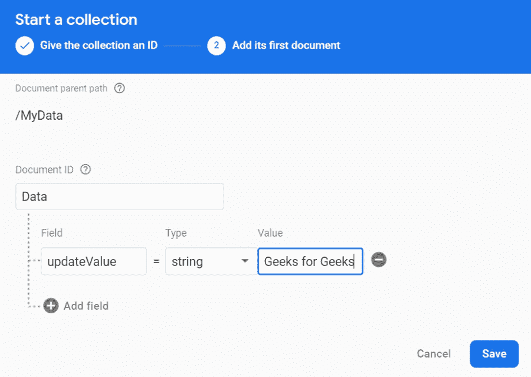
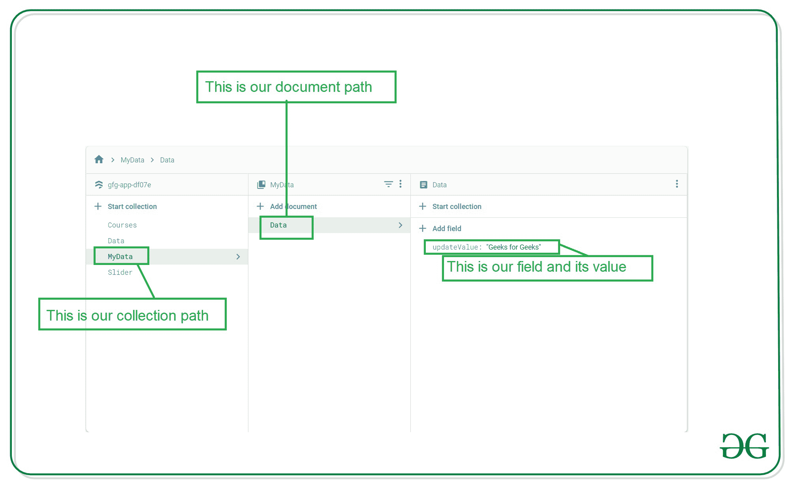

# 如何在安卓系统中使用 Firebase Firestore 作为实时数据库？

> 原文:[https://www . geeksforgeeks . org/how-用法-firebase-firestore-as-real-time-database-in-Android/](https://www.geeksforgeeks.org/how-to-use-firebase-firestore-as-a-realtime-database-in-android/)

[Firebase Firestore](https://www.geeksforgeeks.org/create-and-add-data-to-firebase-firestore-in-android/) 是后端数据库，用于**从安卓系统添加、读取、更新和删除**数据。但是在 Firebase Firestore 中，有一个单独的方法用来从 Firebase Firestore 的实时数据库中读取数据**。在本文中，我们将从实时数据库中的 Firebase Firestore 读取数据。注意，我们将使用 **Java** 语言来实现这个项目。**

### 我们将在本文中构建什么？

我们将构建一个简单的应用程序，其中我们将显示一个简单的[文本视图](https://www.geeksforgeeks.org/textview-widget-in-android-using-java-with-examples/)。在文本视图中，我们将实时更新 Firebase Firestore 的数据。

### **分步实施**

**第一步:创建新项目**

要在安卓工作室创建新项目，请参考[如何在安卓工作室创建/启动新项目](https://www.geeksforgeeks.org/android-how-to-create-start-a-new-project-in-android-studio/)。注意选择 **Java** 作为编程语言。

**第二步:将你的应用连接到 Firebase**

创建新项目后。导航到顶部栏上的工具选项。点击火焰基地。点击 Firebase 后，你可以看到截图中下面提到的右栏。


在那一栏中，导航到火基云火石。点击那个选项，你会看到两个选项:连接应用到 Firebase 和添加云 Firestore 到你的应用。单击立即连接选项，您的应用程序将连接到 Firebase。之后点击第二个选项，现在你的应用程序连接到 Firebase。将您的应用程序连接到 Firebase 后，您将看到下面的屏幕。


之后，验证 Firebase Firestore 数据库的依赖项是否已经添加到我们的 Gradle 文件中。导航到该文件中的**应用程序>梯度脚本**。检查是否添加了以下依赖项。如果您的 build.gradle 文件中不存在以下依赖项。在依赖项部分添加以下依赖项。

> 实现' com . Google . firebase:firebase-firestore:22 . 0 . 1 '

添加此依赖项后，同步您的项目，现在我们可以创建我们的应用程序了。如果你想了解更多关于连接你的应用到 Firebase。参考本文详细了解[如何给安卓 App](https://www.geeksforgeeks.org/adding-firebase-to-android-app/) 添加 Firebase。

**第 3 步:使用 AndroidManifest.xml 文件**

为了向 Firebase 添加数据，我们应该授予访问互联网的权限。要添加这些权限，请导航至**应用程序>和**。在该文件中添加以下权限。

## 可扩展标记语言

```
<!--Permissions for internet-->
<uses-permission android:name="android.permission.INTERNET" />
<uses-permission android:name="android.permission.ACCESS_NETWORK_STATE" />
```

**第 4 步:使用 activity_main.xml 文件**

转到 **activity_main.xml** 文件，参考以下代码。下面是 **activity_main.xml** 文件的代码。

## 可扩展标记语言

```
<?xml version="1.0" encoding="utf-8"?>
<RelativeLayout 
    xmlns:android="http://schemas.android.com/apk/res/android"
    xmlns:tools="http://schemas.android.com/tools"
    android:layout_width="match_parent"
    android:layout_height="match_parent"
    android:orientation="vertical"
    tools:context=".MainActivity">

    <TextView
        android:id="@+id/idTVHead"
        android:layout_width="match_parent"
        android:layout_height="wrap_content"
        android:layout_centerHorizontal="true"
        android:layout_margin="5dp"
        android:layout_marginTop="30dp"
        android:text="Firebase Firestore as Realtime Database"
        android:textAlignment="center"
        android:textAllCaps="false"
        android:textColor="@color/purple_500"
        android:textSize="20sp" />

    <TextView
        android:id="@+id/idTVUpdate"
        android:layout_width="match_parent"
        android:layout_height="wrap_content"
        android:layout_below="@id/idTVHead"
        android:layout_marginTop="50dp"
        android:text="Updated Text"
        android:textAlignment="center"
        android:textColor="@color/purple_500"
        android:textSize="30sp" />

</RelativeLayout>
```

**步骤 5:使用 MainActivity.java 文件**

转到**MainActivity.java**文件，参考以下代码。以下是**MainActivity.java**文件的代码。代码中添加了注释，以更详细地理解代码。

## Java 语言(一种计算机语言，尤用于创建网站)

```
import android.os.Bundle;
import android.widget.TextView;
import android.widget.Toast;

import androidx.annotation.Nullable;
import androidx.appcompat.app.AppCompatActivity;

import com.google.firebase.firestore.DocumentReference;
import com.google.firebase.firestore.DocumentSnapshot;
import com.google.firebase.firestore.EventListener;
import com.google.firebase.firestore.FirebaseFirestore;
import com.google.firebase.firestore.FirebaseFirestoreException;

public class MainActivity extends AppCompatActivity {

    // creating a variable for text view.
    TextView updatedTV;

    // initializing th variable for firebase firestore
    FirebaseFirestore db = FirebaseFirestore.getInstance();

    @Override
    protected void onCreate(Bundle savedInstanceState) {
        super.onCreate(savedInstanceState);
        setContentView(R.layout.activity_main);

        // initializing our text view.
        updatedTV = findViewById(R.id.idTVUpdate);

        // creating a variable for document reference.
        DocumentReference documentReference = db.collection("MyData").document("Data");

        // adding snapshot listener to our document reference.
        documentReference.addSnapshotListener(new EventListener<DocumentSnapshot>() {
            @Override
            public void onEvent(@Nullable DocumentSnapshot value, @Nullable FirebaseFirestoreException error) {
                // inside the on event method.
                if (error != null) {
                    // this method is called when error is not null 
                    // and we gt any error
                    // in this cas we are displaying an error message.
                    Toast.makeText(MainActivity.this, "Error found is " + error, Toast.LENGTH_SHORT).show();
                    return;
                }
                if (value != null && value.exists()) {
                    // if th value from firestore is not null then we are getting
                    // our data and setting that data to our text view.
                    updatedTV.setText(value.getData().get("updateValue").toString());
                }
            }
        });
    }
}
```

**第 6 步:向 Firebase Firestore 控制台添加数据**

转到浏览器，在浏览器中打开 Firebase。打开 Firebase 后，您将看到下面的页面，在此页面上单击右上角的转到控制台选项。


点击此屏幕后，您将看到下面的屏幕，其中包含您选择项目的所有项目。


在该屏幕中，单击左侧窗口中的 n Firebase Firestore 数据库。


点击创建数据库选项后，您将看到下面的屏幕。


在此屏幕中，我们必须选择“在测试模式下启动”选项。我们使用测试模式，因为我们没有在我们的应用程序中设置身份验证。所以我们在测试模式下选择开始。选择测试模式后，点击下一步选项，您将看到下面的屏幕。


在这个屏幕中，我们只需要点击启用按钮来启用我们的 Firebase Firestore 数据库。完成这个过程后，我们只需要运行我们的应用程序，在我们的应用程序中添加数据，然后点击提交按钮。要添加数据，只需点击**开始采集**按钮，并提供**采集标识作为我的数据**。然后提供**文档标识作为数据**，在**字段**内写下**更新值**，在值内提供您想要显示的文本。点击**保存**按钮。



您将看到在 Firebase 控制台中添加的数据。



将数据添加到 Firebase 后。现在运行您的应用程序，并查看应用程序的输出。您可以更改“更新值”字段中的值，并且可以在您的设备上查看实时更新。

### **输出:**

在下面的视频中，我们正在更新应用程序运行时的数据，并在我们的应用程序中显示实时更新。

<video class="wp-video-shortcode" id="video-544450-1" width="640" height="360" preload="metadata" controls=""><source type="video/mp4" src="https://media.geeksforgeeks.org/wp-content/uploads/20210113231717/Screenrecorder-2021-01-13-22-28-22-866.mp4?_=1">[https://media.geeksforgeeks.org/wp-content/uploads/20210113231717/Screenrecorder-2021-01-13-22-28-22-866.mp4](https://media.geeksforgeeks.org/wp-content/uploads/20210113231717/Screenrecorder-2021-01-13-22-28-22-866.mp4)</video>