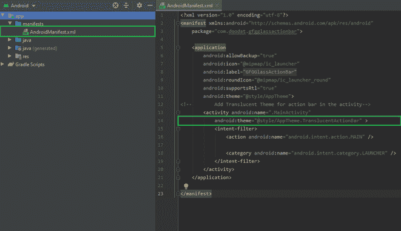

# 如何在安卓 App 中使用 GlassActionBar 库？

> 原文:[https://www . geeksforgeeks . org/使用方法-glassactionbar-Android 中的库-app/](https://www.geeksforgeeks.org/how-to-use-glassactionbar-library-in-android-app/)

GlassActionBar 是一个安卓库，它给动作栏增加了一种玻璃般的外观。它使动作栏后面的景色半透明，给人一种美的美感。它也适用于三种最流行的动作栏实现:stock (API 11+)、ActionBarCompat 和 ActionBarSherlock。在本文中，我们将使用 Java 编程语言将这个库集成到一个安卓应用程序中。下面提供了一个示例 GIF，让您了解我们将在本文中做什么。


### **分步实施**

**第一步:创建新项目**

要在安卓工作室创建新项目，请参考[如何在安卓工作室创建/启动新项目](https://www.geeksforgeeks.org/android-how-to-create-start-a-new-project-in-android-studio/)。注意选择 **Java** 作为编程语言。

**第二步:添加库依赖**

导航到 **Gradle 脚本> build.gradle(模块:应用)**，在依赖项部分添加库，并同步项目。

```
dependencies {
      implementation 'com.github.manuelpeinado.glassactionbar:glassactionbar:0.3.0'
}
```


**步骤 3:使用 activity_main.xml 文件**

导航至**应用程序> res >布局> activity_main.xml** 并参考以下代码。下面是 **activity_main.xml** 文件的代码。

## 可扩展标记语言

```
<com.cyrilmottier.android.translucentactionbar.NotifyingScrollView
    xmlns:android="http://schemas.android.com/apk/res/android"
    android:layout_width="match_parent"
    android:layout_height="match_parent">

    <!--This layout contains the main layout below action bar-->
    <!--This LinearLayout contains children in vertical order-->

    <LinearLayout
        android:layout_width="match_parent"
        android:layout_height="wrap_content"
        android:orientation="vertical">

        <ImageView
            android:layout_width="match_parent"
            android:layout_height="wrap_content"
            android:layout_gravity="top"
            android:scaleType="centerCrop"
            android:src="@drawable/gfgicon" />

        <TextView
            android:layout_width="match_parent"
            android:layout_height="wrap_content"
            android:background="#fff"
            android:padding="15dp"
            android:text="@string/gfg"
            android:textAppearance="@android:style/TextAppearance.Medium" />

    </LinearLayout>

</com.cyrilmottier.android.translucentactionbar.NotifyingScrollView>
```

**第 4 步:使用 styles.xml 文件**

导航至**应用程序> res >值>style . XML**并参考以下代码。下面是**style . XML**文件的代码。

## 可扩展标记语言

```
<resources>

    <!--Adding background for GlassActionBar-->
    <style name="TranslucentActionBar" parent="android:Widget.ActionBar">
        <item name="android:background">@drawable/ab_transparent</item>
    </style>

</resources>
```

**第 5 步:使用 themes.xml 文件**

*   导航至**应用程序> res >值**
*   右键单击值并选择**新建>值资源文件**
*   现在将出现一个对话框，然后将**文件名**添加为**主题**，并按确定。
*   下面是 **themes.xml** 文件的代码。

## 可扩展标记语言

```
<?xml version="1.0" encoding="utf-8"?>
<resources>
    <style name="AppTheme" parent="android:Theme.Holo.Light">
    </style>

    <!--Adding translucent theme for glassy effect -->
    <style name="AppTheme.TranslucentActionBar">
        <item name="android:windowActionBarOverlay">true</item>
        <item name="android:actionBarStyle">@style/TranslucentActionBar</item>
    </style>

</resources>
```

**第 6 步:使用 AndroidManifest.xml 文件**

导航到**应用程序>清单>和安卓清单. xml** ，并在活动中为动作栏添加半透明主题。

```
android:theme="@style/AppTheme.TranslucentActionBar" 
```



**步骤 7:使用 MainActivity.java 文件**

转到**MainActivity.java**文件，参考以下代码。以下是**MainActivity.java**文件的代码。

## Java 语言(一种计算机语言，尤用于创建网站)

```
import android.app.Activity;
import android.os.Bundle;

import com.manuelpeinado.glassactionbar.GlassActionBarHelper;

public class MainActivity extends Activity {
    private GlassActionBarHelper helper;

    @Override
    protected void onCreate(Bundle savedInstanceState) {
        super.onCreate(savedInstanceState);

        // Adding glass action bar view to the activity
        helper = new GlassActionBarHelper().contentLayout(R.layout.activity_main);
        setContentView(helper.createView(this));
    }
}
```

**输出:**

<video class="wp-video-shortcode" id="video-648683-1" width="640" height="360" preload="metadata" controls=""><source type="video/mp4" src="https://media.geeksforgeeks.org/wp-content/uploads/20210717202558/gab.mp4?_=1">[https://media.geeksforgeeks.org/wp-content/uploads/20210717202558/gab.mp4](https://media.geeksforgeeks.org/wp-content/uploads/20210717202558/gab.mp4)</video>

以下项目的 **Github 资源库**可以在[这里](https://media.geeksforgeeks.org/wp-content/cdn-uploads/20210722133421/GFGGlassActionBar-master.zip)找到。