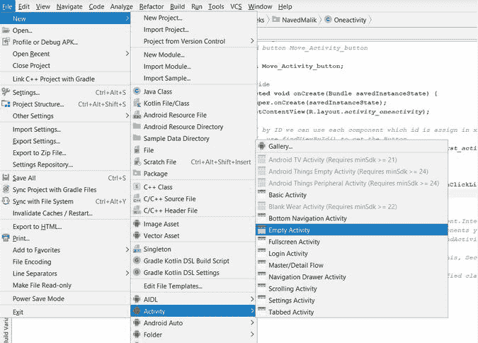

# 如何在安卓中使用 ImageView 作为按钮？

> 原文:[https://www . geesforgeks . org/如何使用-imageview-as-a-button in-Android/](https://www.geeksforgeeks.org/how-to-use-imageview-as-a-button-in-android/)

[ImageView](https://www.geeksforgeeks.org/imageview-in-android-with-example/) 在我们想要处理图像或者想要在应用程序中显示图像时使用。因此，本文将为您提供在 android studio 中将 ImageView 用作按钮的完整概念。因此，在不浪费更多时间的情况下，让我们转到文章中，阅读如何实现这一任务。

### 我们将在这篇文章中开发什么？

我们将构建一个简单的应用程序，其中我们将显示一个[图像视图](https://www.geeksforgeeks.org/imageview-in-android-with-example/)，当我们点击该图像视图时，我们将进入一个新的活动，或者简单地说，我们将使用图像视图作为一个按钮在不同的活动之间切换。下面给出了一个示例视频，以了解我们将在本文中做什么。请注意，我们将使用 **Java** 语言来实现这个项目。

<video class="wp-video-shortcode" id="video-556260-1" width="640" height="360" preload="metadata" controls=""><source type="video/mp4" src="https://media.geeksforgeeks.org/wp-content/uploads/20210203110443/gfg_output5.mp4?_=1">[https://media.geeksforgeeks.org/wp-content/uploads/20210203110443/gfg_output5.mp4](https://media.geeksforgeeks.org/wp-content/uploads/20210203110443/gfg_output5.mp4)</video>

### 逐步实施

**第一步:创建新项目**

要在安卓工作室创建新项目，请参考[如何在安卓工作室创建/启动新项目](https://www.geeksforgeeks.org/android-how-to-create-start-a-new-project-in-android-studio/)。注意选择 **Java** 作为编程语言。

**步骤 2:创建另一个新活动**

现在，我们将创建另一个**空活动**(秒活动)，通过单击图像视图从一个活动移动到另一个活动。所以，要创建第二个活动，去**安卓项目>文件>新建>活动>清空活动。**



**步骤 3:使用 activity_main.xml 文件**

现在是时候设计应用程序的布局了。为此，转到**应用程序> res >布局> activity_main.xml** 并将下面编写的代码粘贴到 **activity_main.xml** 文件中。

## 可扩展标记语言

```
<?xml version="1.0" encoding="utf-8"?>
<RelativeLayout 
    xmlns:android="http://schemas.android.com/apk/res/android"
    xmlns:app="http://schemas.android.com/apk/res-auto"
    xmlns:tools="http://schemas.android.com/tools"
    android:id="@+id/relative_layout"
    android:layout_width="match_parent"
    android:layout_height="match_parent"
    tools:context=".MainActivity">

    <!--ImageView which will used as a button 
        to switch from one activity to another-->
    <ImageView
        android:id="@+id/imageView"
        android:layout_width="200dp"
        android:layout_height="wrap_content"
        android:layout_centerInParent="true"
        app:srcCompat="@drawable/geeksforgeeks" />

</RelativeLayout>
```

**步骤 4:使用 MainActivity.java 文件**

转到 **app > java >包名>MainActivity.java**文件，参考以下代码。以下是**MainActivity.java**文件的代码。代码中添加了注释，以更详细地理解代码。

## Java 语言(一种计算机语言，尤用于创建网站)

```
import android.content.Intent;
import android.os.Bundle;
import android.view.View;
import android.widget.ImageView;

import androidx.appcompat.app.AppCompatActivity;

public class MainActivity extends AppCompatActivity {

    ImageView imageView;

    @Override
    protected void onCreate(Bundle savedInstanceState) {
        super.onCreate(savedInstanceState);
        setContentView(R.layout.activity_main);

        // initialize imageView 
        // with method findViewById()
        imageView = findViewById(R.id.imageView);

        // Apply OnClickListener  to imageView to 
        // switch from one activity to another
        imageView.setOnClickListener(new View.OnClickListener() {
            @Override
            public void onClick(View v) {
                // Intent class will help to go to next activity using
                // it's object named intent.
                // SecondActivty is the name of new created EmptyActivity.
                Intent intent = new Intent(MainActivity.this, SecondActivity.class);
                startActivity(intent);
            }
        });
    }
}
```

仅此而已，现在应用程序已准备好安装在设备上。下面是应用程序的输出。

### 输出:

<video class="wp-video-shortcode" id="video-556260-2" width="640" height="360" preload="metadata" controls=""><source type="video/mp4" src="https://media.geeksforgeeks.org/wp-content/uploads/20210203110443/gfg_output5.mp4?_=2">[https://media.geeksforgeeks.org/wp-content/uploads/20210203110443/gfg_output5.mp4](https://media.geeksforgeeks.org/wp-content/uploads/20210203110443/gfg_output5.mp4)</video>