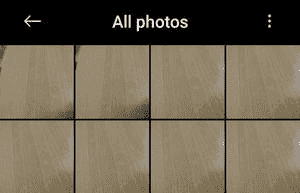
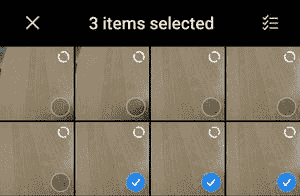

# 如何在安卓 App 中使用素材上下文动作栏库？

> 原文:[https://www . geesforgeks . org/how-use-material-context-action bar-library-in-Android-app/](https://www.geeksforgeeks.org/how-to-use-material-contextual-actionbar-library-in-android-app/)

让我们首先了解安卓应用中的两种应用栏:

*   **常规应用栏**
*   **上下文应用栏**

**常规 AppBar** 只是一个出现在页面顶部的规范化 AppBar，可以很好的根据用户需求进行定制。可用于**显示页面主题/公司名称/等。，可点击图标，导航到其他页面，抽屉，文本字段**，以及各种其他动作。现在这里有一个陷阱…

常规的**顶部应用程序栏**可以随时转换为**上下文动作栏**，该栏将保持活动状态，直到该动作被移除/完成。这一转换导致了一个新的**定制应用程序栏，与常规应用程序栏重叠，直到动作终止**。现在让我们来看一看这些图片，展示两种类型的应用程序栏:



常规应用程序栏(定制)

上面只是一个**普通的 app 栏**，有自己的装饰。



上下文操作栏

这是所选项目集的**上下文动作栏**，有自己的**动画/添加集**(也是用户自己设置的！).操作栏为任何应用程序的页面提供了视觉一致性。它以一种持久的、用户友好的方式引导用户到达指定的目的地。定制[动作栏](https://www.geeksforgeeks.org/actionbar-in-android-with-example/)有多种方式。在本文中，我们将创建一个小项目，它很好地演示了在安卓应用程序中使用材质上下文动作栏。

### **分步实施**

**第一步:创建新项目**

要在安卓工作室创建新项目，请参考[如何在安卓工作室创建/启动新项目](https://www.geeksforgeeks.org/android-how-to-create-start-a-new-project-in-android-studio/)。注意选择 **Java** 作为编程语言。

**步骤 2:使用 activity_main.xml 文件**

导航到**应用程序> res >布局> activity_main.xml** 并将下面的代码添加到该文件中。下面是 **activity_main.xml** 文件的代码。

## 可扩展标记语言

```
<?xml version="1.0" encoding="utf-8"?>
<androidx.constraintlayout.widget.ConstraintLayout 
    xmlns:android="http://schemas.android.com/apk/res/android"
    xmlns:app="http://schemas.android.com/apk/res-auto"
    xmlns:tools="http://schemas.android.com/tools"
    android:layout_width="match_parent"
    android:layout_height="match_parent"
    tools:context=".MainActivity">

    <TextView
        android:id="@+id/text_view"
        android:layout_width="wrap_content"
        android:layout_height="wrap_content"
        android:text="Hello GFG!"
        android:textSize="30sp"
        app:layout_constraintBottom_toBottomOf="parent"
        app:layout_constraintLeft_toLeftOf="parent"
        app:layout_constraintRight_toRightOf="parent"
        app:layout_constraintTop_toTopOf="parent" />

</androidx.constraintlayout.widget.ConstraintLayout>
```