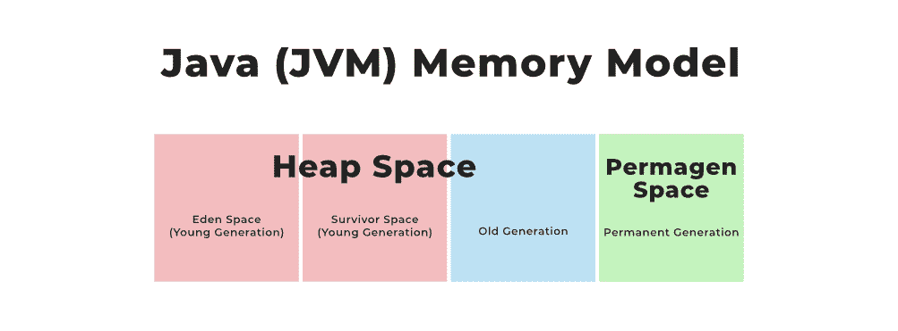
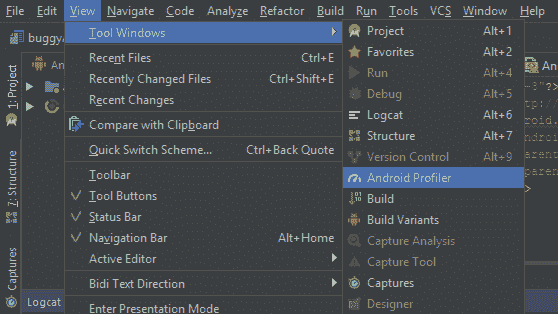
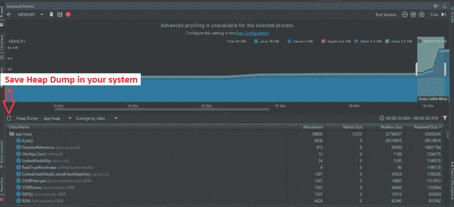
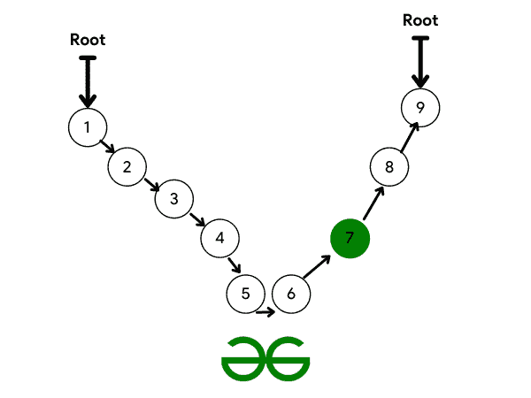

# 如何在安卓系统中使用内存堆转储数据？

> 原文:[https://www . geesforgeks . org/如何使用内存-堆-转储-安卓中的数据/](https://www.geeksforgeeks.org/how-to-use-memory-heap-dumps-data-in-android/)

当我们设计安卓应用程序时，开发人员最关心的是程序的内存利用率。这是因为，由于大多数人使用低内存设备，如果您的程序使用大量内存，您可能会失去用户。开发人员试图找到应用程序中的每一个内存泄漏，以便优化它，使其更精简、更快速。如果您知道哪些对象在任何时候都在使用内存，那么消除程序中的内存泄漏也会更容易。

### 什么是 Profiler？

Profiler 是 Android Studio 中的一项功能，它显示关于我们应用程序的 CPU、内存、网络和能源利用率的信息。这是应用程序的中央处理器、内存、网络和能源利用率的图形表示。我们可以在这些信息的帮助下优化我们的代码。但是，在 CPU、内存、网络和能源这四个因素中，内存分析器是每个开发人员使用最多的一个。因此，让我们来看看什么是内存分析器，然后我们将了解内存泄漏的原因，并尝试使用内存分析器找到它们。

> 问题内存分析器有助于检测内存泄漏和流失。

**当运行中的应用程序无法访问某个对象，但该对象继续占用内存时，就会发生内存泄漏。**

然而，在 Java 或 Kotlin 中，我们有一个被称为垃圾收集的概念。当应用程序的垃圾收集器检测到一些项目不再使用时，它会将未使用的内存返回到堆中。JVM 将首先识别垃圾收集根(GC 根)，这是一个可以从堆外访问的对象，比如一个正在运行的线程或局部变量。然后，可以从垃圾收集根访问的所有对象都将被识别并保存。最后，任何不能从垃圾收集根获得的东西都被认为是垃圾并被回收。



#图像 1–JVM 内存模型

当一个对象还没有被销毁，但是你不能使用它时，就会发生内存泄漏。因此，您的对象将存储内存，您将无法访问它。

> 换句话说，内存泄漏是由于被放弃的项目而发生的，这些项目永远不会在程序中使用，但仍然可用。

### 替代方案

我们可以利用内存分析器来发现程序中的内存泄漏。按照以下步骤在我们的应用程序中打开内存分析器:

1.  从菜单栏中选择视图>工具窗口>探查器。
2.  在目标设备上，运行程序。
3.  该图描述了中央处理器、内存、网络和能源利用率。通过单击内存时间线上的任意位置，可以启动内存分析器。将出现以下窗口:



图 1:打开安卓工作室内存分析器

从这里，您可以避免两种类型的对象(活动和片段)的内存泄漏。这些问题令人担忧，因为它们经常消耗大量内存。最棒的是，从安卓工作室 3.6 或更高版本开始，内存分析器会自动检测活动和片段的内存泄漏。因为这两个类的行为是明确指定的。那么，概要分析器如何知道这些类是否在泄漏呢？如果活动已终止但仍被引用，则存在泄漏。

如果没有片段管理器与片段相关联，并且它仍然被引用，这是一个泄漏的情况。因此，识别由某些操作或片段导致的泄漏的第一步是记录堆转储。让我们来看看如何:

### 转储内存堆

堆转储用于确定在进行堆转储时应用程序中的哪个对象正在消耗内存。堆转储可以通过显示仍在内存中但不会被程序使用的对象来帮助检测内存泄漏。您可以通过捕获堆转储来检索以下信息:

#### 每件事都有自己的记忆。

1.  代码中的每个对象都由一个引用表示。
2.  我们的软件分配特定类型的对象。
3.  调用堆栈上分配对象的位置。

在内存分析器中，您有一个名为“转储 Java 堆”的选项来捕获堆转储。点击选择它。

**我们有很多信息。有四个班级可供我们选择。**

它们如下:

1.  **分配**:此处显示堆中分配或实例的数量。
2.  **该对象类型的本机大小**(以字节为单位)表示其使用的本机内存总量(仅在 Android 7.0 或更高版本中可见)。
3.  **浅** **大小:**这是对象消耗的内存量(字节)。
4.  **保留** **大小:**这是该类所有实例使用的内存量(以字节为单位)。



图 2:检查堆转储

因此，您可以使用这些信息来选择哪些课程值得关注。如果您单击任何类名，内存分析器将打开一个实例视图，这将显示该类的所有实例的列表。一个新的信息，深度，可以在这里找到。从任何垃圾收集根到指定的实例，深度是最短的跳数。项目离垃圾收集根越近，从垃圾收集根到该对象的路径就越多，垃圾收集的可能性就越小。



图 3:垃圾收集过程。

如果前面示例中左侧的任何引用被破坏，第 6 个节点将变得不可访问，并将被垃圾收集。但是，如果您希望在绿色节点上进行垃圾收集，则必须从左右两侧断开路径。

### 例子

当使用任何侦听器时，我们必须总是在侦听器不使用时注销它，因为如果我们不这样做，侦听器将保留在 GC 根目录中，并且永远不会被垃圾收集。因此，尽可能尝试在 onPause()、onStop()或 onDestroy()方法中注销侦听器。位置监听器的示例如下:

## Java 语言(一种计算机语言，尤用于创建网站)

```
public class GeeksforGeeksAndroid
    extends Activity implements doCourse {
    @Override
    public void onCourseAdded(Location course)
    {
      // Do something
    }
    @Override public void onStart()
    {
        LocationListener.get().register(this);
    }
    @Override public void onStop()
    {
        LocationListener.get().unregister(this);
    }
}
```

### 结论

如果您不注销侦听器，您将在转储 java 堆中获得状态，表明 LocationListener 导致了内存泄漏。这就是如何使用内存分析器的堆转储发现泄漏，然后优化和修复代码以获得更好的结果。