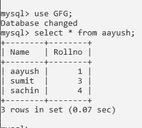
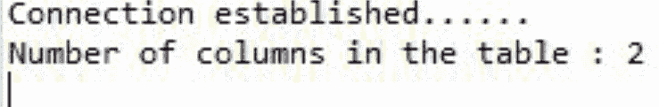

# 如何使用列的方法统计 JDBC 的列数？

> 原文:[https://www . geeksforgeeks . org/如何使用列数方法来计算 jdbc 中的列数/](https://www.geeksforgeeks.org/how-to-use-methods-of-column-to-count-number-of-columns-in-jdbc/)

单个独立程序无法满足客户端的所有需求客户端的每个请求都有一些不同的请求，如[](https://www.geeksforgeeks.org/introduction-to-jdbc/)**更新、删除、插入[**【JDBC】**](https://www.geeksforgeeks.org/introduction-to-jdbc/><strong>,</strong></a> and many. An intermediate level program must contain two levels of architecture Frontend and backend. The frontend is the GUI interface of the program and Backend that works behind the frontend and handles all the incoming requests of the client and performers further operation like retrieving the information of the client from the database and many more.  </p>
<p><a href=)是 java 语言的著名 API 之一，用于将在结构化查询语言上工作的关系数据库与 java 程序连接起来。JDBC 连同数据库驱动程序能够访问数据库和电子表格。存储在关系数据库(RDB)中的企业数据可以在 JDBC API 的帮助下访问。**

**JDBC 原料药的主要任务**

1.  **与数据库建立连接**
2.  **向数据库服务器发送 SQL 语句。**
3.  **处理获得的结果。**

****图解:**假设 MySQL 客户端**

> ****输入:****
> 
> *   **数据库:GFG**
> *   **表:阿尤斯**
> 
> ****输出:****
> 
> ****

****方法:【Java 程序和数据库连接的步骤****

1.  **正在导入数据库文件。**
2.  **加载和注册驱动程序到 java 程序。**
3.  **建立联系。**
4.  **创建一个语句。**
5.  **执行查询。**
6.  **处理结果。**
7.  **关闭连接。**

**现在，讨论上面的步骤，以便弄清楚如何使用列的方法来计算 JDBC 的列数**

****1。**加载和注册驱动程序:首先需要先加载驱动程序或注册驱动程序，然后才能在程序中使用。注册在你的程序中只需完成一次。您可以通过以下两种方式之一注册驾驶员:使用 [*Class.forName()*](https://www.geeksforgeeks.org/class-forname-method-in-java-with-examples/) 方法。用于在运行时将驱动程序的类文件加载到内存中，不需要使用新建或创建对象。为了说明 Oracle 驱动程序，如下所示:**

```
 Class.forName(“oracle.jdbc.driver.OracleDriver”);
```

****2。**建立连接:加载驱动程序后，通过创建主类的连接类对象建立连接，如下图所示:**

```
Connection con = DriverManager.getConnection(url,user,password)
```

*   ****用户**:可以访问您的 SQL 命令提示符的用户名。**
*   ****密码**:可以访问你的 SQL 命令提示符的密码。**
*   ****con** :连接类对象是对连接接口的引用。**
*   ****网址**:统一资源定位器。**

**如果甲骨文被用作数据库，那么它被以类似的方式对待，但有一个小花招如下。**

*   **@localhost 使用的驱动程序是存储数据库的 IP 地址。**
*   **1521 是端口号。**
*   **服务提供商在这里。**

**这里的 3 个参数都是 String 类型的，在调用函数之前要由程序员声明，并且可以从最终代码中引用。它可以按如下方式创建:**

```
String url = “ jdbc:oracle:thin:@localhost:1521:xe”
OR
String mysqlUrl = "jdbc:mysql://localhost/Databasename";
```

****3。**创建一条语句:一旦建立了连接，您就可以与数据库进行交互。JDBCStatement、Callable Statement 和 PreparedStatement 接口定义了能够发送 SQL 命令和从数据库接收数据的方法。JDBC 声明的用法如下。这里，con 是对上一步中使用的连接接口的引用。**

```
Statement st = con.createStatement();
```

****4。**执行查询:现在是最重要的部分，即执行查询。这里的查询是一个 SQL 查询。现在我们知道我们可以有多种类型的查询。其中一些如下:**

*   **在数据库中更新/插入表的查询。**
*   **用于检索数据的查询。**

> **语句接口的 [*executeQuery()*](https://www.geeksforgeeks.org/establishing-jdbc-connection-in-java/) 方法用于执行从数据库中检索值的查询。此方法返回 ResultSet 的对象，该对象可用于获取表的所有记录。语句界面的[*execute update*](https://www.geeksforgeeks.org/performing-database-operations-java-sql-create-insert-update-delete-select/)*(SQL 查询*)方法用于执行更新/插入的查询。**

****例****

## **Java 语言(一种计算机语言，尤用于创建网站)**

```
// Java Program to use methods of column
// to Count no of columns in JDBC

// Importing all classes of java.util package
import java.util.*;

// Step 1: Importing DB
import java.sql.*;

// Class
public class GFG {

    // Main driver method
    public static void main(String args[])
        throws ClassNotFoundException, SQLException
    {
        // Step 2: Loading and registering drivers

        // Registering using Drivermanager
        DriverManager.registerDriver(
            new com.mysql.jdbc.Driver());

        // MySQL URL
        String mysqlUrl = "jdbc:mysql://localhost/gfg";

        // Step 3: Establish the connection
        Connection con = DriverManager.getConnection(
            mysqlUrl, "root", "Aayush");
        // Display message to show in console
        // connection is estalished
        System.out.println("Connection established......");

        // Step 4: Creating a statement object
        Statement stmt = con.createStatement();

        // Step 5: Executing the query
        ResultSet rs
            = stmt.executeQuery("select * from aayush;");

        // Step 6: Process the results

        // Retrieving the ResultSetMetaData object
        ResultSetMetaData rsmd = rs.getMetaData();

        // Get the column type and count
        // using getColumnCount() method
        int column_count = rsmd.getColumnCount();

        // Print the number of columns in a table
        System.out.println(
            "Number of columns in the table : "
            + column_count);
    }
}
```

****输出:****

****

> **实现部分使用了相同的表。因此，上面的输出是下面生成的对应表的输出，对该表调用 count。**
> 
> ****