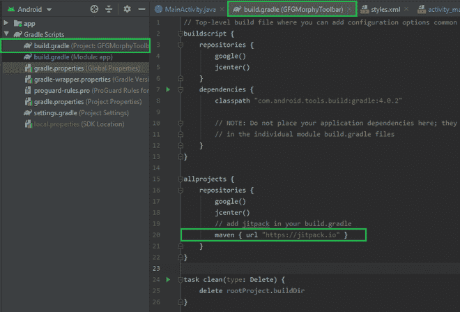
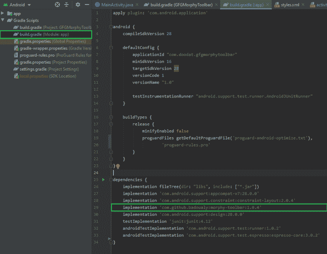

# 如何在安卓 App 中使用 Morphy 工具栏库？

> 原文:[https://www . geesforgeks . org/how-用法-morphy-toolbar-library-in-Android-app/](https://www.geeksforgeeks.org/how-to-use-morphy-toolbar-library-in-android-app/)

MorphyToolbar 是一个库，它允许我们有一个带有标题、副标题和图片的自定义工具栏，进一步提供了在过渡之间制作视图动画的可能性。这个库非常容易集成，并且提供了多种定制。在本文中，我们将使用 **Java** 语言在安卓应用程序中实现这个库。下面给出了一个示例 GIF，以了解我们将在本文中做什么。


### **分步实施**

**第一步:创建新项目**

要在安卓工作室创建新项目，请参考[如何在安卓工作室创建/启动新项目](https://www.geeksforgeeks.org/android-how-to-create-start-a-new-project-in-android-studio/)。注意选择 **Java** 作为编程语言。

**第二步:添加 JitPack**

导航到 **Gradle 脚本> build.gradle(项目:项目名称)**，在存储库的末尾添加 jitpack，并同步项目。

```
maven { url "https://jitpack.io" }
```



**第三步:添加库依赖**

导航到 **Gradle 脚本> build.gradle(模块:应用)**，在依赖项部分添加库，并同步项目。

```
dependencies {
    implementation 'com.github.badoualy:morphy-toolbar:1.0.4'  
}
```



**第 4 步:使用 styles.xml 文件**

导航到**应用程序> res >值>style . XML**，并将下面的代码添加到该文件中。下面是**style . XML**文件的代码。

## 可扩展标记语言

```
<resources>
    <!-- Base application theme. -->
    <style name="AppTheme.Base" parent="Theme.AppCompat.Light.NoActionBar">
        <item name="windowActionBar">false</item>
        <item name="android:windowNoTitle">true</item>
        <item name="windowActionModeOverlay">true</item>
        <item name="windowActionBarOverlay">true</item>

        <item name="colorPrimary">@color/colorPrimary</item>
        <item name="colorPrimaryDark">@color/colorPrimaryDark</item>>
    </style>

    <style name="AppTheme" parent="AppTheme.Base">
    </style>

    <style name="ToolbarStyle" parent="Widget.AppCompat.Toolbar">
        <item name="popupTheme">@style/ThemeOverlay.AppCompat.Light</item>
        <item name="theme">@style/ThemeOverlay.AppCompat.Dark.ActionBar</item>
    </style>

</resources>
```

**第 5 步:使用 activity_main.xml 文件**

导航到**应用程序> res >布局> activity_main.xml** 并将下面的代码添加到该文件中。下面是 **activity_main.xml** 文件的代码。

## 可扩展标记语言

```
<?xml version="1.0" encoding="utf-8"?>
<!--Use Coordinator Layout -->
<android.support.design.widget.CoordinatorLayout 
    xmlns:android="http://schemas.android.com/apk/res/android"
    xmlns:app="http://schemas.android.com/apk/res-auto"
    android:id="@+id/main_content"
    android:layout_width="match_parent"
    android:layout_height="match_parent">

    <android.support.design.widget.AppBarLayout
        android:id="@+id/layout_app_bar"
        android:layout_width="match_parent"
        android:layout_height="wrap_content"
        android:fitsSystemWindows="true">

        <!--Toolbar-->
        <android.support.v7.widget.Toolbar
            android:id="@+id/toolbar"
            style="@style/ToolbarStyle"
            android:layout_width="match_parent"
            android:layout_height="@dimen/mt_toolbar_height"
            android:background="#0F9D58"
            android:minHeight="@dimen/mt_toolbar_height"
            app:title=""
            app:titleTextColor="#FFFFFF" />

    </android.support.design.widget.AppBarLayout>

    <!--Floating Action Button is attached to 
        the AppBarLayout using app:layout_anchor.-->
    <android.support.design.widget.FloatingActionButton
        android:id="@+id/fab_photo"
        android:layout_width="wrap_content"
        android:layout_height="wrap_content"
        android:layout_marginEnd="16dp"
        android:layout_marginRight="16dp"
        android:src="@drawable/ic_photo_camera_white_24dp"
        android:tint="#797979"
        app:backgroundTint="#FFFFFF"
        app:layout_anchor="@id/layout_app_bar"
        app:layout_anchorGravity="center_vertical|end|right" />

</android.support.design.widget.CoordinatorLayout>
```

**步骤 6:使用 MainActivity.java 文件**

转到**MainActivity.java**文件，参考以下代码。以下是**MainActivity.java**文件的代码。代码中添加了注释，以更详细地理解代码。

## Java 语言(一种计算机语言，尤用于创建网站)

```
import android.graphics.Color;
import android.os.Bundle;
import android.support.annotation.NonNull;
import android.support.design.widget.AppBarLayout;
import android.support.design.widget.CoordinatorLayout;
import android.support.design.widget.FloatingActionButton;
import android.support.v7.app.ActionBar;
import android.support.v7.app.AppCompatActivity;
import android.support.v7.widget.Toolbar;
import android.view.Gravity;
import android.view.MenuItem;
import android.view.View;

import com.github.badoualy.morphytoolbar.MorphyToolbar;

public class MainActivity extends AppCompatActivity {

    MorphyToolbar morphyToolbar;

    // primary2 determines the color 
    // of morphyToolbar when expanded
    int primary2 = Color.parseColor("#fbc757");

    // primaryDark2 determines the color
    // of status bar when expanded
    int primaryDark2 = Color.parseColor("#e6b449");

    AppBarLayout appBarLayout;
    Toolbar toolbar;
    FloatingActionButton fabPhoto;

    @Override
    protected void onCreate(Bundle savedInstanceState) {
        super.onCreate(savedInstanceState);
        setContentView(R.layout.activity_main);

        appBarLayout = findViewById(R.id.layout_app_bar);
        toolbar = findViewById(R.id.toolbar);
        fabPhoto = findViewById(R.id.fab_photo);

        disableAppBarDrag();

        // disableAppBarDrag() disables the scrolling-of
        // AppBarLayout in CoordinatorLayout
        // i.e prevents the user from hiding
        // the ToolBar when swiped above
        hideFab();

        // hideFab() hides the floating action button
        // Attaching MorphyToolbar to the given activity/toolbar
        morphyToolbar = MorphyToolbar.builder(this, toolbar)
                .withToolbarAsSupportActionBar()
                // Title of Toolbar
                .withTitle("GeeksForGeeks DS and Algorithms Course")
                // Subtitle of Toolbar
                .withSubtitle("16,000 Participants")
                // Adding image to the toolbar
                .withPicture(R.drawable.gfgicon)
                // if you want to hide the img when 
                // AppBarLayout collapses, set it to true
                .withHidePictureWhenCollapsed(false)
                .build();

        morphyToolbar.setOnClickListener(new View.OnClickListener() {
            @Override
            public void onClick(View v) {
                // if morphyToolbar is collapsed, expand it
                // and if expanded, collapse it.
                if (morphyToolbar.isCollapsed()) {
                    morphyToolbar.expand(primary2, primaryDark2,
                            new MorphyToolbar.OnMorphyToolbarExpandedListener() {
                                @Override
                                public void onMorphyToolbarExpanded() {
                                    // shows the floating action button
                                    // when morphyToolbar expands
                                    showFab();
                                }
                            });
                } else {
                    // hides the floating action 
                    // button when morphyToolbar collapses
                    hideFab();
                    morphyToolbar.collapse();
                }
            }
        });

        // adding a back button
        if (getSupportActionBar() != null) {
            getSupportActionBar().setDisplayOptions(ActionBar.DISPLAY_HOME_AS_UP
                    | ActionBar.DISPLAY_SHOW_TITLE
                    | ActionBar.DISPLAY_SHOW_CUSTOM);
            getSupportActionBar().setDisplayHomeAsUpEnabled(true);
        }
    }

    private void disableAppBarDrag() {
        // disables the scrolling-of AppBarLayout in CoordinatorLayout
        CoordinatorLayout.LayoutParams params = (CoordinatorLayout.LayoutParams) appBarLayout.getLayoutParams();
        AppBarLayout.Behavior behavior = new AppBarLayout.Behavior();
        params.setBehavior(behavior);
        behavior.setDragCallback(new AppBarLayout.Behavior.DragCallback() {
            @Override
            public boolean canDrag(@NonNull AppBarLayout appBarLayout) {
                return false;
            }
        });
    }

    // These two methods hideFab() & showFab() are 
    // for hiding and showing the floating
    // action button, which is to be used only 
    // if you are adding a floating action button.
    private void hideFab() {
        fabPhoto.show();
        fabPhoto.hide();
        final CoordinatorLayout.LayoutParams layoutParams = (CoordinatorLayout.LayoutParams) fabPhoto.getLayoutParams();
        layoutParams.setAnchorId(View.NO_ID);
        fabPhoto.requestLayout();
        fabPhoto.hide();
    }

    private void showFab() {
        final CoordinatorLayout.LayoutParams layoutParams = (CoordinatorLayout.LayoutParams) fabPhoto.getLayoutParams();
        layoutParams.setAnchorId(R.id.layout_app_bar);
        layoutParams.anchorGravity = Gravity.RIGHT | Gravity.END | Gravity.BOTTOM;
        fabPhoto.requestLayout();
        fabPhoto.show();
    }

    @Override
    public void onBackPressed() {
        // if morphyToolbar is already
        // collapsed finish the activity
        // else collapse the toolbar
        if (!morphyToolbar.isCollapsed()) {
            hideFab();
            morphyToolbar.collapse();
        } else
            super.onBackPressed();
    }

    @Override
    public boolean onOptionsItemSelected(MenuItem item) {
        switch (item.getItemId()) {
            case android.R.id.home:
                // It is called, when a user
                // presses back button
                onBackPressed();
                return true;
        }
        return super.onOptionsItemSelected(item);
    }
}
```

**输出:**

<video class="wp-video-shortcode" id="video-639122-1" width="640" height="360" preload="metadata" controls=""><source type="video/mp4" src="https://media.geeksforgeeks.org/wp-content/uploads/20210704025102/MorphyToolbar.mp4?_=1">[https://media.geeksforgeeks.org/wp-content/uploads/20210704025102/MorphyToolbar.mp4](https://media.geeksforgeeks.org/wp-content/uploads/20210704025102/MorphyToolbar.mp4)</video>

**GitHub 资源库:**[morphitolbarlibrary](https://github.com/garg-lucifer/GFGMorphyToolbar)