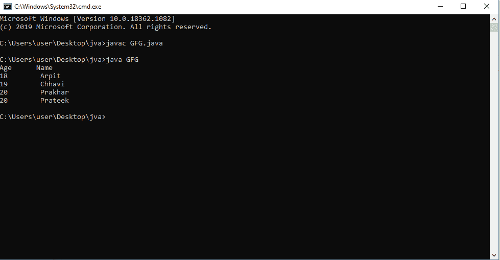
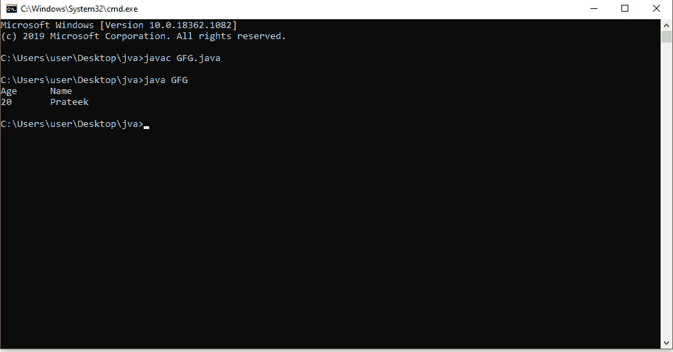
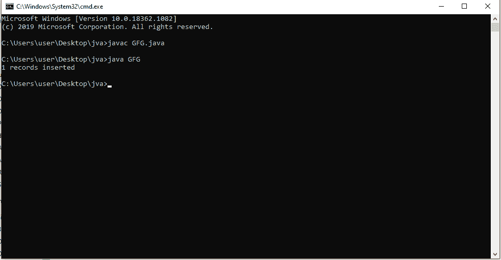
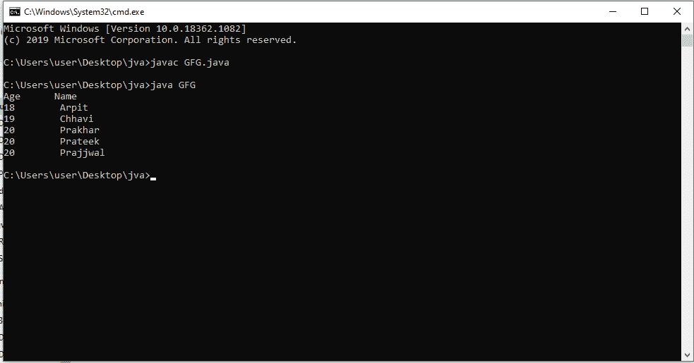

# 如何在 Java 中使用 PreparedStatement？

> 原文:[https://www . geesforgeks . org/how-use-prepared statement-in-Java/](https://www.geeksforgeeks.org/how-to-use-preparedstatement-in-java/)

一个 **PreparedStatement** 是一个预编译的 SQL 语句。是**声明**的子接口。准备好的语句对象比语句对象有一些有用的附加功能。PreparedStatement 对象提供了执行参数化查询的功能，而不是硬编码查询。

**准备报表的优势**

*   创建 PreparedStatement 时，SQL 查询作为参数传递。这个 PreparedStatement 包含一个预编译的 SQL 查询，所以当执行 Prepared Statement 时，DBMS 可以直接运行查询，而不是先编译它。
*   我们可以使用相同的 PreparedStatement，并在执行时提供不同的参数。
*   “准备好陈述”的一个重要优势是它们可以防止 SQL 注入攻击。

**使用准备状态的步骤**

**1。创建到数据库的连接**

```
Connection myCon = DriverManager.getConnection(path,username,password)
```

**2。准备声明**
而不是硬编码查询，

```
select * from students where age>10 and name ='Chhavi'
```

设置参数占位符(使用问号表示占位符)，如:

```
select * from students where age> ? and name = ?
```

```
PreparedStatement myStmt; 
myStmt = myCon.prepareStatement(select * from students where age> ? and name = ?);
```

**3。设置类型和位置的参数值**

```
myStmt.setInt(1,10);     
myStmt.setString(2,"Chhavi");      
```

**4。执行查询**

```
ResultSet myRs= myStmt.executeQuery();
```

**报表编制方法:**

*   **setInt(int，int):** 该方法可以在给定的参数索引处设置整数值。
*   **setString(int，string):** 此方法可用于在给定的参数索引处设置字符串值。
*   **设置浮点(int，float):** 此方法可用于在给定的参数索引处设置浮点值。
*   **设置 Double(int，Double):** 此方法可用于在给定的参数索引处设置 double 值。
*   **executeUpdate():** 此方法可用于创建、删除、插入、更新、删除等。它返回 int 类型。
*   **executeQuery():** 执行选择查询时返回 ResultSet 的一个实例。



原始表

**执行查询示例代码**

## Java 语言(一种计算机语言，尤用于创建网站)

```
// Java program to execute a query using PreparedStatement

import java.sql.*;

public class GFG {

    // Driver Code
    public static void main(String[] args) throws Exception
    {

        // Register Driver Class
        Class.forName("org.apache.derby.jdbc.ClientDriver");

        // Connection to your database
        Connection con = DriverManager.getConnection();

        // Query which needs parameters
        String query
            = "Select * from students where age> ? and name = ?";

        // Prepare Statement
        PreparedStatement myStmt
            = con.prepareStatement(query);

        // Set Parameters
        myStmt.setInt(1, 20);
        myStmt.setStrin(2, 'Prateek');

        // Execute SQL query
        ResultSet myRs = myStmt.executeQuery();

        System.out.println('Age      Name');

        // Display function to show the Resultset
        while (myRs.next()) {
            String Name = rs.getString("name");
            int age = rs.getInt("age");
            System.out.println(Name + "     " + age);
        }

        // Close the connection
        con.close();
    }
}
```



输出

**执行更新示例代码**

## Java 语言(一种计算机语言，尤用于创建网站)

```
// Java program to update a table using PreparedStatement

import java.sql.*;

public class GFG {

    // Driver Code
    public static void main(String[] args) throws Exception
    {

        // Register Driver Class
        Class.forName("org.apache.derby.jdbc.ClientDriver");

        // Connection to your database
        Connection con = DriverManager.getConnection();

        // Query which needs parameters
        String query = "insert into Students values(?,?)";

        // Prepare Statement
        PreparedStatement myStmt
            = con.prepareStatement(query);

        // Set Parameters
        myStmt.setInt(1, 21);
        myStmt.setStrin(2, 'Prajjwal');

        // Execute SQL query
        int res = myStmt.executeUpdate();

        // Display the records inserted
        System.out.println(res + " records inserted");

        // Close the connection
        con.close();
    }
}
```



输出



插入值后的表格