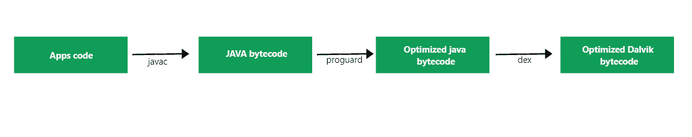

# 如何在安卓系统中使用 Proguard 缩小 APK 尺寸？

> 原文:[https://www . geeksforgeeks . org/如何使用-proguard-to-reduce-apk-size-in-Android/](https://www.geeksforgeeks.org/how-to-use-proguard-to-reduce-apk-size-in-android/)

构建任何应用程序时，应用程序大小都很重要。如果应用程序尺寸较大，大多数用户不会下载你的应用程序，因为它的尺寸很大。大的应用程序将花费你的用户大量的数据，他还需要磁盘空间来安装你的应用程序。所以减小 APK 程序的大小是一个重要的 java 工具，用来减小你的 APK 的大小。在本文中，我们将看一看下面提到的主题:

*   什么是 Proguard？
*   Proguard 有什么用？
*   如何在应用程序中使用 proguard？
*   使用 Proguard 有什么缺点？
*   Proguard 中的自定义规则。

## 什么是 Proguard？

Proguard 是一个 java 工具，存在于安卓系统中，用来缩小你的应用程序大小。这是一个免费的工具，将帮助你减少 8.5 %的应用程序大小。Proguard 会将你的应用程序代码转换成优化的 Dalvik 字节码。转换过程如下:



## Proguard 有哪些用途？

*   Proguard 会混淆你的代码并重命名你的代码。在这个过程中，它将重命名不同 java 类的文件。这将使您的应用程序更加安全，并且很难进行反向工程。
*   它将删除代码中未使用的代码片段，并优化代码。
*   使用 proguard 将使您的应用程序大小减少 8.5 %。
*   Proguard 将缩小应用程序中未使用的资源。
*   proguard 的使用将减小应用程序的大小，并使您的代码内联。这将使您的应用程序速度更快，尺寸更小。

## 如何在应用程序中使用 Proguard？

要在应用程序中启用 proguard，请导航至**应用程序>梯度脚本>打开构建.梯度文件**。在那个 gradle 文件中，您将会在您的文件的发布部分看到下面的代码行。将 minifyEnabled 从 false 更改为 true。这将使用 proguard 文件激活您的 proguard。

> buildtypes
> 
> 发布{
> 
> //在此进行更改
> 
> minifyEnabled 为真
> 
> Prog guardfiles getdefaurdfile(' Prog guard-Android-optimize . txt ')，“Prog guard-rules . pro”
> 
> }
> 
> }

您将在发布块中找到这组代码。这意味着 Proguard 将仅为您的发布应用程序激活。

## 程序中的自定义规则

当我们在应用程序中使用 proguard 时，它会自动删除应用程序中需要的一些模态类。因此，为了避免删除这些文件，我们必须在应用程序中添加一些自定义规则。

### 1.保住我们的班级

在使用库进行联网时，或者在实现[回收视图](https://www.geeksforgeeks.org/android-recyclerview/)或[列表视图](https://www.geeksforgeeks.org/android-listview-in-java-with-example/)时。我们必须创建一个数据类来存储我们所有的数据。因此，当使用 Proguard 时，它将删除该类中无用的变量。所以为了避免删除这个类的变量，我们必须给这个类添加@Keep 注释。例如，我们正在创建一个数据类，用于在我们的类中存储 studentName 和 StudentId，我们不想让 proguard 混淆我们的类。所以在这种情况下，我们将向它添加@Keep 注释。所以在下面的代码片段中@Keep 将防止这个类混淆。除了“@keep”之外，我们还可以使用-keep 来防止我们的类混淆。如果我们必须保留类中的任何变量，那么我们将用“@SerializableName”注释该变量。当我们必须解析来自 JSON 文件或服务器的数据时，通常会使用这种类型的注释。

## Java 语言(一种计算机语言，尤用于创建网站)

```
/*package whatever //do not write package name here */

import java.io.*;
@Keep
class GFG {
   string StudentName;
     int studentID;
}
```

### 2.保存我们班及其成员的名字

假设如果我们必须保留类名及其成员变量，那么我们将使用注释作为“-keepnames”。该注释将保留该类的名称及其成员变量。虽然 proguard 会缩小这个类，但它不会混淆你的类。下面的代码片段将告诉我们如何使用“-keepname”来保留我们的类成员。

## Java 语言(一种计算机语言，尤用于创建网站)

```
/*package whatever //do not write package name here */

import java.io.*;

-keepnames class GFG {
   string studentName;
  int studentId;
}
```

### 3.留住我们班的成员

如果我们希望只保留类的成员，而不要让类被 Proguard 混淆。然后我们将使用“-keepclassmembers”注释该类。这个注释将防止混淆我们的类成员。下面是代码片段，我们将在其中看到这个方法的实现。

## Java 语言(一种计算机语言，尤用于创建网站)

```
/*package whatever //do not write package name here */

import java.io.*;

-keepclassmembers  class GFG {
   string studentName;
  int studentId;
}
```

### 4.保留注释

当使用 Proguard 时，它将删除我们在库中提供的类中添加的所有注释。无论如何，这段代码运行良好，没有任何问题。但是如果移除它可能会引起问题。如果你正在使用一个改装库从你的应用程序中的网络服务器获取数据，那么你会使用很多注释，比如“@GET”、“POST”、“PUSH”等等。如果这些注释将被删除[改装](https://www.geeksforgeeks.org/introduction-retofit-2-android-set-1/)可能会导致从服务器获取数据的问题。因此，为了避免删除这些注释，我们将使用“-keepattributes”关键字。下面是其用法的代码片段。

## Java 语言(一种计算机语言，尤用于创建网站)

```
/*package whatever //do not write package name here */

import java.io.*;

-keepattributes @GET
class GFG {
   string studentName;
  int studentID;
}
```

### 5.使用外部库

当我们使用一些外部库时。它们提供了具体的规则，我们可以将其添加到我们的程序规则中。但是如果图书馆没有任何规则。在这种情况下，我们可以在日志中看到警告。为了避免这个库的警告，我们必须在程序中添加带有“-dontwarn”注释的库。

> -不要说“你的图书馆”

## 使用 Proguard 的缺点

有时在使用 Proguard 时，它会删除大量必需的代码，这可能会导致应用程序崩溃。为了避免从我们的应用程序代码中删除这些代码。我们必须在我们的 proguard 中添加一些自定义规则来保存特定的文件，这样就可以避免删除这些文件，并且我们的应用程序即使在使用 Proguard 后也不会崩溃。

## **结论**

所以 Proguard 对缩小我们的应用程序非常有帮助，它也将使我们的应用程序更加安全，并且很难进行逆向工程。所以我们应该用它来优化我们的应用程序的大小。