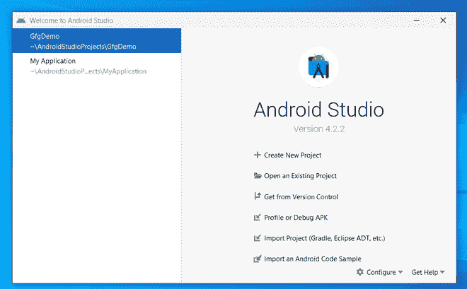
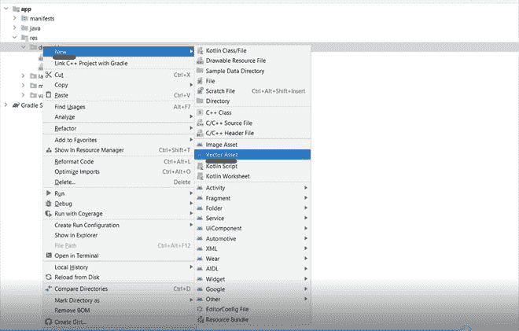
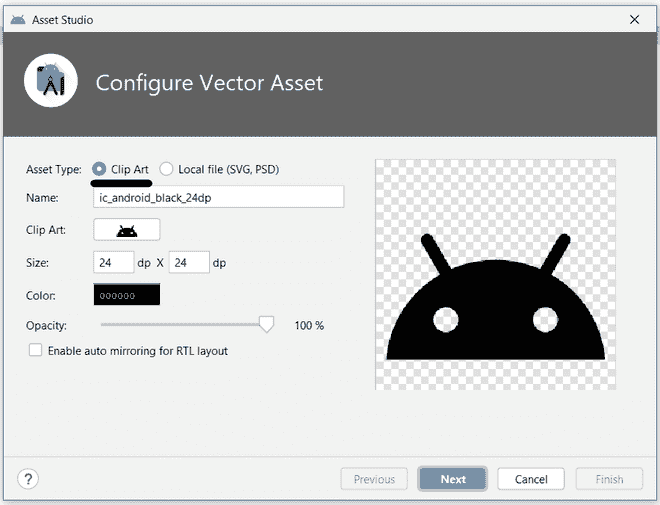
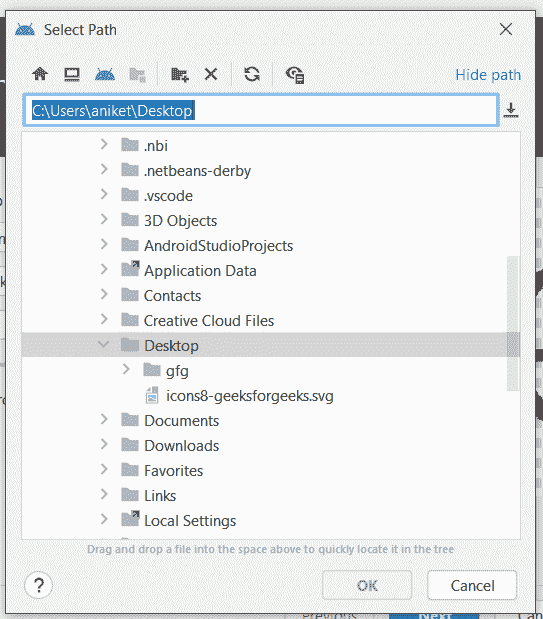
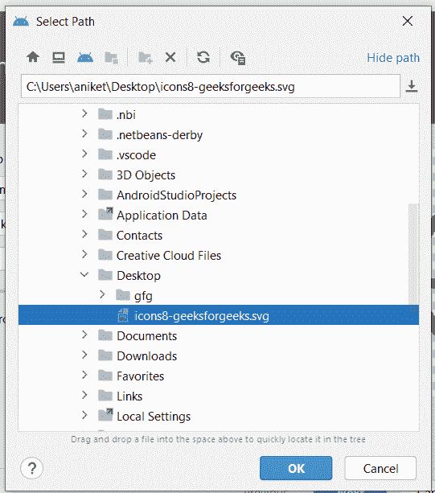

# 如何在安卓系统中使用 SVG 矢量绘图工具？

> 原文:[https://www . geesforgeks . org/how-用法-SVG-vector-draw ables-in-Android/](https://www.geeksforgeeks.org/how-to-use-svg-vector-drawables-in-android/)

**SVG 代表可缩放矢量图形**。它用于在互联网上呈现二维图像。SVG 用于可以缩放到任何大小的高质量图像。我们也可以在安卓系统中使用 SVG 文件。SVG 可以用于图标，用于创建图像，用于创建漂亮的用户界面。在这篇文章中，我们将看到如何在安卓工作室中创建矢量图形

### 创建支持向量机向量的分步实现

**第一步:创建新项目**



**步骤 2:右键单击 RES–>可绘制–>新建–>矢量资产**



**第三步:默认选择剪贴画**



**第四步:选择本地文件**


**第五步:选择本地文件后，你会看到这个画面**



**第六步:定位你的图像文件位置。之后点击完成。**



**第 7 步:使用 activity_main.xml 文件**

导航到**应用程序> res >布局> activity_main.xml** 并将下面的代码添加到该文件中。下面是 **activity_main.xml** 文件的代码。

## 可扩展标记语言

```
<androidx.constraintlayout.widget.ConstraintLayout
    xmlns:android="http://schemas.android.com/apk/res/android"
    xmlns:app="http://schemas.android.com/apk/res-auto"
    xmlns:tools="http://schemas.android.com/tools" 
    android:layout_width="match_parent" 
    android:layout_height="match_parent" 
    tools:context=".MainActivity">

      <!--creating imatgeview-->
    <!--app:srcCompat="@drawable/ic_icons8_geeksforgeeks-->
    <!--this attribute is used for showing image-->
    <ImageView android:id="@+id/imageView" 
               android:layout_width="178dp" 
               android:layout_height="180dp" 
               android:layout_marginStart="128dp"
               android:layout_marginTop="120dp" 
               android:layout_marginEnd="105dp" 
               app:layout_constraintBottom_toTopOf="@+id/gfgButton" 
               app:layout_constraintEnd_toEndOf="parent" 
               app:layout_constraintStart_toStartOf="parent" 
               app:layout_constraintTop_toTopOf="parent" 
               android:visibility="gone" 
               app:layout_constraintVertical_bias="0.0" 
               app:srcCompat="@drawable/ic_icons8_geeksforgeeks"/>

  <!--creating button-->
    <Button android:id="@+id/gfgButton" 
            android:layout_width="wrap_content" 
            android:layout_height="wrap_content" 
            android:layout_marginStart="92dp" 
            android:layout_marginTop="127dp" 
            android:layout_marginEnd="77dp"
            android:layout_marginBottom="256dp" 
            android:backgroundTint="#000" 
            android:text="Tap here to see gfg icon" 
            android:textColor="#fff" 
            app:layout_constraintBottom_toBottomOf="parent"
            app:layout_constraintEnd_toEndOf="parent"
            app:layout_constraintStart_toStartOf="parent" 
            app:layout_constraintTop_toBottomOf="@+id/imageView"/>

</androidx.constraintlayout.widget.ConstraintLayout>
```

**第 8 步:使用****MainActivity.java 文件**

转到**MainActivity.java**文件，参考以下代码。以下是**MainActivity.java**文件的代码。代码中添加了注释，以更详细地理解代码。

## Java 语言(一种计算机语言，尤用于创建网站)

```
import androidx.appcompat.app.AppCompatActivity;

import android.os.Bundle;
import android.view.View;
import android.widget.Button;
import android.widget.ImageView;

public class MainActivity extends AppCompatActivity implements View.OnClickListener
{
    ImageView imageView;
    @Override
    protected void onCreate(Bundle savedInstanceState) {
        super.onCreate(savedInstanceState);
        setContentView(R.layout.activity_main);
        Button b = findViewById(R.id.gfgButton);
        imageView = findViewById(R.id.imageView);
        // registering on click listener
        b.setOnClickListener(this);
    }

    @Override
    public void onClick(View v) {
      // when we will click on button we will see image
      // therefore using View.VISIBLE to make it visible
      imageView.setVisibility(View.VISIBLE);
    }
}
```

**输出:**

<video class="wp-video-shortcode" id="video-658497-1" width="640" height="360" preload="metadata" controls=""><source type="video/mp4" src="https://media.geeksforgeeks.org/wp-content/uploads/20210803223927/20210803-222529-720x1480.mp4?_=1">[https://media.geeksforgeeks.org/wp-content/uploads/20210803223927/20210803-222529-720x1480.mp4](https://media.geeksforgeeks.org/wp-content/uploads/20210803223927/20210803-222529-720x1480.mp4)</video>