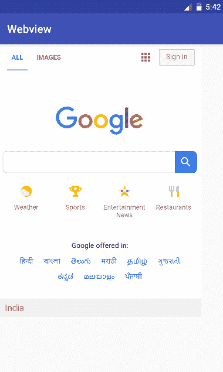

# 如何在安卓中使用 WebView

> 原文:[https://www . geeksforgeeks . org/如何使用-android 中的 web view/](https://www.geeksforgeeks.org/how-to-use-webview-in-android/)

```
public class WebView 
extends AbsoluteLayout 
implements 
    ViewTreeObserver.OnGlobalFocusChangeListener, 
    ViewGroup.OnHierarchyChangeListener
```

网络视图是在应用程序内部显示网页的视图。它用于将应用程序转变为 web 应用程序。
**等级等级:**

```
java.lang.Object
   ↳  android.view.View
        ↳  android.view.ViewGroup
             ↳  android.widget.AbsoluteLayout
                  ↳  android.webkit.WebView
```

**MainActivity.java**

## Java 语言(一种计算机语言，尤用于创建网站)

```
package com.example.hp.webview;

import android.support.v7.app.AppCompatActivity;
import android.os.Bundle;
import android.webkit.WebView;
import android.webkit.WebViewClient;

public class MainActivity extends AppCompatActivity {

    @Override
    protected void onCreate(Bundle savedInstanceState) {
        super.onCreate(savedInstanceState);

        // Binding MainActivity.java with
        // activity_main.xml file
        setContentView(R.layout.activity_main);

        // Find the WebView by its unique ID
        WebView w = (WebView) findViewById(R.id.web);

        // loading http://www.google.com url in the the WebView.
        w.loadUrl("http://www.google.com");

        // this will enable the javascript.
        w.getSettings().setJavaScriptEnabled(true);

        // WebViewClient allows you to handle
        // onPageFinished and override Url loading.
        w.setWebViewClient(new WebViewClient());

    }
}
```

**activity _ main . xml**
在 XML 文件中，只有使用 WebView 才是在 RelativeLayout 内部进行的。

## 可扩展标记语言

```
<?xml version="1.0" encoding="utf-8"?>
<RelativeLayout
    xmlns:android="http://schemas.android.com/apk/res/android"
    xmlns:tools="http://schemas.android.com/tools"
    xmlns:app="http://schemas.android.com/apk/res-auto"
    android:layout_width="match_parent"
    android:layout_height="match_parent"
    tools:context="com.example.hp.webview.MainActivity">

    <WebView
        <!-- covers 368dp width as required. -->
        android:layout_width="368dp"

        <!-- unique ID of WebView -->
        android:id="@+id/web"

        <!-- covers 495dp height as required. -->
        android:layout_height="495dp"

        tools:layout_editor_absoluteX="8dp"
        tools:layout_editor_absoluteY="8dp" />
</RelativeLayout>
```

在 **AndroidManifest.xml** 中，需要包含以下权限，才能访问互联网:

```
"uses-permission android:name="android.permission.INTERNET"
```

