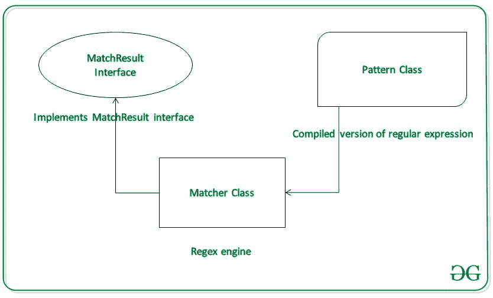

# 如何在安卓系统中使用正则表达式验证密码？

> 原文:[https://www . geesforgeks . org/如何使用安卓正则表达式验证密码/](https://www.geeksforgeeks.org/how-to-validate-a-password-using-regular-expressions-in-android/)

[正则表达式](https://www.geeksforgeeks.org/write-regular-expressions/)基本上定义了搜索模式、模式匹配或者字符串匹配。它存在于 **java.util.regex** 包中。Java Regex API 提供 1 个接口和 3 个类。它们是:

1.  匹配结果界面
2.  匹配类
3.  模式类
4.  PatternSyntaxException 类



> Pattern p = Pattern.compile(")。e”)；//代表单个字符
> 
> 匹配 m = p 匹配(怪胎)：
> 
> 布尔 b = m . matches()；//布尔值“b”为真，因为极客中的第二个字符是“e”

## **例**

在本例中，我们将在客户端验证电子邮件和密码，这意味着我们不会检查电子邮件密码是否存储在某个服务器上并与之匹配，而是将电子邮件密码与预定义的模式进行比较。注意我们要用 **Java** 语言实现这个项目。

### **分步实施**

**第一步:创建新项目**

要在安卓工作室创建新项目，请参考[如何在安卓工作室创建/启动新项目](https://www.geeksforgeeks.org/android-how-to-create-start-a-new-project-in-android-studio/)。注意选择 **Java** 作为编程语言。

**步骤 2:添加依赖关系**

为了使用设计支持库，我们需要添加它的依赖项。转到**梯度脚本>构建.梯度(模块:应用)**并添加以下依赖项。添加依赖项后，点击**立即同步**。

> 实现' com . Google . Android . material:material:1 . 0 . 0 '

在进一步移动之前，让我们添加一些颜色属性，以增强应用程序栏。转到**应用程序> res >值> colors.xml** 并添加以下颜色属性。

## 可扩展标记语言

```
<resources> 
    <color name="colorPrimary">#0F9D58</color> 
    <color name="colorPrimaryDark">#16E37F</color> 
    <color name="colorAccent">#03DAC5</color> 
</resources> 
```

**第三步:设计布局文件**

在这一步中，我们将为我们的应用程序设计布局。转到 **app > res >布局> activity_main.xml** 。在这个布局中，我们使用了文本输入布局，以便为我们的[编辑文本](https://www.geeksforgeeks.org/edittext-widget-in-android-using-java-with-examples/)添加额外的功能，例如视图下方错误消息的间距。下面是 **activity_main.xml** 文件的代码片段。

## 可扩展标记语言

```
<?xml version="1.0" encoding="utf-8"?>
<LinearLayout 
    xmlns:android="http://schemas.android.com/apk/res/android"
    xmlns:app="http://schemas.android.com/apk/res-auto"
    xmlns:tools="http://schemas.android.com/tools"
    android:layout_width="match_parent"
    android:layout_height="match_parent"
    android:orientation="vertical"
    android:padding="16dp"
    tools:context=".MainActivity">

    <com.google.android.material.textfield.TextInputLayout
        android:id="@+id/email"
        android:layout_width="match_parent"
        android:layout_height="wrap_content"
        app:errorEnabled="true">

        <com.google.android.material.textfield.TextInputEditText
            android:layout_width="match_parent"
            android:layout_height="wrap_content"
            android:hint="Email"
            android:inputType="textEmailAddress" />

    </com.google.android.material.textfield.TextInputLayout>

    <com.google.android.material.textfield.TextInputLayout
        android:id="@+id/password"
        android:layout_width="match_parent"
        android:layout_height="wrap_content"
        app:errorEnabled="true"
        app:passwordToggleEnabled="true">

        <com.google.android.material.textfield.TextInputEditText
            android:layout_width="match_parent"
            android:layout_height="wrap_content"
            android:hint="Password"
            android:inputType="textPassword" />

    </com.google.android.material.textfield.TextInputLayout>

    <Button
        android:layout_width="match_parent"
        android:layout_height="wrap_content"
        android:onClick="confirmInput"
        android:text="Submit" />

</LinearLayout>
```

**步骤 4:使用 MainActivity.java 文件**

在**MainActivity.java**文件中，我们使用预定义的模式进行电子邮件验证，并定义自己的密码验证模式。为此，我们定义了两种方法**验证电子邮件()**和**验证密码()**。 **ValidateEmail()** 方法使用预定义的 Email 模式，即它必须有“@”和“.”输入电子邮件中的点。如果电子邮件未能满足条件，它将显示一条错误消息“请输入有效的电子邮件地址”。在 ValidatePassword()中，我们将自己的模式定义为:

> 私有静态最终模式密码模式=
> 
> Pattern.compile("^" +
> 
> "(?=.*[@#$%^&+=])" + //至少 1 个特殊字符
> 
> "(?= \ \ s++ $)"+//无空格
> 
> ".{4，}" + //至少 4 个字符
> 
> “{ content }”x201；);

如果密码不满足这些条件中的任何一个，将显示一条错误消息“密码太弱”。如果任何字段电子邮件或密码为空，它将显示“字段不能为空”。如果电子邮件和密码都符合条件，将显示一条吐司消息，显示输入的电子邮件和密码。下面是 MainActivity.java 文件的代码片段。

## Java 语言(一种计算机语言，尤用于创建网站)

```
import android.os.Bundle;
import android.util.Patterns;
import android.view.View;
import android.widget.Toast;
import androidx.appcompat.app.AppCompatActivity;
import com.google.android.material.textfield.TextInputLayout;
import java.util.regex.Pattern;

public class MainActivity extends AppCompatActivity {

    // defining our own password pattern
    private static final Pattern PASSWORD_PATTERN =
            Pattern.compile("^" +
                    "(?=.*[@#$%^&+=])" +     // at least 1 special character
                    "(?=\\S+$)" +            // no white spaces
                    ".{4,}" +                // at least 4 characters
                    "{content}quot;);
    private TextInputLayout email;
    private TextInputLayout password;

    @Override
    protected void onCreate(Bundle savedInstanceState) {
        super.onCreate(savedInstanceState);
        setContentView(R.layout.activity_main);

        // Referencing email and password
        email = findViewById(R.id.email);
        password = findViewById(R.id.password);
    }

    private boolean validateEmail() {

        // Extract input from EditText
        String emailInput = email.getEditText().getText().toString().trim();

        // if the email input field is empty
        if (emailInput.isEmpty()) {
            email.setError("Field can not be empty");
            return false;
        }

        // Matching the input email to a predefined email pattern
        else if (!Patterns.EMAIL_ADDRESS.matcher(emailInput).matches()) {
            email.setError("Please enter a valid email address");
            return false;
        } else {
            email.setError(null);
            return true;
        }
    }

    private boolean validatePassword() {
        String passwordInput = password.getEditText().getText().toString().trim();
        // if password field is empty
        // it will display error message "Field can not be empty"
        if (passwordInput.isEmpty()) {
            password.setError("Field can not be empty");
            return false;
        }

        // if password does not matches to the pattern
        // it will display an error message "Password is too weak"
        else if (!PASSWORD_PATTERN.matcher(passwordInput).matches()) {
            password.setError("Password is too weak");
            return false;
        } else {
            password.setError(null);
            return true;
        }
    }

    public void confirmInput(View v) {
        if (!validateEmail() | !validatePassword()) {
            return;
        }

        // if the email and password matches, a toast message 
        // with email and password is displayed
        String input = "Email: " + email.getEditText().getText().toString();
        input += "\n";
        input += "Password: " + password.getEditText().getText().toString();
        Toast.makeText(this, input, Toast.LENGTH_SHORT).show();
    }
}
```

### **输出:在仿真器上运行**

<video class="wp-video-shortcode" id="video-525542-1" width="640" height="360" preload="metadata" controls=""><source type="video/mp4" src="https://media.geeksforgeeks.org/wp-content/uploads/20201210225351/Password-Validation-Regex-In-Android.mp4?_=1">[https://media.geeksforgeeks.org/wp-content/uploads/20201210225351/Password-Validation-Regex-In-Android.mp4](https://media.geeksforgeeks.org/wp-content/uploads/20201210225351/Password-Validation-Regex-In-Android.mp4)</video>