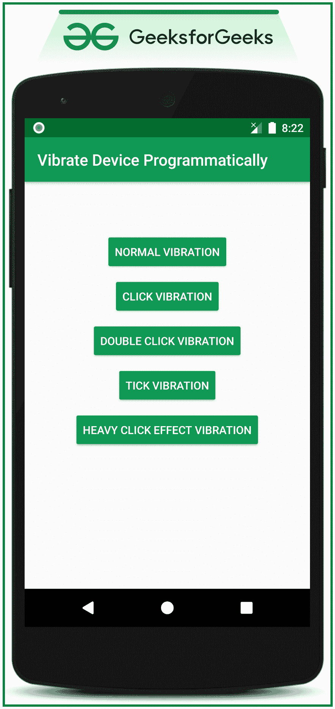

# 如何在安卓系统中编程振动设备？

> 原文:[https://www . geeksforgeeks . org/如何在安卓中以编程方式振动设备/](https://www.geeksforgeeks.org/how-to-vibrate-a-device-programmatically-in-android/)

当涉及到用户体验时，肝反馈也被考虑在内。所以在这个讨论中，已经讨论了各种类型的触觉或者设备的振动类型。例如，点击触觉或长按按钮触觉。触觉反馈中讨论了五种不同类型的振动模式:

1.  设备的默认振动
2.  点击效果振动
3.  双击效果振动
4.  重点击效应振动
5.  滴答效应振动

注意，我们将使用 **Java** 语言来实现这个项目。

## **在安卓系统中实现触觉反馈的步骤**

**第一步:创建一个空的活动安卓工作室项目**

*   创建一个空的活动安卓工作室项目。
*   参考[安卓|如何在安卓工作室创建/启动新项目？](https://www.geeksforgeeks.org/android-how-to-create-start-a-new-project-in-android-studio/)
*   注意选择 **Java** 作为编程语言。

**步骤 2:使用 activity_main.xml**

*   在本讨论中，讨论了四种不同类型的触觉。
*   为了生成触觉，布局中包含了四个不同的按钮。在 **activity_main.xml** 文件中调用以下代码。
*   确保在**MainActivity.java**文件中为所有按钮提供适当的标识来处理它们。

## 可扩展标记语言

```java
<?xml version="1.0" encoding="utf-8"?>
<RelativeLayout 
    xmlns:android="http://schemas.android.com/apk/res/android"
    xmlns:app="http://schemas.android.com/apk/res-auto"
    xmlns:tools="http://schemas.android.com/tools"
    android:layout_width="match_parent"
    android:layout_height="match_parent"
    android:orientation="vertical"
    tools:context=".MainActivity"
    tools:ignore="HardcodedText">

    <!--Button to generate normal vibration-->
    <Button
        android:id="@+id/normalVibrationButton"
        android:layout_width="wrap_content"
        android:layout_height="wrap_content"
        android:layout_centerHorizontal="true"
        android:layout_marginTop="64dp"
        android:backgroundTint="@color/colorPrimary"
        android:text="NORMAL VIBRATION"
        android:textColor="@android:color/white" />

    <!--Button to generate click vibration-->
    <Button
        android:id="@+id/clickVibrationButton"
        android:layout_width="wrap_content"
        android:layout_height="wrap_content"
        android:layout_below="@id/normalVibrationButton"
        android:layout_centerHorizontal="true"
        android:layout_marginTop="8dp"
        android:backgroundTint="@color/colorPrimary"
        android:text="CLICK VIBRATION"
        android:textColor="@android:color/white" />

    <!--Button to generate double click vibration-->
    <Button
        android:id="@+id/doubleClickVibrationButton"
        android:layout_width="wrap_content"
        android:layout_height="wrap_content"
        android:layout_below="@id/clickVibrationButton"
        android:layout_centerHorizontal="true"
        android:layout_marginTop="8dp"
        android:backgroundTint="@color/colorPrimary"
        android:text="DOUBLE CLICK VIBRATION"
        android:textColor="@android:color/white" />

    <!--Button to generate tick vibration-->
    <Button
        android:id="@+id/tickVibrationButton"
        android:layout_width="wrap_content"
        android:layout_height="wrap_content"
        android:layout_below="@id/doubleClickVibrationButton"
        android:layout_centerHorizontal="true"
        android:layout_marginTop="8dp"
        android:backgroundTint="@color/colorPrimary"
        android:text="TICK VIBRATION"
        android:textColor="@android:color/white" />

    <!--Button to generate heavy click vibration-->
    <Button
        android:id="@+id/heavyClickVibrationButton"
        android:layout_width="wrap_content"
        android:layout_height="wrap_content"
        android:layout_below="@id/tickVibrationButton"
        android:layout_centerHorizontal="true"
        android:layout_marginTop="8dp"
        android:backgroundTint="@color/colorPrimary"
        android:text="HEAVY CLICK EFFECT VIBRATION"
        android:textColor="@android:color/white" />

</RelativeLayout>
```

**输出 UI:**



**第三步:在 AndroidManifest 文件**中调用震动权限

设备的振动需要权限。在 AndroidManifest 文件中调用以下代码。

## 可扩展标记语言

```java
<?xml version="1.0" encoding="utf-8"?>
<manifest xmlns:android="http://schemas.android.com/apk/res/android"
    package="com.adityamshidlyali.vibrationsinandroid">

    <!--vibrate permission which needs to be invoked as we hard 
        accessing the vibrator hardware of the device-->
    <uses-permission android:name="android.permission.VIBRATE" />

    <application
        android:allowBackup="true"
        android:icon="@mipmap/ic_launcher"
        android:label="@string/app_name"
        android:roundIcon="@mipmap/ic_launcher_round"
        android:supportsRtl="true"
        android:theme="@style/AppTheme">
        <activity android:name=".MainActivity">
            <intent-filter>
                <action android:name="android.intent.action.MAIN" />

                <category android:name="android.intent.category.LAUNCHER" />
            </intent-filter>
        </activity>
    </application>

</manifest>
```

**步骤 4:使用 MainActivity.java 文件**

*   据说有五种不同的振动。对于这五种振动，每一种都有常数。这些是:

> **默认振幅** - >表示设备的默认振动
> 
> **效果 _ 点击** - >为单次点击触觉
> 
> **效果 _ 双击** - >双击视图
> 
> **效果 _ 重点击** - >为视图的重点击效果
> 
> **效果 _ 滴答** - >为滴答效果振动

*   在**MainActivity.java**文件中调用以下代码。代码中添加了注释，以更详细地理解代码。

## Java 语言(一种计算机语言，尤用于创建网站)

```java
import androidx.appcompat.app.AppCompatActivity;
import android.content.Context;
import android.os.Bundle;
import android.os.VibrationEffect;
import android.os.Vibrator;
import android.view.View;
import android.widget.Button;

public class MainActivity extends AppCompatActivity {

    // buttons for all the types of the vibration effects
    Button bNormalVibration, bClickVibration, bDoubleClickVibration, bTickVibration, bHeavyClickVibration;

    @Override
    protected void onCreate(Bundle savedInstanceState) {
        super.onCreate(savedInstanceState);
        setContentView(R.layout.activity_main);

        // get the VIBRATOR_SERVICE system service
        final Vibrator vibrator = (Vibrator) getSystemService(Context.VIBRATOR_SERVICE);

        // register all of the buttons with their IDs
        bNormalVibration = findViewById(R.id.normalVibrationButton);
        bClickVibration = findViewById(R.id.clickVibrationButton);
        bDoubleClickVibration = findViewById(R.id.doubleClickVibrationButton);
        bTickVibration = findViewById(R.id.tickVibrationButton);
        bHeavyClickVibration = findViewById(R.id.heavyClickVibrationButton);

        // handle normal vibration button
        bNormalVibration.setOnClickListener(new View.OnClickListener() {
            @Override
            public void onClick(View v) {
                final VibrationEffect vibrationEffect1;

                // this is the only type of the vibration which requires system version Oreo (API 26)
                if (android.os.Build.VERSION.SDK_INT >= android.os.Build.VERSION_CODES.O) {

                    // this effect creates the vibration of default amplitude for 1000ms(1 sec)
                    vibrationEffect1 = VibrationEffect.createOneShot(1000, VibrationEffect.DEFAULT_AMPLITUDE);

                    // it is safe to cancel other vibrations currently taking place
                    vibrator.cancel();
                    vibrator.vibrate(vibrationEffect1);
                }
            }
        });

        // handle click vibration button
        bClickVibration.setOnClickListener(new View.OnClickListener() {
            @Override
            public void onClick(View v) {

                // this type of vibration requires API 29
                final VibrationEffect vibrationEffect2;

                if (android.os.Build.VERSION.SDK_INT >= android.os.Build.VERSION_CODES.Q) {

                    // create vibrator effect with the constant EFFECT_CLICK
                    vibrationEffect2 = VibrationEffect.createPredefined(VibrationEffect.EFFECT_CLICK);

                    // it is safe to cancel other vibrations currently taking place
                    vibrator.cancel();

                    vibrator.vibrate(vibrationEffect2);
                }
            }
        });

        // handle double click vibration button
        bDoubleClickVibration.setOnClickListener(new View.OnClickListener() {
            @Override
            public void onClick(View v) {

                final VibrationEffect vibrationEffect3;

                // this type of vibration requires API 29
                if (android.os.Build.VERSION.SDK_INT >= android.os.Build.VERSION_CODES.Q) {

                    // create vibrator effect with the constant EFFECT_DOUBLE_CLICK
                    vibrationEffect3 = VibrationEffect.createPredefined(VibrationEffect.EFFECT_DOUBLE_CLICK);

                    // it is safe to cancel other vibrations currently taking place
                    vibrator.cancel();

                    vibrator.vibrate(vibrationEffect3);
                }
            }
        });

        // handle tick effect vibration button
        bTickVibration.setOnClickListener(new View.OnClickListener() {
            @Override
            public void onClick(View v) {
                final VibrationEffect vibrationEffect4;

                // this type of vibration requires API 29
                if (android.os.Build.VERSION.SDK_INT >= android.os.Build.VERSION_CODES.Q) {

                    // create vibrator effect with the constant EFFECT_TICK
                    vibrationEffect4 = VibrationEffect.createPredefined(VibrationEffect.EFFECT_TICK);

                    // it is safe to cancel other vibrations currently taking place
                    vibrator.cancel();

                    vibrator.vibrate(vibrationEffect4);
                }
            }
        });

        // handle heavy click vibration button
        bHeavyClickVibration.setOnClickListener(new View.OnClickListener() {
            @Override
            public void onClick(View v) {
                final VibrationEffect vibrationEffect5;

                // this type of vibration requires API 29
                if (android.os.Build.VERSION.SDK_INT >= android.os.Build.VERSION_CODES.Q) {

                    // create vibrator effect with the constant EFFECT_HEAVY_CLICK
                    vibrationEffect5 = VibrationEffect.createPredefined(VibrationEffect.EFFECT_HEAVY_CLICK);

                    // it is safe to cancel other vibrations currently taking place
                    vibrator.cancel();

                    vibrator.vibrate(vibrationEffect5);
                }
            }
        });
    }
}
```

### **输出:**

输出应该在物理安卓设备上测试。要知道如何建立一个实体的安卓工作室，请参考[如何在真实设备上运行安卓应用？](https://www.geeksforgeeks.org/how-to-run-the-android-app-on-a-real-device/)