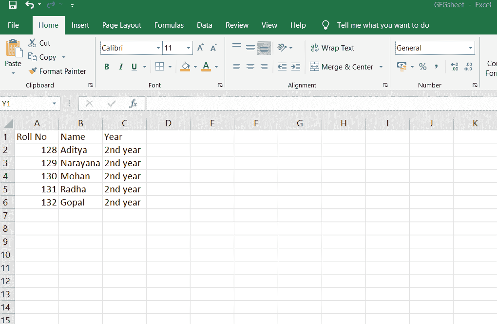

# 如何用 Java 将数据写入 Excel 工作表？

> 原文:[https://www . geesforgeks . org/如何使用-java/](https://www.geeksforgeeks.org/how-to-write-data-into-excel-sheet-using-java/) 将数据写入 excel-sheet

处理文件是任何编程语言的重要部分。Java 为创建、读取、更新和删除文件提供了各种内置方法。这些方法由 **java.io** 包中的**文件**类提供。为了执行文件操作，Java 使用流类。

要使用 JAVA 在 excel 工作表中进行操作，使用 **CSV** 文件非常方便，因为 CSV 文件可以很容易地与微软 Excel、谷歌电子表格以及几乎所有其他可用的电子表格一起使用。

**使用 poi 将数据写入 excel 表格本身:**

**1。**创建空白工作簿。

```java
XSSFWorkbook workbook = new XSSFWorkbook();
```

**2。**创建一个工作表并命名。

```java
XSSFSheet spreadsheet = workbook.createSheet(" Student Data ");
```

**3。**创建一行

```java
Row row = sheet.createRow(rownum++);
```

**4。**将单元格添加到表中。

**5。**重复步骤 3 和 4，写入完整数据。

**先决条件:** 在 Java 程序的构建路径中添加从 Apache POI 下载站点下载的所有 jar 文件。

**示例:**

## Java 语言(一种计算机语言，尤用于创建网站)

```java
// Java program to write data in excel sheet using java code

import java.io.File;
import org.apache.poi.ss.usermodel.Cell;
import org.apache.poi.xssf.usermodel.XSSFRow;
import org.apache.poi.xssf.usermodel.XSSFSheet;
import org.apache.poi.xssf.usermodel.XSSFWorkbook;
import java.io.FileOutputStream;
import java.util.Map;
import java.util.Set;
import java.util.TreeMap;

public class WriteDataToExcel {

    // any exceptions need to be caught
    public static void main(String[] args) throws Exception
    {
        // workbook object
        XSSFWorkbook workbook = new XSSFWorkbook();

        // spreadsheet object
        XSSFSheet spreadsheet
            = workbook.createSheet(" Student Data ");

        // creating a row object
        XSSFRow row;

        // This data needs to be written (Object[])
        Map<String, Object[]> studentData
            = new TreeMap<String, Object[]>();

        studentData.put(
            "1",
            new Object[] { "Roll No", "NAME", "Year" });

        studentData.put("2", new Object[] { "128", "Aditya",
                                            "2nd year" });

        studentData.put(
            "3",
            new Object[] { "129", "Narayana", "2nd year" });

        studentData.put("4", new Object[] { "130", "Mohan",
                                            "2nd year" });

        studentData.put("5", new Object[] { "131", "Radha",
                                            "2nd year" });

        studentData.put("6", new Object[] { "132", "Gopal",
                                            "2nd year" });

        Set<String> keyid = studentData.keySet();

        int rowid = 0;

        // writing the data into the sheets...

        for (String key : keyid) {

            row = spreadsheet.createRow(rowid++);
            Object[] objectArr = studentData.get(key);
            int cellid = 0;

            for (Object obj : objectArr) {
                Cell cell = row.createCell(cellid++);
                cell.setCellValue((String)obj);
            }
        }

        // .xlsx is the format for Excel Sheets...
        // writing the workbook into the file...
        FileOutputStream out = new FileOutputStream(
            new File("C:/savedexcel/GFGsheet.xlsx"));

        workbook.write(out);
        out.close();
    }
}
```

**输出:**

