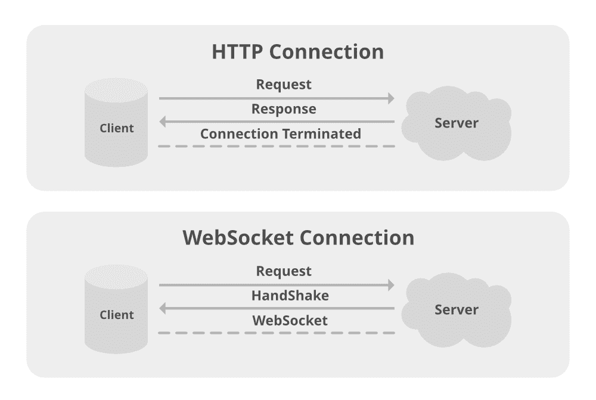

# Java . net . HTTP 包的 HTTP API 示例

> 原文:[https://www . geesforgeks . org/http-API-of-Java-net-http-package-with-examples/](https://www.geeksforgeeks.org/http-api-of-java-net-http-package-with-examples/)

HTTP Client 和 WebSocket APIs 提供了到 HTTP 的高级客户端接口(版本 1.1 和 2)和到 WebSocket 的低级客户端接口。定义的主要类型如下:

*   http client(http 客户端)
*   HttpRequest
*   HttpResponse



协议特定的要求在超文本传输协议第 2 版(HTTP/2)、超文本传输协议(HTTP/1.1)和网络套接字协议中定义。

一般来说，异步任务要么在调用操作的线程中执行，例如发送一个 HTTP 请求，要么由客户端执行器提供的线程执行。从属任务，即由返回的 CompletionStages 或 CompletableFutures 触发的任务，不显式指定执行器，在与 CompletableFuture 相同的默认执行器中执行，如果操作在从属任务注册之前完成，则在调用线程中执行。

这个 API 返回的 CompletableFutures 将为它们的 obtrudeValue 和 obtrudeException 方法抛出[UnsupportedOperationException](https://www.geeksforgeeks.org/how-to-solve-java-list-unsupportedoperationexception/)。在此应用编程接口返回的 CompletableFuture 上调用 cancel 方法可能不会中断底层操作，但在特殊情况下，可能有助于完成尚未完成的相关阶段。

除非另有说明，否则空参数值将导致该包中所有类的方法抛出[NullPointRexception](https://www.geeksforgeeks.org/null-pointer-exception-in-java/)。

**1。界面总结**

界面总结如下表格式:

<figure class="table">

| HTTP component | Action execution |
| --- | --- |
| http client(http 客户端)。你好 | The builder of an HTTP client. |
| HttpRequest .BodyPublisher | A BodyPublisher converts advanced Java objects into byte buffer streams suitable for sending as requesters. |
| HttpRequest .构建器 | The builder of HTTP requests. |
| Response HTTP < T > | An HTTP response. |
| http 响应.身体处理器 | Handler of response body. |
| http response(http 响应)。body subscriber〔t0〕 | A body subscriber consumes the response body byte and converts it to a higher level Java type. |
| HttpResponse。 Commitment handler < T > | Committed handler. |
| http 响应.响应信息 | Initial response information provided to the text handler when the response is initially received and before the text is processed. |

</figure>

**2。**网络套接字客户端。

*   WebSocket。构建者:网络套接字客户端的构建者。
*   WebSocket。监听器:WebSocket.2 的接收接口**。**类
*   类别描述
*   http client(http 客户端)

**3。**一个 HTTP 客户端

*   HTTP 标头:一组 HTTP 标头的只读视图。
*   HTTP 请求:一个 HTTP 请求。
*   HttpRequest。body publisher:body publisher 的实现，它实现了各种有用的发布器，例如从字符串或文件发布请求正文。
*   http 响应。body handlers:body handler 的实现，实现各种有用的处理程序，例如将响应体作为字符串处理，或将响应体流式传输到文件。
*   http 响应。body subscribers:body subscriber 的实现，实现各种有用的订阅者，例如将响应正文字节转换为字符串，或将字节流式传输到文件。

**4。**枚举汇总**T3】**

*   HttpClient。重定向:定义自动重定向策略。
*   HttpClient。版本 HTTP 协议版本。

**5。**异常汇总

<figure class="table">

| gHttpConnectTimeoutException | 当在指定的时间段内未能成功建立连接时抛出，该连接是用来发送 HttpRequest 的。 |
| HttpTimeoutException | 在指定时间段内未收到响应时引发。 |
| WebSocketHandshakeException | 当第一次握手失败时引发。 |

</figure>

**方法:**

有 5 种方式发出 HTTP 请求是现代编程的一个核心特征，也往往是学习一门新的编程语言时首先要做的事情之一。对于 Java 程序员来说，有很多方法可以做到这一点——JDK 的核心库和第三方库。它们如下所示:

1.  在 J2SE 使用 http 连接
2.  在 J2SE 使用 HttpClient
3.  使用 **ApacheHttpClient** 第三方库
4.  使用 **OkHttp** 第三方库
5.  使用**改装**第三方库

让我们用一个例子来证明这一点。

**方式一:**核心 java

用于发出 Java HTTP 请求的核心 Java APIs。从 Java 1.1 开始，JDK 提供的核心库中就有了 HTTP 客户端。Java 11 增加了一个新的客户端。如果您对向项目中添加额外的依赖项很敏感，那么其中一个可能是一个不错的选择。

> **注:**此处代码覆盖了美国宇航局代码样本应用编程接口的天文图片。

1.1Java 1.1 http URL connection

首先，我们是否在类名中大写首字母缩略词？下定决心。无论如何，闭上眼睛，把自己放在 1997 年的中心。《泰坦尼克号》票房大卖，激发了一千个迷因，《辣妹》有一张最畅销的专辑，但今年最大的新闻无疑是 HttpURLConnection 被添加到 Java 1.1 中。在插图**中，它在**处是正确的，如下所示:

插图:

用法以及如何获取请求以获取 APOD 数据

```java
// Step 1: Create a neat value object to hold the URL
URL url = new URL("https://api.nasa.gov/planetary/apod?api_key=DEMO_KEY");

// Step 2: Open a connection(?) on the URL(??) and cast the response(???)
HttpURLConnection connection = (HttpURLConnection) url.openConnection();

// Now it's "open", we can set the request method, headers etc.
connection.setRequestProperty("accept", "application/json");

// This line makes the request
InputStream responseStream = connection.getInputStream();

// Step 3: Manually converting the response body InputStream to
// APOD using Jackson
ObjectMapper mapper = new ObjectMapper();

APOD apod = mapper.readValue(responseStream, APOD.class);

// Step 5: Finally, display the response we have
System.out.println(apod.title);
```

这看起来相当啰嗦，我发现我们做事的顺序很混乱(为什么打开 URL 后还要设置头？).如果你需要用 POST 主体进行更复杂的请求，或者自定义超时**、**等，那么这都是可能的，但是我从来没有发现这个 API 是直观的。

那你什么时候会使用 HTTPUrlConnection 呢？如果您支持使用旧版本 Java 的客户端，并且不能添加依赖项，那么这可能适合您。我怀疑这只是一小部分开发人员，但你可能会在更现代的方法的旧代码库中看到它，请继续阅读。

1.2Java 11 http client

在 http 连接二十多年后，我们在电影院看到了黑豹，并且在 Java 11 中增加了一个新的 HTTP 客户端:java.net.http.HttpClient。这个客户端有一个更符合逻辑的 API，可以处理 HTTP/2 和 Websockets。它还可以通过使用 CompletableFuture API 同步或异步地发出请求。

100 次中有 99 次当我发出 HTTP 请求时，我想把响应体读入我的代码。让这变得困难的图书馆不会给我带来快乐。HttpClient 接受一个 BodyHandler，它可以将 HTTP 响应转换成您选择的类。有一些内置的处理程序:字符串、用于二进制数据的字节[]、拆分署名的流<string>，以及一些其他的。您也可以自己定义，这可能会有所帮助，因为没有用于解析 JSON 的内置 BodyHandler。我已经写了一个(这里)基于杰克逊遵循 Java 文档的例子。它返回一个 APOD 类的供应商，所以我们称之为。当我们需要结果时，获取()。</string>

**说明:**同步请求

```java
// Step 1: Create a client
var client = HttpClient.newHttpClient();

// Step 2: Create a request
var request = HttpRequest.newBuilder(URI.create("https://api.nasa.gov/planetary/apod?api_key=DEMO_KEY")).header("accept", "application/json").build();

// Step 3: Now use the client to send the request

var response = client.send(request, new JsonBodyHandler<>(APOD.class));

// Response
System.out.println(response.body().get().title);

// For an asynchronous request the client and request are made
// in the same way

// Step 3:  After this call .sendAsync instead of .send:
// Step 4: Use the client to send the request
var responseFuture = client.sendAsync(request, new JsonBodyHandler<>(APOD.class));

// We can do other things here while the request is in-flight
// This blocks until the request is complete
var response = responseFuture.get();

// Response
System.out.println(response.body().get().title);
```

**方式二**:第三方 Java HTTP 客户端库。如果内置客户端不为你工作，不用担心！你可以在项目中引入大量的库来完成这项工作。

**2.1** 程式库 1: Apache HttpClient

Apache 软件基金会的 HTTP 客户端已经存在很长时间了。它们被广泛使用，并且是许多高级图书馆的基础。历史有点混乱。旧的 Commons HttpClient 不再开发，新版本(也称为 HttpClient)在 HttpComponents 项目下。5.0 版本于 2020 年初发布，增加了 HTTP/2 支持。该库还支持同步和异步请求。

总的来说，这个应用编程接口是相当低级的，你需要自己实现很多东西。下面的代码调用美国宇航局的应用编程接口。它看起来并不太难使用，但是我跳过了许多您在生产代码中想要的错误处理，并且我不得不再次添加 Jackson 代码来解析 JSON 响应。您可能还想配置一个日志框架来避免 stdout 上的警告(没什么大不了的，但它确实让我有点厌烦)。

> Apache 为同步和异步请求提供了更多的例子。

插图:

```java
ObjectMapper mapper = new ObjectMapper();

try (CloseableHttpClient client = HttpClients.createDefault()) 
{

  HttpGet request = 
  new HttpGet("https://api.nasa.gov/planetary/apod?api_key=DEMO_KEY");

  APOD response = client.execute(request, httpResponse -> 
  mapper.readValue(httpResponse.getEntity().getContent(), APOD.class));

  System.out.println(response.title);
}
```

**2.2** 库 2: OkHttp

OkHttp 是一个来自 Square 的 Http 客户端，具有许多有用的内置功能，如自动处理 GZIP、响应缓存和重试或在出现网络错误时回退到其他主机，以及 HTTP/2 和 WebSocket 支持。该应用编程接口是干净的，尽管没有内置的 JSON 响应解析。

**图解:**用 Jackson 解析 JSON

```java
ObjectMapper mapper = new ObjectMapper();
OkHttpClient client = new OkHttpClient();

Request request = new Request.Builder().url("https://api.nasa.gov/planetary/apod?api_key=DEMO_KEY").build(); // defaults to GET

Response response = client.newCall(request).execute();

APOD apod = mapper.readValue(response.body().byteStream(), APOD.class);

System.out.println(apod.title);
```

> **注意:**这个没问题，但是当你在顶部加上 reflution 的时候，OkHttp 的真正威力就很明显了。

**2.3** 图书馆 3: 改造

改装是另一个来自 Square 的库，建立在 OkHttp 之上。除了 OkHttp 的所有低级特性之外，它还增加了一种构建 Java 类的方法，这些类抽象了 Http 的细节，并提供了一个很好的 Java 友好的 API。

**2.3.1** 首先，我们需要创建一个接口，该接口声明我们想要针对 APOD API 调用的方法，并带有定义这些方法如何对应于 HTTP 请求的注释，如下所示:

```java
public interface APODClient 
{
  @GET("/planetary/apod")
  @Headers("accept: application/json")
  CompletableFuture<APOD> getApod(@Query("api_key") String apiKey);

}
```

**2 . 3 . 2**CompletableFuture<APOD>的返回类型使其成为异步客户端。Square 提供了其他适配器，或者您可以编写自己的适配器。拥有这样的界面有助于模仿客户进行测试，这是值得赞赏的。

**2.3.3** 在声明接口之后，我们要求改装创建一个实现，我们可以使用它来针对给定的基本网址发出请求。能够切换基本 URL 对集成测试也很有帮助。

**图示:**生成客户端

```java
Retrofit retrofit = new Retrofit.Builder().baseUrl("https://api.nasa.gov").addConverterFactory(JacksonConverterFactory.create()).build();

APODClient apodClient = retrofit.create(APODClient.class);

CompletableFuture<APOD> response = apodClient.getApod("DEMO_KEY");

// Do all other stuffs here
// while the request is in-flight

APOD apod = response.get();

System.out.println(apod.title);
```

**API 认证**

如果我们的接口中有多个方法都需要一个应用编程接口密钥，那么可以通过向基本的 OkHttpClient 添加一个 HttpInterceptor 来配置它。自定义客户端可以添加到改装构建器中。

**实现:**创建自定义客户端

```java
private OkHttpClient clientWithApiKey(String apiKey) {
    return new OkHttpClient.Builder()

    .addInterceptor(chain -> {

        Request originalRequest = chain.request();

        HttpUrl newUrl = originalRequest.url().newBuilder()

        .addQueryParameter("api_key", apiKey).build();

        Request request = originalRequest.newBuilder().url(newUrl).build();

        return chain.proceed(request);

    }).build();

}
```

在这里，除了最简单的情况之外，这种 java API 是所有情况的首选。构建类来表示远程应用编程接口是一个很好的抽象，可以很好地处理依赖注入，让改装基于一个可定制的 OkHttp 客户端为您创建它们是很好的。

【Java 的其他 HTTP 客户端

如果以上都不是你想要的，看看下面列出的建议:

*   **放心，**一个为测试你的 REST 服务而设计的 HTTP 客户端。提供了一个流畅的界面来提出请求，并提供了有用的方法来断言响应。
*   **cvurl** 是 Java 11 HttpClient 的一个包装器，它可以消除您在发出复杂请求时可能遇到的一些尖锐的边缘。
*   **Feign**–类似于改装，feign 可以从带注释的接口构建类。Feign 非常灵活，有多种选项可用于发出和读取请求、度量、重试等。
*   **Spring RestTemplate(同步)和 WebClient(异步)客户端**–如果您已经将 Spring 用于项目中的其他所有内容，那么坚持使用这个生态系统可能是一个好主意。贝尔东有一篇文章比较了他们。
*   **微文件 Rest Client–**另一个处于“从一个带注释的接口构建一个类”模式的客户端，这个很有趣，因为你也可以重用同一个接口来创建一个 web 服务器，并且确保客户端和服务器匹配。如果您正在构建服务和该服务的客户端，那么它可能就是适合您的那个。

**A.** 密码认证

除了最简单的情况，我喜欢这种 Java 应用编程接口。构建类来表示远程应用编程接口是一个很好的抽象，可以很好地处理依赖注入，让改装基于一个可定制的 OkHttp 客户端为您创建它们是很好的。这里我们可以使用 PasswordAuthentication 类，它只是这些值的持有者。

> **注意:**每个请求都应该使用相同的用户名和密码。Authenticator 类提供了许多 getXXX(例如 getRequestingSite())方法，这些方法可以用来找出应该提供什么值。

**例**

```java
import java.io.*;

class {

    public static void main (String[] args) {

        HttpClient.newBuilder().authenticator(new Authenticator() {

            // @Override
            protectedPasswordAuthenticationgetPasswordAuthentication() {

                return new PasswordAuthentication( "username", "password".toCharArray());
            }

        }).build();
    }
}
```

**B.** 设置重定向策略

调用网站页面时，有时您想要访问的页面已被移动到不同的地址。在这种情况下，您将收到 HTTP 状态代码 3xx，通常带有关于新 URI 的信息。通过设置适当的重定向策略，HttpClient 可以自动将请求重定向到新的 URI。所有重定向策略都在名为 HttpClient.Redirect 的枚举中定义和描述。

> **注意:**使用 followRedirects()方法，可以设置重定向策略

```java
HttpClient.newBuilder()
followRedirects(HttpClient.Redirect.ALWAYS)
build();
```

**C.** 发送同步或异步请求

*   HttpClient 为向服务器发送请求提供了两种可能性:
*   同步发送(…)(阻塞直到响应到来)
*   异步发送异步(…)(不等待响应，非阻塞)
*   到目前为止，send(…)方法自然会等待响应:

**例 1:**

```java
HttpResponse<String> response = HttpClient.newBuilder()
.build()
.send(request, BodyHandlers.ofString());
```

这个调用返回一个 HttpResponse 对象，这意味着只有当响应已经返回时，应用程序流中的下一条指令才会被执行

这种方法有很多缺点，尤其是在处理大量数据时。为了克服这个限制，您可以使用 sendAsync(…)方法，该方法返回一个 CompletableFeature <string>来异步处理请求:</string>

```java
CompletableFuture<String> response = HttpClient.newBuilder()
.build()
.sendAsync(request, BodyHandlers.ofString())
.thenApply(HttpResponse::body);
```

> **注意:**API 还可以处理多个响应，并流式传输请求和响应体

**例 2:**

```java
class  {

    public static void main (String[] args) {

        List<URI>uris = Arrays.asList()

new URI("https://postman-echo.com/get?foo1=bar1"),
new URI("https://postman-echo.com/get?foo2=bar2");

HttpClient client = HttpClient.newHttpClient();

List<HttpRequest> requests = uris.stream()
.map(HttpRequest::newBuilder)
.map(reqBuilder ->reqBuilder.build())
.collect(Collectors.toList());

CompletableFuture.allOf(requests.stream()
.map(request ->client.sendAsync(request, ofString()))
.toArray(CompletableFuture<?>[]::new))
.join();

    }
}
```

```java
CompletableFuture.allOf(requests.stream()
.map(request ->client.sendAsync(request, ofString()))
.toArray(CompletableFuture<?>[]::new))
.join();
   }
}
```

**代码解释和链接如下:**

因此，您的主代码将继续执行，在将来配置回调，然后调用。但是这个回调只有在服务器返回响应时才会被触发。HTTP 客户端将使用后台线程进行调用。请注意，服务器响应需要一段时间。同时，你的申请也将结束。那么，如何让这个例子起作用呢？以后调用 join 方法。这将加入您的代码将来运行的应用程序线程。在代码的这一点上，join 方法将等到将来完成。如果它完成了，这也意味着您的 thenAccept 回调将会运行。事实上，当你运行这个例子时，你会得到预期的结果。

**例 3:**

```java
class {

    // Main driver method
    public static void main (String[] args) {

        HttpClient.newBuilder().authenticator(new Authenticator() {

            // @Override
            protectedPasswordAuthenticationgetPasswordAuthentication() {

                return new PasswordAuthentication("username", "password".toCharArray());
            }

        }).build();

    }
}
```

```java
CompletableFuture<HttpResponse<String>> response1 = HttpClient.newBuilder()
.executor(executor)
.build()
.sendAsync(request,asString());
```

> **注意:**默认情况下，HttpClient 使用 executor Java . util . concurrent . executors . new cachedthreadpool()。

同步和阻塞发送应用编程接口更容易使用，但异步应用编程接口将帮助您创建响应更快、可伸缩性更强的应用程序，因此您必须选择最适合您的用例的应用程序。

**HTTP 客户端应用编程接口的目标**

HTTP 客户端应用编程接口有许多目标，旨在帮助您理解该应用编程接口的重要特性以及如何在编程中使用它:

*   易于在常见情况下使用，包括简单的阻塞模式。
*   简单简洁的应用编程接口，满足 80-90%的应用需求
*   支持标准和通用的身份验证机制
*   易于设置网络套接字接口握手
*   对嵌入式系统要求友好；特别是，避免永久运行定时器线程

> **注意:**支持 HTTPS/TLS
> 
> *   它必须面向性能，并且其内存占用比旧的和第三方 API 少
> *   通过 CompletableFuture 提供非阻塞的请求和响应语义，这些语义可以链接到触发相关操作。