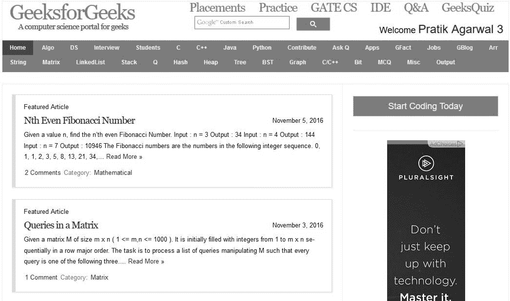

# Java 中的图像处理|第 12 集(对比度增强)

> 原文:[https://www . geesforgeks . org/image-processing-Java-set-12-对比度增强/](https://www.geeksforgeeks.org/image-processing-java-set-12-contrast-enhancement/)

在本文中，我们将学习如何使用 OpenCV 库来增强图像的对比度。为了增强对比度，使用了直方图均衡化技术。
关于直方图均衡技术的更多信息，请参考这篇论文的[。](https://arxiv.org/ftp/arxiv/papers/1307/1307.3054.pdf)

首先我们需要为 Java 设置 OpenCV，我们建议同样使用 eclipse，因为它易于使用和设置。安装参考[http://docs . opencv . org/2.4/doc/教程/简介/Java _ eclipse/Java _ eclipse . html](http://docs.opencv.org/2.4/doc/tutorials/introduction/java_eclipse/java_eclipse.html)

现在让我们了解对比度增强所需的一些方法。

1.  均衡器(源，目的地)——这个方法存在于 OpenCv 的 Imgproc 包中。 ***源*** 参数为 8 位单通道源图像，而 ***目的地*** 参数为目的地图像
2.  imcodecs . imread()/imcodecs . imwrite()–这些方法用于将图像作为由 OpenCV 渲染的 Mat 对象进行读写。

```java
// Java program to demonstrate contrast enhancement
package ocv;
import org.opencv.core.Core;
import org.opencv.core.Mat;
import org.opencv.imgcodecs.Imgcodecs;
import org.opencv.imgproc.Imgproc;

public class Main
{
    public static void main( String[] args )
    {
        try
        {
            // For proper execution of native libraries
            // Core.NATIVE_LIBRARY_NAME must be loaded before
            // calling any of the opencv methods
            System.loadLibrary( Core.NATIVE_LIBRARY_NAME );

            //input image
            Mat source = Imgcodecs.imread("E:\\input.jpg",
                           Imgcodecs.CV_LOAD_IMAGE_GRAYSCALE);
            Mat destination = new Mat(source.rows(),
                               source.cols(), source.type());

            // applying histogram equalization
            Imgproc.equalizeHist(source, destination);

            // writing output image
            Imgcodecs.imwrite("E:\\output.jpg", destination);
        }
        catch (Exception e)
        {
            System.out.println("error: " + e.getMessage());
        }
    }
}
```

**注意:**该代码在联机 ide 中无法工作，因为它需要硬盘中的映像。

**Input.jpg**

 **Output.jpg**


本文由 **[Pratik Agarwal](https://www.facebook.com/Pratik.Agarwal01)** 供稿。如果你喜欢 GeeksforGeeks 并想投稿，你也可以使用[contribute.geeksforgeeks.org](http://www.contribute.geeksforgeeks.org)写一篇文章或者把你的文章邮寄到 contribute@geeksforgeeks.org。看到你的文章出现在极客博客主页上，帮助其他极客。

如果你发现任何不正确的地方，或者你想分享更多关于上面讨论的话题的信息，请写评论。