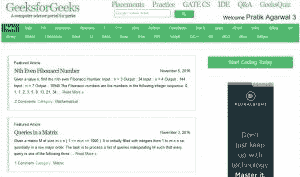
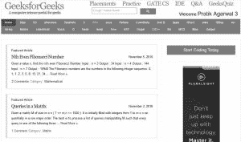
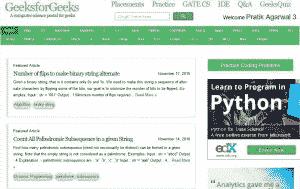
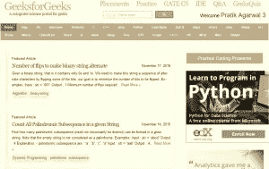

# Java 中的图像处理|第 14 集(两幅图像的比较)

> 原文:[https://www . geesforgeks . org/image-processing-Java-set-14-comparison-two-images/](https://www.geeksforgeeks.org/image-processing-java-set-14-comparison-two-images/)

我们强烈建议将以下帖子作为先决条件。

*   [Java 中的图像处理|集 1(读写)](https://www.geeksforgeeks.org/image-processing-java-set-1-read-write/)
*   [Java 中的图像处理|设置 2(获取和设置像素)](https://www.geeksforgeeks.org/image-processing-java-set-2-get-set-pixels/)

在本文中，我们将学习如何比较两个给定的图像(**必须具有相同的尺寸**)并打印它们之间的差异百分比。

**算法:**

步骤 1–检查两个图像的尺寸是否匹配。
步骤 2–获取两幅图像的 RGB 值。
步骤 3–计算三个颜色分量的两个对应像素的差异。
步骤 4–对图像的每个像素重复步骤 2-3。
第 5 步–通过将差值之和除以以下值来计算百分比:

*   像素数量，以获得每个像素的平均差异
*   3、获得每个颜色分量的平均差异
*   255，以获得介于 0.0 和 1.0 之间的值，该值可以转换为百分比值

**实施:**

```
// Java Program to compare two images
import java.awt.image.BufferedImage;
import javax.imageio.ImageIO;
import java.io.File;
import java.io.IOException;

class ImageComparision
{
    public static void main(String[] args)
    {
        BufferedImage imgA = null;
        BufferedImage imgB = null;

        try
        {
            File fileA = new File("/home / pratik /"+
                             " Desktop / image1.jpg");
            File fileB = new File("/home / pratik /"+
                             " Desktop / image2.jpg");

            imgA = ImageIO.read(fileA);
            imgB = ImageIO.read(fileB);
        }
        catch (IOException e)
        {
            System.out.println(e);
        }
        int width1 = imgA.getWidth();
        int width2 = imgB.getWidth();
        int height1 = imgA.getHeight();
        int height2 = imgB.getHeight();

        if ((width1 != width2) || (height1 != height2))
            System.out.println("Error: Images dimensions"+
                                             " mismatch");
        else
        {
            long difference = 0;
            for (int y = 0; y < height1; y++)
            {
                for (int x = 0; x < width1; x++)
                {
                    int rgbA = imgA.getRGB(x, y);
                    int rgbB = imgB.getRGB(x, y);
                    int redA = (rgbA >> 16) & 0xff;
                    int greenA = (rgbA >> 8) & 0xff;
                    int blueA = (rgbA) & 0xff;
                    int redB = (rgbB >> 16) & 0xff;
                    int greenB = (rgbB >> 8) & 0xff;
                    int blueB = (rgbB) & 0xff;
                    difference += Math.abs(redA - redB);
                    difference += Math.abs(greenA - greenB);
                    difference += Math.abs(blueA - blueB);
                }
            }

            // Total number of red pixels = width * height
            // Total number of blue pixels = width * height
            // Total number of green pixels = width * height
            // So total number of pixels = width * height * 3
            double total_pixels = width1 * height1 * 3;

            // Normalizing the value of different pixels
            // for accuracy(average pixels per color
            // component)
            double avg_different_pixels = difference /
                                          total_pixels;

            // There are 255 values of pixels in total
            double percentage = (avg_different_pixels /
                                            255) * 100;

            System.out.println("Difference Percentage-->" +
                                                percentage);
        }
    }
}
```

**注意:**代码不会在联机 ide 上运行，因为它需要驱动器中的映像。

输出:

**输入图像:**

 

**产量:**差异百分比–>2.363600443606

**输入图像:**

 

**产量:**差异百分比–>6.3666666666616

**输入图像:**

 

**输出:**差异百分比–>0.0

本文由 **[Pratik Agarwal](https://www.facebook.com/Pratik.Agarwal01)** 供稿。如果你喜欢 GeeksforGeeks 并想投稿，你也可以使用[contribute.geeksforgeeks.org](http://contribute.geeksforgeeks.org)写一篇文章或者把你的文章邮寄到 contribute@geeksforgeeks.org。看到你的文章出现在极客博客主页上，帮助其他极客。

如果你发现任何不正确的地方，或者你想分享更多关于上面讨论的话题的信息，请写评论。