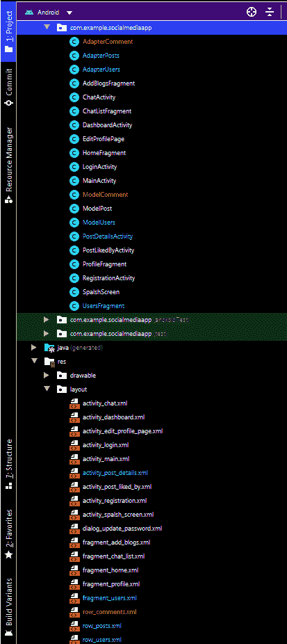

# 在社交媒体安卓应用中实现删除博文功能

> 原文:[https://www . geesforgeks . org/implement-delete-a-blog-post-functional-in-social-media-Android-app/](https://www.geeksforgeeks.org/implement-delete-a-blog-post-functionality-in-social-media-android-app/)

这是**“在安卓工作室上构建社交媒体应用”**教程的**第 13 部分**，我们将在本文中介绍以下功能:

*   我们将删除用户写的博客。
*   博客只能由博客的所有者删除。在博客的右上角，有一个按钮。
*   点击后会弹出一个删除按钮。单击“删除”后，博客将从博客中成功删除。

### **分步实施**

**步骤 1:使用 AdapterPosts.java 文件**

我们将获得我们想要删除的“帖子”中的节点。我们直接删除快照参考值。

```java
Query query= FirebaseDatabase.getInstance().getReference("Posts").orderByChild("ptime").equalTo(pid);
                query.addValueEventListener(new ValueEventListener() {
                    @Override
                    public void onDataChange(@NonNull DataSnapshot dataSnapshot) {
                        for (DataSnapshot dataSnapshot1:dataSnapshot.getChildren()){
                            dataSnapshot1.getRef().removeValue();//removing the value after getting reference
                        }

                        pd.dismiss();
                        Toast.makeText(context,"Deleted Successfully",Toast.LENGTH_LONG).show();
                    }

                    @Override
                    public void onCancelled(@NonNull DatabaseError databaseError) {

                    }
                });
```

以下是**AdapterPosts.java**文件的更新代码。

## Java 语言(一种计算机语言，尤用于创建网站)

```java
package com.example.socialmediaapp;

import android.app.ProgressDialog;
import android.content.Context;
import android.content.Intent;
import android.text.format.DateFormat;
import android.view.Gravity;
import android.view.LayoutInflater;
import android.view.Menu;
import android.view.MenuItem;
import android.view.View;
import android.view.ViewGroup;
import android.widget.Button;
import android.widget.ImageButton;
import android.widget.ImageView;
import android.widget.LinearLayout;
import android.widget.PopupMenu;
import android.widget.TextView;
import android.widget.Toast;

import androidx.annotation.NonNull;
import androidx.recyclerview.widget.RecyclerView;

import com.bumptech.glide.Glide;
import com.google.android.gms.tasks.OnFailureListener;
import com.google.android.gms.tasks.OnSuccessListener;
import com.google.firebase.auth.FirebaseAuth;
import com.google.firebase.database.DataSnapshot;
import com.google.firebase.database.DatabaseError;
import com.google.firebase.database.DatabaseReference;
import com.google.firebase.database.FirebaseDatabase;
import com.google.firebase.database.Query;
import com.google.firebase.database.ValueEventListener;
import com.google.firebase.storage.FirebaseStorage;
import com.google.firebase.storage.StorageReference;

import java.util.Calendar;
import java.util.List;
import java.util.Locale;

public class AdapterPosts extends RecyclerView.Adapter<AdapterPosts.MyHolder> {

    Context context;
    String myuid;
    private DatabaseReference liekeref, postref;
    boolean mprocesslike = false;

    public AdapterPosts(Context context, List<ModelPost> modelPosts) {
        this.context = context;
        this.modelPosts = modelPosts;
        myuid = FirebaseAuth.getInstance().getCurrentUser().getUid();
        liekeref = FirebaseDatabase.getInstance().getReference().child("Likes");
        postref = FirebaseDatabase.getInstance().getReference().child("Posts");
    }

    List<ModelPost> modelPosts;

    @NonNull
    @Override
    public MyHolder onCreateViewHolder(@NonNull ViewGroup parent, int viewType) {
        View view = LayoutInflater.from(context).inflate(R.layout.row_posts, parent, false);
        return new MyHolder(view);
    }

    @Override
    public void onBindViewHolder(@NonNull final MyHolder holder, final int position) {
        final String uid = modelPosts.get(position).getUid();
        String nameh = modelPosts.get(position).getUname();
        final String titlee = modelPosts.get(position).getTitle();
        final String descri = modelPosts.get(position).getDescription();
        final String ptime = modelPosts.get(position).getPtime();
        String dp = modelPosts.get(position).getUdp();
        String plike = modelPosts.get(position).getPlike();
        final String image = modelPosts.get(position).getUimage();
        String email = modelPosts.get(position).getUemail();
        String comm = modelPosts.get(position).getPcomments();
        final String pid = modelPosts.get(position).getPtime();
        Calendar calendar = Calendar.getInstance(Locale.ENGLISH);
        calendar.setTimeInMillis(Long.parseLong(ptime));
        String timedate = DateFormat.format("dd/MM/yyyy hh:mm aa", calendar).toString();
        holder.name.setText(nameh);
        holder.title.setText(titlee);
        holder.description.setText(descri);
        holder.time.setText(timedate);
        holder.like.setText(plike + " Likes");
        holder.comments.setText(comm + " Comments");
        setLikes(holder, ptime);
        try {
            Glide.with(context).load(dp).into(holder.picture);
        } catch (Exception e) {

        }
        holder.image.setVisibility(View.VISIBLE);
        try {
            Glide.with(context).load(image).into(holder.image);
        } catch (Exception e) {

        }
        holder.like.setOnClickListener(new View.OnClickListener() {
            @Override
            public void onClick(View v) {
                Intent intent = new Intent(holder.itemView.getContext(), PostLikedByActivity.class);
                intent.putExtra("pid", pid);
                holder.itemView.getContext().startActivity(intent);
            }
        });
        holder.likebtn.setOnClickListener(new View.OnClickListener() {
            @Override
            public void onClick(View v) {
                final int plike = Integer.parseInt(modelPosts.get(position).getPlike());
                mprocesslike = true;
                final String postid = modelPosts.get(position).getPtime();
                liekeref.addValueEventListener(new ValueEventListener() {
                    @Override
                    public void onDataChange(@NonNull DataSnapshot dataSnapshot) {

                        if (mprocesslike) {
                            if (dataSnapshot.child(postid).hasChild(myuid)) {
                                postref.child(postid).child("plike").setValue("" + (plike - 1));
                                liekeref.child(postid).child(myuid).removeValue();
                                mprocesslike = false;
                            } else {
                                postref.child(postid).child("plike").setValue("" + (plike + 1));
                                liekeref.child(postid).child(myuid).setValue("Liked");
                                mprocesslike = false;
                            }
                        }
                    }

                    @Override
                    public void onCancelled(@NonNull DatabaseError databaseError) {

                    }
                });
            }
        });
        holder.more.setOnClickListener(new View.OnClickListener() {
            @Override
            public void onClick(View v) {
                showMoreOptions(holder.more, uid, myuid, ptime, image);
            }
        });
        holder.comment.setOnClickListener(new View.OnClickListener() {
            @Override
            public void onClick(View v) {
                Intent intent = new Intent(context, PostDetailsActivity.class);
                intent.putExtra("pid", ptime);
                context.startActivity(intent);
            }
        });
    }

    private void showMoreOptions(ImageButton more, String uid, String myuid, final String pid, final String image) {

        PopupMenu popupMenu = new PopupMenu(context, more, Gravity.END);
        if (uid.equals(myuid)) {
            popupMenu.getMenu().add(Menu.NONE, 0, 0, "DELETE");
        }
        popupMenu.setOnMenuItemClickListener(new PopupMenu.OnMenuItemClickListener() {
            @Override
            public boolean onMenuItemClick(MenuItem item) {
                if (item.getItemId() == 0) {
                    deltewithImage(pid, image);
                }

                return false;
            }
        });
        popupMenu.show();
    }

    private void deltewithImage(final String pid, String image) {
        final ProgressDialog pd = new ProgressDialog(context);
        pd.setMessage("Deleting");
        StorageReference picref = FirebaseStorage.getInstance().getReferenceFromUrl(image);
        picref.delete().addOnSuccessListener(new OnSuccessListener<Void>() {
            @Override
            public void onSuccess(Void aVoid) {
                Query query = FirebaseDatabase.getInstance().getReference("Posts").orderByChild("ptime").equalTo(pid);
                query.addValueEventListener(new ValueEventListener() {
                    @Override
                    public void onDataChange(@NonNull DataSnapshot dataSnapshot) {
                        for (DataSnapshot dataSnapshot1 : dataSnapshot.getChildren()) {
                            dataSnapshot1.getRef().removeValue();
                        }

                        pd.dismiss();
                        Toast.makeText(context, "Deleted Successfully", Toast.LENGTH_LONG).show();
                    }

                    @Override
                    public void onCancelled(@NonNull DatabaseError databaseError) {

                    }
                });
            }
        }).addOnFailureListener(new OnFailureListener() {
            @Override
            public void onFailure(@NonNull Exception e) {

            }
        });
    }

    private void setLikes(final MyHolder holder, final String pid) {
        liekeref.addValueEventListener(new ValueEventListener() {
            @Override
            public void onDataChange(@NonNull DataSnapshot dataSnapshot) {

                if (dataSnapshot.child(pid).hasChild(myuid)) {
                    holder.likebtn.setCompoundDrawablesWithIntrinsicBounds(R.drawable.ic_liked, 0, 0, 0);
                    holder.likebtn.setText("Liked");
                } else {
                    holder.likebtn.setCompoundDrawablesWithIntrinsicBounds(R.drawable.ic_like, 0, 0, 0);
                    holder.likebtn.setText("Like");
                }
            }

            @Override
            public void onCancelled(@NonNull DatabaseError databaseError) {

            }
        });

    }

    @Override
    public int getItemCount() {
        return modelPosts.size();
    }

    class MyHolder extends RecyclerView.ViewHolder {
        ImageView picture, image;
        TextView name, time, title, description, like, comments;
        ImageButton more;
        Button likebtn, comment;
        LinearLayout profile;

        public MyHolder(@NonNull View itemView) {
            super(itemView);
            picture = itemView.findViewById(R.id.picturetv);
            image = itemView.findViewById(R.id.pimagetv);
            name = itemView.findViewById(R.id.unametv);
            time = itemView.findViewById(R.id.utimetv);
            more = itemView.findViewById(R.id.morebtn);
            title = itemView.findViewById(R.id.ptitletv);
            description = itemView.findViewById(R.id.descript);
            like = itemView.findViewById(R.id.plikeb);
            comments = itemView.findViewById(R.id.pcommentco);
            likebtn = itemView.findViewById(R.id.like);
            comment = itemView.findViewById(R.id.comment);
            profile = itemView.findViewById(R.id.profilelayout);
        }
    }
}
```

**输出:**

<video class="wp-video-shortcode" id="video-583128-1" width="640" height="360" preload="metadata" controls=""><source type="video/mp4" src="https://media.geeksforgeeks.org/wp-content/uploads/20210317162701/deleteblog.mp4?_=1">[https://media.geeksforgeeks.org/wp-content/uploads/20210317162701/deleteblog.mp4](https://media.geeksforgeeks.org/wp-content/uploads/20210317162701/deleteblog.mp4)</video>

**本文使用的所有可绘制文件请参考此链接:**[<u>https://drive . Google . com/drive/folders/1M _ knOH _ ugcuwsp5nkyzed 4 DRP-Honzbe？usp =共享</u>](https://drive.google.com/drive/folders/1M_knOH_ugCuwSP5nkYzeD4dRp-Honzbe?usp=sharing)

**以下是执行这些操作后的文件结构:**

