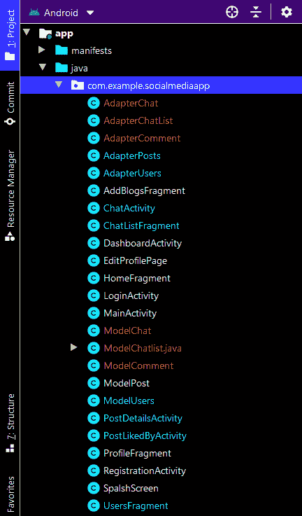
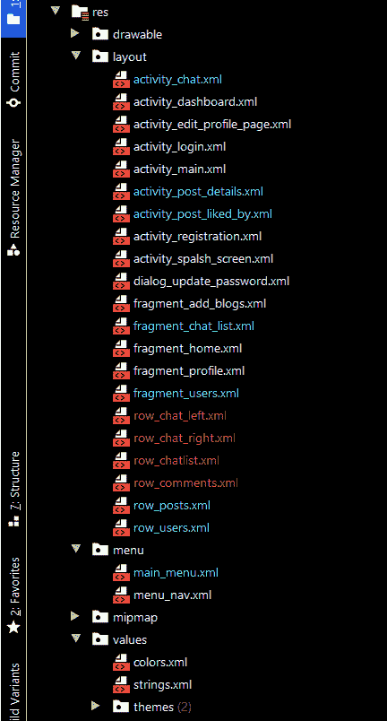

# 在社交媒体安卓应用中实现删除消息功能

> 原文:[https://www . geesforgeks . org/implement-delete-messages-functional-in-social-media-Android-app/](https://www.geeksforgeeks.org/implement-delete-messages-functionality-in-social-media-android-app/)

这是 **【在 Android Studio 上构建社交媒体 App】**教程的 **第 15 部分** ，我们将在本文中介绍以下功能:

*   我们将删除**聊天活动**中的消息。
*   我们将删除文本和图像消息。当我们点击一个文本时，一个**报警框**就会出现。
*   有两个选项可以删除该消息或取消事件。点击删除后，消息将从两侧删除。

### **分步实施**

**步骤 1:使用 AdapterChat.java 文件**

只有当我们是邮件的发件人时，我们才能删除邮件。有两种方法可以删除消息。你可以用任何一个。在一个示例中，我们使用 datasnapshot 移除了该值，在另一个示例中，我们将消息更新为“此消息已被删除”，正如我们在 WhatsApp 中看到的那样。

```
if(dataSnapshot1.child("sender").getValue().equals(myuid)) {
// any two of below can be used
dataSnapshot1.getRef().removeValue();

// <----------------------------------->   
HashMap<String, Object> hashMap = new HashMap<>();
hashMap.put("message", "This Message Was Deleted");
dataSnapshot1.getRef().updateChildren(hashMap);
Toast.makeText(context,"Message Deleted.....",Toast.LENGTH_LONG).show();
}
```

下面是**文件的代码。**

## **Java 语言(一种计算机语言，尤用于创建网站)**

```
package com.example.socialmediaapp;

import android.app.AlertDialog;
import android.content.Context;
import android.content.DialogInterface;
import android.text.format.DateFormat;
import android.view.LayoutInflater;
import android.view.View;
import android.view.ViewGroup;
import android.widget.ImageView;
import android.widget.LinearLayout;
import android.widget.TextView;
import android.widget.Toast;

import androidx.annotation.NonNull;
import androidx.recyclerview.widget.RecyclerView;

import com.bumptech.glide.Glide;
import com.google.firebase.auth.FirebaseAuth;
import com.google.firebase.auth.FirebaseUser;
import com.google.firebase.database.DataSnapshot;
import com.google.firebase.database.DatabaseError;
import com.google.firebase.database.DatabaseReference;
import com.google.firebase.database.FirebaseDatabase;
import com.google.firebase.database.Query;
import com.google.firebase.database.ValueEventListener;

import java.util.Calendar;
import java.util.List;
import java.util.Locale;

import de.hdodenhof.circleimageview.CircleImageView;

public class AdapterChat extends RecyclerView.Adapter<com.example.socialmediaapp.AdapterChat.Myholder> {
    private static final int MSG_TYPE_LEFT = 0;
    private static final int MSG_TYPR_RIGHT = 1;
    Context context;
    List<ModelChat> list;
    String imageurl;
    FirebaseUser firebaseUser;

    public AdapterChat(Context context, List<ModelChat> list, String imageurl) {
        this.context = context;
        this.list = list;
        this.imageurl = imageurl;
    }

    @NonNull
    @Override
    public Myholder onCreateViewHolder(@NonNull ViewGroup parent, int viewType) {
        if (viewType == MSG_TYPE_LEFT) {
            View view = LayoutInflater.from(context).inflate(R.layout.row_chat_left, parent, false);
            return new Myholder(view);
        } else {
            View view = LayoutInflater.from(context).inflate(R.layout.row_chat_right, parent, false);
            return new Myholder(view);
        }
    }

    @Override
    public void onBindViewHolder(@NonNull Myholder holder, final int position) {
        String message = list.get(position).getMessage();
        String timeStamp = list.get(position).getTimestamp();
        String type = list.get(position).getType();
        Calendar calendar = Calendar.getInstance(Locale.ENGLISH);
        calendar.setTimeInMillis(Long.parseLong(timeStamp));
        String timedate = DateFormat.format("dd/MM/yyyy hh:mm aa", calendar).toString();
        holder.message.setText(message);
        holder.time.setText(timedate);
        try {
            Glide.with(context).load(imageurl).into(holder.image);
        } catch (Exception e) {

        }
        if (type.equals("text")) {
            holder.message.setVisibility(View.VISIBLE);
            holder.mimage.setVisibility(View.GONE);
            holder.message.setText(message);
        } else {
            holder.message.setVisibility(View.GONE);
            holder.mimage.setVisibility(View.VISIBLE);
            Glide.with(context).load(message).into(holder.mimage);
        }

        holder.msglayput.setOnClickListener(new View.OnClickListener() {
            @Override
            public void onClick(View v) {
                AlertDialog.Builder builder = new AlertDialog.Builder(context);
                builder.setTitle("Delete Message");
                builder.setMessage("Are You Sure To Delete This Messgae");
                builder.setPositiveButton("Delete", new DialogInterface.OnClickListener() {
                    @Override
                    public void onClick(DialogInterface dialog, int which) {
                        deleteMsg(position);
                    }
                });
                builder.setNegativeButton("Cancel", new DialogInterface.OnClickListener() {
                    @Override
                    public void onClick(DialogInterface dialog, int which) {
                        dialog.dismiss();
                    }
                });
                builder.create().show();
            }
        });
    }

    private void deleteMsg(int position) {
        final String myuid = FirebaseAuth.getInstance().getCurrentUser().getUid();
        String msgtimestmp = list.get(position).getTimestamp();
        DatabaseReference dbref = FirebaseDatabase.getInstance().getReference().child("Chats");
        Query query = dbref.orderByChild("timestamp").equalTo(msgtimestmp);
        query.addListenerForSingleValueEvent(new ValueEventListener() {
            @Override
            public void onDataChange(@NonNull DataSnapshot dataSnapshot) {
                for (DataSnapshot dataSnapshot1 : dataSnapshot.getChildren()) {
                    if (dataSnapshot1.child("sender").getValue().equals(myuid)) {
                        // any two of below can be used
                        dataSnapshot1.getRef().removeValue();
                       /* HashMap<String, Object> hashMap = new HashMap<>();
                        hashMap.put("message", "This Message Was Deleted");
                        dataSnapshot1.getRef().updateChildren(hashMap);
                        Toast.makeText(context,"Message Deleted.....",Toast.LENGTH_LONG).show();
*/
                    } else {
                        Toast.makeText(context, "you can delete only your msg....", Toast.LENGTH_LONG).show();
                    }
                }
            }

            @Override
            public void onCancelled(@NonNull DatabaseError databaseError) {

            }
        });
    }

    @Override
    public int getItemCount() {
        return list.size();
    }

    @Override
    public int getItemViewType(int position) {
        firebaseUser = FirebaseAuth.getInstance().getCurrentUser();
        if (list.get(position).getSender().equals(firebaseUser.getUid())) {
            return MSG_TYPR_RIGHT;
        } else {
            return MSG_TYPE_LEFT;
        }
    }

    class Myholder extends RecyclerView.ViewHolder {

        CircleImageView image;
        ImageView mimage;
        TextView message, time, isSee;
        LinearLayout msglayput;

        public Myholder(@NonNull View itemView) {
            super(itemView);
            image = itemView.findViewById(R.id.profilec);
            message = itemView.findViewById(R.id.msgc);
            time = itemView.findViewById(R.id.timetv);
            isSee = itemView.findViewById(R.id.isSeen);
            msglayput = itemView.findViewById(R.id.msglayout);
            mimage = itemView.findViewById(R.id.images);
        }
    }
}
```

****输出:****

**<video class="wp-video-shortcode" id="video-583138-1" width="640" height="360" preload="metadata" controls=""><source type="video/mp4" src="https://media.geeksforgeeks.org/wp-content/uploads/20210317165808/deleetmsg.mp4?_=1">[https://media.geeksforgeeks.org/wp-content/uploads/20210317165808/deleetmsg.mp4](https://media.geeksforgeeks.org/wp-content/uploads/20210317165808/deleetmsg.mp4)</video>**

****本文使用的所有可抽图文件请参考此链接:**[<u>https://drive . Google . com/drive/folders/1M _ knOH _ ugcuwsp5nkyzed 4 DRP-Honzbe？usp =共享</u>](https://drive.google.com/drive/folders/1M_knOH_ugCuwSP5nkYzeD4dRp-Honzbe?usp=sharing)**

****以下是执行这些操作后的文件结构:****

** **