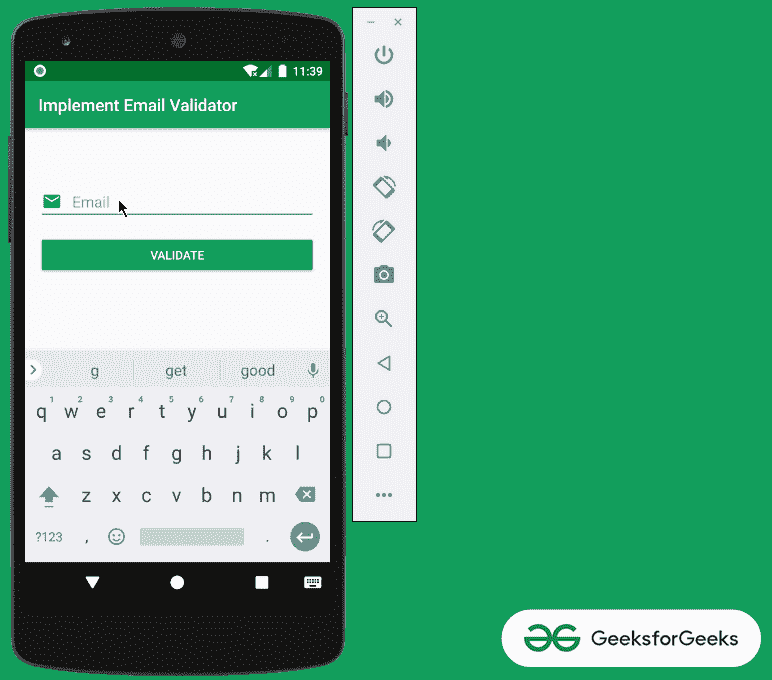
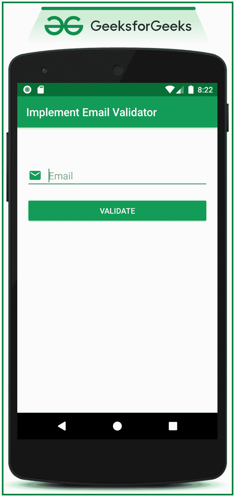

# 在安卓中实现邮件验证器

> 原文:[https://www . geesforgeks . org/implement-email-validator-in-Android/](https://www.geeksforgeeks.org/implement-email-validator-in-android/)

**先决条件:** [使用 Java 在安卓系统中编辑文本小部件，示例](https://www.geeksforgeeks.org/edittext-widget-in-android-using-java-with-examples/)

电子邮件验证需要通知用户，用户输入的电子邮件格式无效。如果用户没有以错误的格式输入电子邮件，那么将为编辑文本提供错误字段。在本文中，已经讨论了如何在 Android 中逐步实现电子邮件验证器。请看下面的图片，了解本文中讨论的内容。注意，我们将使用 **Java** 语言来实现这个项目。



## **在安卓系统中实现电子邮件验证器的步骤**

**第一步:创建一个空的活动项目**

*   创建一个空的活动安卓工作室项目。选择 **Java** 作为编程语言。
*   要知道如何创建一个空的活动安卓工作室项目，请参考[安卓|如何在安卓工作室创建/启动一个新项目？](https://www.geeksforgeeks.org/android-how-to-create-start-a-new-project-in-android-studio/)。

**步骤 2:使用 activity_main.xml 文件**

*   在应用程序的主布局中，只实现了两个小部件。一个是电子邮件编辑文本字段和一个按钮，当点击输入的电子邮件将被检查。
*   在 **activity_main.xml** 文件中调用以下代码实现 UI 布局。

## 可扩展标记语言

```java
<?xml version="1.0" encoding="utf-8"?>
<RelativeLayout 
    xmlns:android="http://schemas.android.com/apk/res/android"
    xmlns:tools="http://schemas.android.com/tools"
    android:layout_width="match_parent"
    android:layout_height="match_parent"
    tools:context=".MainActivity"
    tools:ignore="HardcodedText">

    <!--EditText which takes input 
        as Email from the user-->
    <EditText
        android:id="@+id/emailField"
        android:layout_width="match_parent"
        android:layout_height="wrap_content"
        android:layout_marginStart="16dp"
        android:layout_marginTop="64dp"
        android:layout_marginEnd="16dp"
        android:drawableStart="@drawable/ic_email_black_24dp"
        android:drawablePadding="12dp"
        android:hint="Email" />

    <!--Button which when clicked validates 
        the entered email is valid or not-->
    <Button
        android:id="@+id/validateButton"
        android:layout_width="match_parent"
        android:layout_height="wrap_content"
        android:layout_below="@+id/emailField"
        android:layout_marginStart="16dp"
        android:layout_marginTop="16dp"
        android:layout_marginEnd="16dp"
        android:backgroundTint="@color/colorPrimary"
        android:text="VALIDATE"
        android:textColor="@android:color/white" />

</RelativeLayout>
```

**输出 UI:**



**步骤 3:使用 MainActivity.java 文件**

*   在这种情况下，模式 ***EMAIL_ADDRESS*** 用于演示目的。
*   然而，还有 5 种模式可以验证用户的输入。这些是:

> **域名、IP 地址、电话、顶级域名、网址。**

*   有关安卓系统中预定义模式的更多信息，请参考[模式](https://developer.android.com/reference/android/util/Patterns)。
*   在这种情况下，在 MainActivity.java 文件中调用以下代码来实现电子邮件验证器。添加注释是为了更好地理解。

## Java 语言(一种计算机语言，尤用于创建网站)

```java
import androidx.appcompat.app.AppCompatActivity;
import android.os.Bundle;
import android.util.Patterns;
import android.view.View;
import android.widget.Button;
import android.widget.EditText;
import android.widget.Toast;

public class MainActivity extends AppCompatActivity {

    // EditText filed for Email
    EditText etMail;

    // Button to validate the Email address
    Button bValidate;

    @Override
    protected void onCreate(Bundle savedInstanceState) {
        super.onCreate(savedInstanceState);
        setContentView(R.layout.activity_main);

        // register all the UI elements 
          // with their appropriate IDs
        etMail = findViewById(R.id.emailField);
        bValidate = findViewById(R.id.validateButton);

        // handle the VALIDATE button to show the toast
          // message whether the entered email is valid or not
        bValidate.setOnClickListener(new View.OnClickListener() {
            @Override
            public void onClick(View v) {
                emailValidator(etMail);
            }
        });
    }

    // the function which triggered when the VALIDATE button is clicked
    // which validates the email address entered by the user
    public void emailValidator(EditText etMail) {

        // extract the entered data from the EditText
        String emailToText = etMail.getText().toString();

        // Android offers the inbuilt patterns which the entered 
          // data from the EditText field needs to be compared with
        // In this case the the entered data needs to compared with
          // the EMAIL_ADDRESS, which is implemented same below
        if (!emailToText.isEmpty() && Patterns.EMAIL_ADDRESS.matcher(emailToText).matches()) {
            Toast.makeText(this, "Email Verified !", Toast.LENGTH_SHORT).show();
        } else {
            Toast.makeText(this, "Enter valid Email address !", Toast.LENGTH_SHORT).show();
        }
    }
}
```

### **输出:在仿真器上运行**

<video class="wp-video-shortcode" id="video-526201-1" width="640" height="360" preload="metadata" controls=""><source type="video/mp4" src="https://media.geeksforgeeks.org/wp-content/uploads/20201212234414/Untitled-Project.mp4?_=1">[https://media.geeksforgeeks.org/wp-content/uploads/20201212234414/Untitled-Project.mp4](https://media.geeksforgeeks.org/wp-content/uploads/20201212234414/Untitled-Project.mp4)</video>