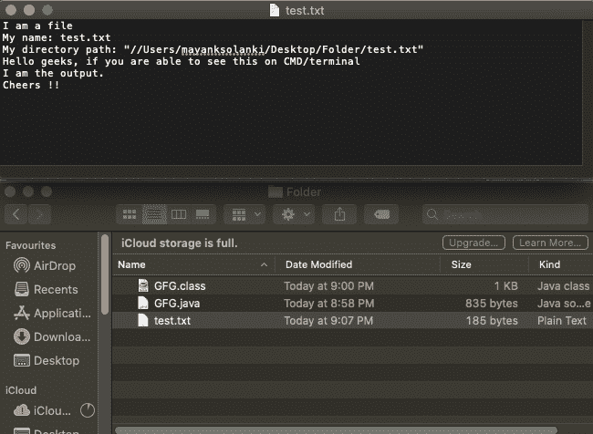
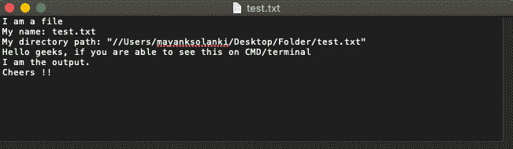

# 实现如何在 Java 中将文件加载为输入流

> 原文:[https://www . geesforgeks . org/implement-how-load-file-as-inputstream-in-Java/](https://www.geeksforgeeks.org/implement-how-to-load-file-as-inputstream-in-java/)

**问题陈述:**已经存在一个需要使用 InputStream 方法加载相同文件的文件。

**概念:**当访问一个文件时，该文件要么被读取，要么被写入。这里有两个流，即文件输入流和文件输出流

Java Stream 是从源到目标的数据流。OutputStream 和 InputStream 是对低级数据访问的抽象。InputStream 是读取数据的来源。一个流可以有多种来源，如磁盘文件、设备、其他程序和内存阵列。下面讨论了几种在 Java 中使用 InputStream 读取文件内容的方法。

假设文本文件存储在路径“/***Users/mayanksolanki/Desktop/Folder/test . txt***中，内容如下:



**接近:**

*   使用 [*阿帕奇*](https://www.geeksforgeeks.org/apache-poi-getting-started/) 命令 IO 库
*   使用 [*readline()*](https://www.geeksforgeeks.org/bufferedreader-readline-method-in-java-with-examples/) 方法的 BufferedReaderClass
*   使用 [*读取()*](https://www.geeksforgeeks.org/reader-read-method-in-java-with-examples/) 方法输入流类

让我们通过例子来逐一描述和实现这些方法:

**方法一:使用 Apache 公共 IO 库**

Apache Commons IO 库中的 IOUtils 类包含一个 [toString()](https://www.geeksforgeeks.org/integer-tostring-in-java/) 方法，该方法接受一个 InputStream，并将其内容呈现为字符串，如下所示:

## Java 语言(一种计算机语言，尤用于创建网站)

```java
// Importing generic Classes/Files
import java.util.*;

// importing Apache specific Class/es
import org.apache.commons.io.IOUtils;

class GFG {
    // Main driver method
    public static void main(String[] args)
    {
        // Creating file object and specify file path
        File file = new file(
            "/Users/mayanksolanki/Desktop/Folder/test.txt");
        // create a stream to read contents of that file

        // Try block to check exception
        try {

            FileInputStream input
                = new FileInputStream(file);
            // Representing input object in form of string

            String contents = IOUtils.toString(input);

            // Print contents of that file
            System.out.println(contents);
        }

        // Catch block to handle exceptions
        catch (IOException e) {
            e.printStackTrace();
        }
    }
}
```

输出:



**方法二:BufferedReader 的 readLine()方法**

**使用的概念:使用内置的 readLine()函数:**Java 中 BufferedReader 类的 readLine()方法用于一次读取一行文本。行尾要用“\r”或“\n”或 EOF 来理解。

下面是*r*T2*eadLine()*T5】的实现方法:

## Java 语言(一种计算机语言，尤用于创建网站)

```java
// Importing generic Classes/Files
import java.io.*;

class GFG {

    // Main driver method
    public static void main(String[] args)
    {
        // Create file object and specify file path
        File file = new File(
            "/Users/mayanksolanki/Desktop/Folder/test.txt");

        try (FileInputStream input
             = new FileInputStream(file)) {
            // create an empty string builder to store
            // string

            StringBuilder content = new StringBuilder();
            // create an object of bufferedReader to read
            // lines from file

            BufferedReader br = new BufferedReader(
                new InputStreamReader(input));

            String line;
            // store each line one by one until reach end of
            // file

            while ((line = br.readLine()) != null) {
                // append string builder with line and with
                // '/n' or '/r' or EOF
                content.append(line
                               + System.lineSeparator());
            }

            // print string builder object i.e content
            System.out.println(content.toString());
        }

        // Catch block to handle exceptions
        catch (IOException e) {
            e.printStackTrace();
        }
    }
}
```

输出:


**方法 3: InputStream 的 read()方法**

InputStream 类的 read()方法从输入流中读取一个字节的数据。返回数据的下一个字节，如果到达文件的末尾，则返回-1，如果出现输入/输出错误，则抛出异常。参考程序。

## Java 语言(一种计算机语言，尤用于创建网站)

```java
// Importing generic Classes/Files
import java.io.*;

class GFG {

    // Main driver function
    public static void main(String[] args)
    {
        // Creating file object and specifying path
        File file = new File(
            "/Users/mayanksolanki/Desktop/Folder/test.txt");

        try (FileInputStream input
             = new FileInputStream(file)) {
            int character;
            // read character by character
            // by default read() function return int between
            // 0 and 255.

            while ((character = input.read()) != -1) {
                System.out.print((char)character);
            }
        }
        catch (Exception e) {
            e.printStackTrace();
        }
    }
}
```

> 还有另一个重载版本的 [*read()*](https://www.geeksforgeeks.org/reader-read-method-in-java-with-examples/) 方法，该方法将指定长度的字节从输入流读入字节数组。相应的字节可以被解码成字符。参考下面的例子。

## Java 语言(一种计算机语言，尤用于创建网站)

```java
import java.nio.charset.StandardCharsets;
import java.io.*;

class GFG {
    public static void main(String[] args)
    {
        // create file object and specify path
        // specicified directory is random
        File file = new File(
            "/Users/mayanksolanki/Desktop/Folder/test.txt");

        // Try block to catch exception/s if any
        try {
            (FileInputStream input
             = new FileInputStream(file))

                // create a byte array of size equal to
                // length of file
                byte bytes[]
                = new byte[(int)file.length()];

            // read bytes from file
            input.read(bytes);

            // decode into string format
            String content
                = new String(bytes, StandardCharsets.UTF_8);

            // print contents of that file
            System.out.println(content);
        }
        catch (Exception e) {

            //
            e.printStackTrace();
        }
    }
}
```

**输出**


以上所有程序的输出都是一样的。