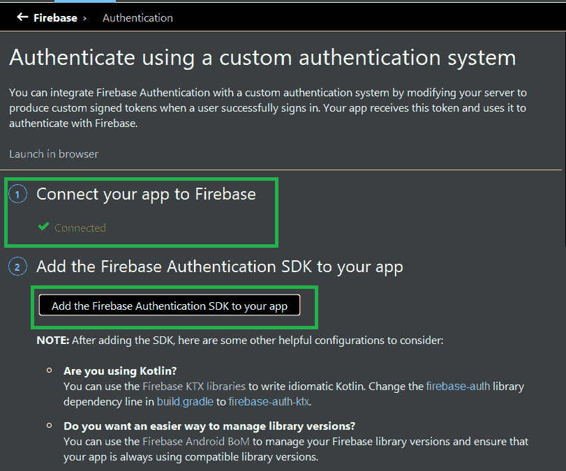
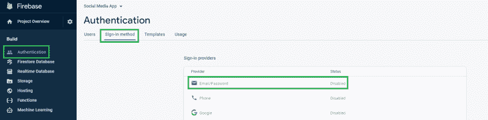

# 在社交媒体安卓 App 中实现闪屏和认证

> 原文:[https://www . geesforgeks . org/implement-闪屏和身份验证-社交媒体-安卓-app/](https://www.geeksforgeeks.org/implement-splash-screen-and-authentication-in-social-media-android-app/)

这是**“在安卓工作室上构建社交媒体应用”**教程的**第 1 部分**，我们将在本文中介绍以下功能:

*   创建[闪屏](https://www.geeksforgeeks.org/android-creating-a-splash-screen/)
*   认证部分:
    *   注册，以及
    *   注册

### **分步实施**

**第一步:创建新项目**

要在安卓工作室创建新项目，请参考[如何在安卓工作室创建/启动新项目](https://www.geeksforgeeks.org/android-how-to-create-start-a-new-project-in-android-studio/)。注意选择 **Java** 作为编程语言。

**第二步:将你的应用连接到 firebase**

转到**工具> Firebase >认证****将你的应用连接到 firebase** 并且**将 Firebase 认证 SDK** 添加到你的应用中，如下图所示。



然后到[火基地控制台](https://console.firebase.google.com/) **>认证>登录方式****启用**邮件/密码。



**第三步:新建 4 个空活动**

转到**包名称>右键单击>新建>活动>清空活动**并将活动命名为**闪屏**、**注册活动**、**逻辑活动**和**仪表板活动**。你也可以参考这篇文章[如何在安卓工作室](https://www.geeksforgeeks.org/how-to-create-constructor-getter-setter-methods-and-new-activity-in-android-studio-using-shortcuts/)创建新的空活动。

**步骤 4:** **使用闪屏活动**

导航到**应用程序> res >布局>activity _ splash _ screen . XML**并将下面的代码添加到该文件中。下面是**活动文件的代码。**

## 可扩展标记语言

```
<?xml version="1.0" encoding="utf-8"?>
<androidx.constraintlayout.widget.ConstraintLayout
    xmlns:android="http://schemas.android.com/apk/res/android"
    xmlns:tools="http://schemas.android.com/tools"
    android:layout_width="match_parent"
    android:layout_height="match_parent"
    android:background="@drawable/background_color"

    tools:context=".SplashScreen">

</androidx.constraintlayout.widget.ConstraintLayout>
```

使用**SplashScreen.java**文件。这里我们检查如果用户为空，则转到**逻辑活动**。否则移至**仪表板活动。**

```
new Handler().postDelayed(new Runnable() {
            @Override
            public void run() {
                FirebaseUser user=mAuth.getCurrentUser();
                if(user==null){
                    Intent intent = new Intent(SplashScreen.this, LoginActivity.class);
                    startActivity(intent);
                    finish();
                }
                else {
                    Intent mainIntent= new Intent(SplashScreen.this, DashboardActivity.class);
                    mainIntent.addFlags(Intent.FLAG_ACTIVITY_NEW_TASK | Intent.FLAG_ACTIVITY_CLEAR_TASK);
                    startActivity(mainIntent);
                    finish();
                }
            }
      },1000);
```

以下是**SplashScreen.java**文件的代码。

## Java 语言(一种计算机语言，尤用于创建网站)

```
package com.example.socialmediaapp;

import android.content.Intent;
import android.os.Bundle;
import android.os.Handler;

import androidx.appcompat.app.AppCompatActivity;

import com.google.firebase.auth.FirebaseAuth;
import com.google.firebase.auth.FirebaseUser;

public class SplashScreen extends AppCompatActivity {

    FirebaseUser currentUser;
    private FirebaseAuth mAuth;

    @Override
    protected void onCreate(Bundle savedInstanceState) {
        super.onCreate(savedInstanceState);
        setContentView(R.layout.activity_splash_screen);
        mAuth = FirebaseAuth.getInstance();
        if (mAuth != null) {
            currentUser = mAuth.getCurrentUser();
        }
        new Handler().postDelayed(new Runnable() {
            @Override
            public void run() {
                FirebaseUser user = mAuth.getCurrentUser();
                if (user == null) {
                    Intent intent = new Intent(SplashScreen.this, LoginActivity.class);
                    startActivity(intent);
                    finish();
                } else {
                    Intent mainIntent = new Intent(SplashScreen.this, DashboardActivity.class);
                    mainIntent.addFlags(Intent.FLAG_ACTIVITY_NEW_TASK | Intent.FLAG_ACTIVITY_CLEAR_TASK);
                    startActivity(mainIntent);
                    finish();
                }
            }
        }, 1000);
    }
}
```

**第 5 步:** **处理注册活动**

导航到**应用程序> res >布局>activity _ registration . XML**，并将下面的代码添加到该文件中。下面是**activity _ registration . XML**文件的代码。这里我们为姓名、电子邮件和密码创建了三个[编辑文本](https://www.geeksforgeeks.org/edittext-widget-in-android-using-java-with-examples/)，并为注册用户创建了一个[按钮](https://www.geeksforgeeks.org/button-in-kotlin/)。

## 可扩展标记语言

```
<?xml version="1.0" encoding="utf-8"?>
<RelativeLayout
    xmlns:android="http://schemas.android.com/apk/res/android"
    xmlns:tools="http://schemas.android.com/tools"
    android:layout_width="match_parent"
    android:layout_height="match_parent"
    tools:context=".RegistrationActivity">

    <TextView
        android:id="@+id/teacher"
        android:layout_width="match_parent"
        android:layout_height="wrap_content"
        android:layout_alignParentStart="true"
        android:layout_alignParentTop="true"
        android:layout_marginTop="50dp"
        android:gravity="center"
        android:text="Sign Up Here"
        android:textColor="@color/colorBlack"
        android:textSize="28sp"
        android:textStyle="bold|italic" />

    <TextView
        android:id="@+id/names"
        android:layout_width="match_parent"
        android:layout_height="wrap_content"
        android:layout_below="@id/teacher"
        android:layout_marginStart="35dp"
        android:layout_marginTop="120dp"
        android:text="Name"
        android:textColor="@color/colorBlack" />

    <EditText
        android:id="@+id/register_name"
        android:layout_width="match_parent"
        android:layout_height="wrap_content"
        android:layout_below="@+id/names"
        android:layout_alignParentStart="true"
        android:layout_marginLeft="30dp"
        android:layout_marginTop="10dp"
        android:layout_marginRight="30dp"
        android:background="@drawable/edit"
        android:drawableStart="@drawable/name"
        android:hint="Your Name..."
        android:inputType="text"
        android:padding="8dp" />

    <TextView
        android:id="@+id/email"
        android:layout_width="match_parent"
        android:layout_height="wrap_content"
        android:layout_below="@id/register_name"
        android:layout_marginStart="35dp"
        android:layout_marginTop="10dp"
        android:text="Email"
        android:textColor="@color/colorBlack" />

    <EditText
        android:id="@+id/register_email"
        android:layout_width="match_parent"
        android:layout_height="wrap_content"
        android:layout_below="@+id/email"
        android:layout_alignParentStart="true"
        android:layout_marginLeft="30dp"
        android:layout_marginTop="10dp"
        android:layout_marginRight="30dp"
        android:background="@drawable/edit"
        android:drawableStart="@drawable/ic_email"
        android:hint="Email..."
        android:inputType="textEmailAddress"
        android:padding="8dp" />

    <TextView
        android:id="@+id/pass"
        android:layout_width="match_parent"
        android:layout_height="wrap_content"
        android:layout_below="@id/register_email"
        android:layout_marginStart="35dp"
        android:layout_marginTop="10dp"
        android:text="Password"
        android:textColor="@color/colorBlack" />

    <EditText
        android:id="@+id/register_password"
        android:layout_width="match_parent"
        android:layout_height="wrap_content"
        android:layout_below="@+id/pass"
        android:layout_alignParentStart="true"
        android:layout_marginLeft="30dp"
        android:layout_marginTop="10dp"
        android:layout_marginRight="30dp"
        android:background="@drawable/edit"
        android:drawableStart="@drawable/password"
        android:hint="Password..."
        android:inputType="textPassword"
        android:padding="8dp" />

    <Button
        android:id="@+id/register_button"
        android:layout_width="match_parent"
        android:layout_height="wrap_content"
        android:layout_below="@+id/register_password"
        android:layout_marginLeft="30dp"
        android:layout_marginTop="30dp"
        android:layout_marginRight="30dp"
        android:background="@drawable/buttonss"
        android:padding="4dp"
        android:text="Create Account"
        android:textAllCaps="false"
        android:textColor="@android:color/background_light"
        android:textSize="24sp" />

    <TextView
        android:id="@+id/homepage"
        android:layout_width="match_parent"
        android:layout_height="wrap_content"
        android:layout_below="@+id/register_button"
        android:layout_centerHorizontal="true"
        android:layout_marginStart="15dp"
        android:layout_marginTop="20dp"
        android:layout_marginEnd="23dp"
        android:text=" Already Have a Account?Sign In"
        android:textAlignment="center"
        android:textColor="@color/colorBlack"
        android:textSize="17sp"
        android:textStyle="bold" />

</RelativeLayout>
```

使用**RegistrationActivity.java**文件。使用用户编写的电子邮件和密码创建用户。如果失败，那么我们将显示错误。

```
mAuth.createUserWithEmailAndPassword(emaill, pass).addOnCompleteListener(new OnCompleteListener<AuthResult>() {
            @Override
            public void onComplete(@NonNull Task<AuthResult> task) {
                if (task.isSuccessful()){
                    progressDialog.dismiss();
                }
                else {
                    progressDialog.dismiss();
                    Toast.makeText(RegistrationActivity.this,"Error",Toast.LENGTH_LONG).show();
                }
            }
        }).addOnFailureListener(new OnFailureListener() {
            @Override
            public void onFailure(@NonNull Exception e) {
                progressDialog.dismiss();
                Toast.makeText(RegistrationActivity.this,"Error Occured",Toast.LENGTH_LONG).show();
            }
     });
```

以下是**RegistrationActivity.java**文件的代码。

## Java 语言(一种计算机语言，尤用于创建网站)

```
package com.example.socialmediaapp;

import android.app.ProgressDialog;
import android.content.Intent;
import android.os.Bundle;
import android.util.Patterns;
import android.view.View;
import android.widget.Button;
import android.widget.EditText;
import android.widget.TextView;
import android.widget.Toast;

import androidx.annotation.NonNull;
import androidx.appcompat.app.ActionBar;
import androidx.appcompat.app.AppCompatActivity;

import com.google.android.gms.tasks.OnCompleteListener;
import com.google.android.gms.tasks.OnFailureListener;
import com.google.android.gms.tasks.Task;
import com.google.firebase.auth.AuthResult;
import com.google.firebase.auth.FirebaseAuth;
import com.google.firebase.auth.FirebaseUser;
import com.google.firebase.database.DatabaseReference;
import com.google.firebase.database.FirebaseDatabase;

import java.util.HashMap;

public class RegistrationActivity extends AppCompatActivity {

    private EditText email, password, name;
    private Button mRegister;
    private TextView existaccount;
    private ProgressDialog progressDialog;
    private FirebaseAuth mAuth;

    @Override
    protected void onCreate(Bundle savedInstanceState) {
        super.onCreate(savedInstanceState);
        setContentView(R.layout.activity_registration);
        ActionBar actionBar = getSupportActionBar();
        actionBar.setTitle("Create Account");
        actionBar.setDisplayShowHomeEnabled(true);
        actionBar.setDisplayHomeAsUpEnabled(true);
        email = findViewById(R.id.register_email);
        name = findViewById(R.id.register_name);
        password = findViewById(R.id.register_password);
        mRegister = findViewById(R.id.register_button);
        existaccount = findViewById(R.id.homepage);
        mAuth = FirebaseAuth.getInstance();
        progressDialog = new ProgressDialog(this);
        progressDialog.setMessage("Register");

        mRegister.setOnClickListener(new View.OnClickListener() {
            @Override
            public void onClick(View v) {
                String emaill = email.getText().toString().trim();
                String uname = name.getText().toString().trim();
                String pass = password.getText().toString().trim();
                if (!Patterns.EMAIL_ADDRESS.matcher(emaill).matches()) {
                    email.setError("Invalid Email");
                    email.setFocusable(true);
                } else if (pass.length() < 6) {
                    password.setError("Length Must be greater than 6 character");
                    password.setFocusable(true);
                } else {
                    registerUser(emaill, pass, uname);
                }
            }
        });
        existaccount.setOnClickListener(new View.OnClickListener() {
            @Override
            public void onClick(View v) {
                startActivity(new Intent(RegistrationActivity.this, LoginActivity.class));
            }
        });
    }

    private void registerUser(String emaill, final String pass, final String uname) {
        progressDialog.show();
        mAuth.createUserWithEmailAndPassword(emaill, pass).addOnCompleteListener(new OnCompleteListener<AuthResult>() {
            @Override
            public void onComplete(@NonNull Task<AuthResult> task) {
                if (task.isSuccessful()) {
                    progressDialog.dismiss();
                    FirebaseUser user = mAuth.getCurrentUser();
                    String email = user.getEmail();
                    String uid = user.getUid();
                    HashMap<Object, String> hashMap = new HashMap<>();
                    hashMap.put("email", email);
                    hashMap.put("uid", uid);
                    hashMap.put("name", uname);
                    hashMap.put("onlineStatus", "online");
                    hashMap.put("typingTo", "noOne");
                    hashMap.put("image", "");
                    FirebaseDatabase database = FirebaseDatabase.getInstance();
                    DatabaseReference reference = database.getReference("Users");
                    reference.child(uid).setValue(hashMap);
                    Toast.makeText(RegistrationActivity.this, "Registered User " + user.getEmail(), Toast.LENGTH_LONG).show();
                    Intent mainIntent = new Intent(RegistrationActivity.this, DashboardActivity.class);
                    mainIntent.addFlags(Intent.FLAG_ACTIVITY_NEW_TASK | Intent.FLAG_ACTIVITY_CLEAR_TASK);
                    startActivity(mainIntent);
                    finish();
                } else {
                    progressDialog.dismiss();
                    Toast.makeText(RegistrationActivity.this, "Error", Toast.LENGTH_LONG).show();
                }
            }
        }).addOnFailureListener(new OnFailureListener() {
            @Override
            public void onFailure(@NonNull Exception e) {
                progressDialog.dismiss();
                Toast.makeText(RegistrationActivity.this, "Error Occured", Toast.LENGTH_LONG).show();
            }
        });
    }

    @Override
    public boolean onSupportNavigateUp() {
        onBackPressed();
        return super.onSupportNavigateUp();
    }
}
```