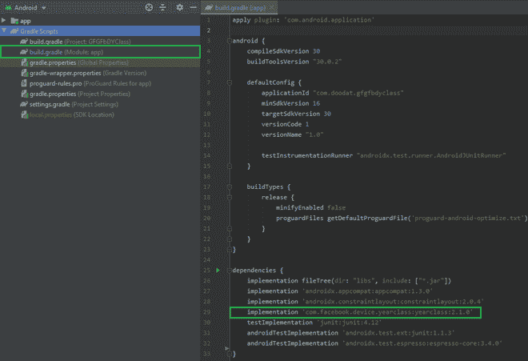

# 脸书安卓设备年类库在安卓的实现

> 原文:[https://www . geesforgeks . org/implementation-of-face books-Android-device-year-class-library-in-Android/](https://www.geeksforgeeks.org/implementation-of-facebooks-android-device-year-class-library-in-android/)

作为开发人员，我们的目标始终是创建一个能够在数百万台设备上流畅运行的应用程序，然而，实际上每个应用程序的性能都受到设备规格的影响。目前市场上有超过 16，000 部不同规格的手机，与其他设备相比，该应用程序在某些设备上的性能可能较差。一些功能需要快速处理器才能平稳运行，在慢速处理器上可能会滞后。为了解决这个问题，脸书开发了[设备年份类库](https://github.com/facebookarchive/device-year-class)，它使用简单的算法将设备的内存、中央处理器内核和时钟速度与这些特征被认为是高端的年份相匹配。这使得开发人员能够根据手机的硬件能力，轻松地为应用程序的行为编写不同的逻辑。对于分类，年类库考虑了三个因素:

*   设备中的中央处理器内核数量
*   设备上中央处理器内核的时钟速度
*   设备的总内存

基于设备硬件，我们可以优化各种操作，包括:

*   确定是否显示动画，因为动画在低端设备上可能会滞后。
*   选择是加载低质量内容还是高质量内容，以加快加载速度。
*   建议低规格设备使用精简版应用程序。

我们现在来看看如何在应用程序中使用这个库。我们将构建一个应用程序，根据设备的年级来检测是否显示动画。

### **分步实施**

**第一步:创建新项目**

要在安卓工作室创建新项目，请参考[如何在安卓工作室创建/启动新项目](https://www.geeksforgeeks.org/android-how-to-create-start-a-new-project-in-android-studio/)。请注意，选择 Java 作为编程语言。

**第二步:添加库依赖**

导航到 **Gradle 脚本> build.gradle(模块:应用)**，在依赖项部分添加库，并同步项目。

```java
implementation 'com.facebook.device.yearclass:yearclass:2.1.0'
```



**步骤 3:使用 activity_main.xml 文件**

导航到**应用程序> res >布局> activity_main.xml** 并将下面的代码添加到该文件中。下面是 **activity_main.xml** 文件的代码。

## 可扩展标记语言

```java
<?xml version="1.0" encoding="utf-8"?>
<androidx.constraintlayout.widget.ConstraintLayout 
    xmlns:android="http://schemas.android.com/apk/res/android"
    xmlns:app="http://schemas.android.com/apk/res-auto"
    xmlns:tools="http://schemas.android.com/tools"
    android:layout_width="match_parent"
    android:layout_height="match_parent"
    tools:context=".MainActivity">

    <TextView
        android:layout_width="wrap_content"
        android:layout_height="wrap_content"
        android:id="@+id/text"
        android:text="Hello World!"
        app:layout_constraintBottom_toBottomOf="parent"
        app:layout_constraintLeft_toLeftOf="parent"
        app:layout_constraintRight_toRightOf="parent"
        app:layout_constraintTop_toTopOf="parent" />

</androidx.constraintlayout.widget.ConstraintLayout>
```

**第 4 步:使用动画. xml 文件**

*   导航至**应用程序> res**
*   右键单击**资源**和**资源**上的，选择**新建>目录**
*   键入 **anim** 作为目录名
*   右键点击**动画**，选择**新建>动画资源文件**
*   键入**动画**作为文件名，然后按确定。

下面是**动画. xml** 文件的代码。

## 可扩展标记语言

```java
<?xml version="1.0" encoding="utf-8"?>
<set xmlns:android="http://schemas.android.com/apk/res/android"
     android:fillAfter="true">

    <!-- animation to scale out the view -->
    <scale
        android:fromXScale="1.0"
        android:fromYScale="1.0"
        android:toYScale="2.0"
        android:toXScale="2.0"
        android:pivotX="50%"
        android:pivotY="50%"
        android:duration="2000"/>
</set>
```

**步骤 5:使用 MainActivity.java 文件**

转到**MainActivity.java**文件，参考以下代码。以下是**MainActivity.java**文件的代码。

## Java 语言(一种计算机语言，尤用于创建网站)

```java
import androidx.appcompat.app.AppCompatActivity;

import android.os.Bundle;
import android.view.animation.Animation;
import android.view.animation.AnimationUtils;
import android.widget.TextView;

import com.facebook.device.yearclass.YearClass;

public class MainActivity extends AppCompatActivity {

    TextView textView;

    @Override
    protected void onCreate(Bundle savedInstanceState) {
        super.onCreate(savedInstanceState);
        setContentView(R.layout.activity_main);
        textView = findViewById(R.id.text);

        // getting the device year class
        int year = YearClass.get(getApplicationContext());
        if (year > 2013) {
            // if device year class is greater than 2013 --> load animation
            Animation animation = AnimationUtils.loadAnimation(this, R.anim.animation);
            textView.startAnimation(animation);
        } else {
            // load no animation if device year 
              // class is less than 2013
        }
    }
}
```

**输出**:

<video class="wp-video-shortcode" id="video-646439-1" width="640" height="360" preload="metadata" controls=""><source type="video/mp4" src="https://media.geeksforgeeks.org/wp-content/uploads/20210716174229/fb.mp4?_=1">[https://media.geeksforgeeks.org/wp-content/uploads/20210716174229/fb.mp4](https://media.geeksforgeeks.org/wp-content/uploads/20210716174229/fb.mp4)</video>