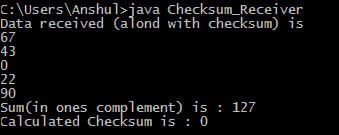

# 使用 Java 实现校验和

> 原文:[https://www . geesforgeks . org/impering-checksum-use-Java/](https://www.geeksforgeeks.org/implementing-checksum-using-java/)

**校验和**是一种错误检测技术，可以应用于任何长度的消息。它主要用于 TCP/IP 协议套件的网络层和传输层。
这里，我们考虑了发送方使用套接字编程发送给接收方的十进制数据。这里数据被分成的段的数量取决于被发送的数据的长度。如果发送的数据长度是“x”，那么数据段的数量也是“x”，这意味着每个数据段只有一个数据。这里，我们基本上处理十进制数据。这个概念对于字符串数据来说也是一致的，因为字符串的每个字符都可以用它的等价 ASCII 码来表示，因此我们又剩下了十进制数据。

**先决条件:**[Java 套接字编程](https://www.geeksforgeeks.org/socket-programming-in-java/) | [校验和](https://www.geeksforgeeks.org/error-detection-computer-networks/)

示例:

```
At sender side :
Enter data length
4
Enter data to send
67
43
0
22
Checksum Calculated is : 90
Data being sent along with Checksum.....
Thanks for the feedback!! 
Message received Successfully! 
At receiver side :
Data received (alond with checksum) is
67
43
0
22
90
Sum(in ones complement) is : 127
Calculated Checksum is : 0

Here the checksum calculated at 
the receiver side was 0\. Hence, 
it indicates a successful data transfer.
```

**进场:**

**发送方:**

1.  首先，询问要发送的数据长度，以确定数据段的数量。
2.  然后对输入的每个数据执行一次补码，同时将它们相加。这意味着这笔钱不需要再补了。
3.  然后将数据和计算出的校验和一起发送到服务器。
4.  然后根据从服务器收到的反馈，报告消息的成功传输。

**在接收端:**

1.  接收者等待来自发送者的数据到达。
2.  一旦从发送方接收到数据和校验和，接收方就补充接收到的数据，同时继续添加它们。
3.  最后，接收方对上述总和进行补充，并检查结果是否为零，并将结果报告给发送方。零表示数据传输成功，其他任何值都表示收到的数据有错误。

**最后**、**双方关闭所有连接。**

**以下是上述方法的实现。**

在这里，“localhost”被用作建立连接的 IP，端口号为 5000。发送方应该先开始运行，然后等待接收方。

## Java 语言(一种计算机语言，尤用于创建网站)

```
// Java code for Checksum_Sender
package checksum_sender;

import java.io.*;
import java.net.*;
import java.util.*;

public class Checksum_Sender
{
    // Setting maximum data length
    private int MAX = 100;

    // initialize socket and I/O streams
    private Socket socket = null;
    private ServerSocket servsock = null;
    private DataInputStream dis = null;
    private DataOutputStream dos = null;

    public Checksum_Sender(int port) throws IOException
    {
        servsock = new ServerSocket(port);

        // Used to block until a client connects to the server
        socket = servsock.accept();

        dis = new DataInputStream(socket.getInputStream());
        dos = new DataOutputStream(socket.getOutputStream());

        while (true)
        {
            int i, l, sum = 0, nob;
            Scanner sc = new Scanner(System.in);
            System.out.println("Enter data length");
            l = sc.nextInt();

            // Array to hold the data being entered
            int data[] = new int[MAX];

            // Array to hold the complement of each data
            int c_data[] = new int[MAX];

            System.out.println("Enter data to send");

            for (i = 0; i < l; i++)
            {
                data[i] = sc.nextInt();

                // Complementing the entered data
                // Here we find the number of bits required to represent
                // the data, like say 8 requires 1000, i.e 4 bits
                nob = (int)(Math.floor(Math.log(data[i]) / Math.log(2))) + 1;

                // Here we do a XOR of the data with the number 2^n -1,
                // where n is the nob calculated in previous step
                c_data[i] = ((1 << nob) - 1) ^ data[i];

                // Adding the complemented data and storing in sum
                sum += c_data[i];
            }

            // The sum(i.e checksum) is also sent along with the data
            data[i] = sum;
            l += 1;

            System.out.println("Checksum Calculated is : " + sum);
            System.out.println("Data being sent along with Checksum.....");

            // Sends the data length to receiver
            dos.writeInt(l);

            // Sends the data one by one to receiver
            for (int j = 0; j < l; j++)
                dos.writeInt(data[j]);

            // Displaying appropriate message depending on feedback received
            if (dis.readUTF().equals("success"))
            {  
                System.out.println("Thanks for the feedback!! Message received
                                   Successfully!");
                break;
            }

            else if (dis.readUTF().equals("failure"))
            {
                System.out.println("Message was not received successfully!");
                break;
            }
        }

        // Closing all connections
        dis.close();
        dos.close();
        socket.close();
    }

    // Driver Method
    public static void main(String args[]) throws IOException
    {
        Checksum_Sender cs = new Checksum_Sender(45678);
    }
}
```

## Java 语言(一种计算机语言，尤用于创建网站)

```
// Java code for Checksum_Receiver
package checksum_sender;

import java.net.*;
import java.io.*;
import java.util.*;

public class Checksum_Receiver {

    // Initialize socket and I/O streams
    private Socket s = null;
    private DataInputStream dis = null;
    private DataOutputStream dos = null;

    // Constructor to put ip address and port
    public Checksum_Receiver(InetAddress ip,int port)throws IOException
    {

        // Opens a socket for connection
        s = new Socket(ip,port);

        dis = new DataInputStream(s.getInputStream());
        dos = new DataOutputStream(s.getOutputStream());

        while (true)
        {   Scanner sc = new Scanner(System.in);
            int i, l, nob, sum = 0, chk_sum;

            // Reads the data length sent by sender
            l = dis.readInt();

            // Initializes the arrays based on data length received
            int c_data[] = new int[l];
            int data[] = new int[l];

            System.out.println("Data received (alond with checksum) is");

            for(i = 0; i< data.length; i++)
            {  
                // Reading the data being sent one by one
                data[i] = dis.readInt();
                System.out.println(data[i]);

                // Complementing the data being received
                nob = (int)(Math.floor(Math.log(data[i]) / Math.log(2))) + 1;
                c_data[i] = ((1 << nob) - 1) ^ data[i];

                // Adding the complemented data
                sum += c_data[i];
            }
            System.out.println("Sum(in ones complement) is : "+sum);

            // Complementing the sum
            nob = (int)(Math.floor(Math.log(sum) / Math.log(2))) + 1;
            sum = ((1 << nob) - 1) ^ sum;
            System.out.println("Calculated Checksum is : "+sum);

            // Checking whether final result is 0 or something else
            // and sending feedback accordingly
            if(sum == 0)
            {  
                dos.writeUTF("success");
                break;
            }    
            else
            {  
                dos.writeUTF("failure");
                break;
            }
        }

        // Closing all connections
        dis.close();
        dos.close();
        s.close();
    }

    // Driver Method
    public static void main(String args[])throws IOException
    {  
        // Getting ip address on which the receiver is running
        // Here, it is "localhost"
        InetAddress ip = InetAddress.getLocalHost();
        Checksum_Receiver cr = new Checksum_Receiver(ip,5000);
    }   
}
```

**输出:**

 