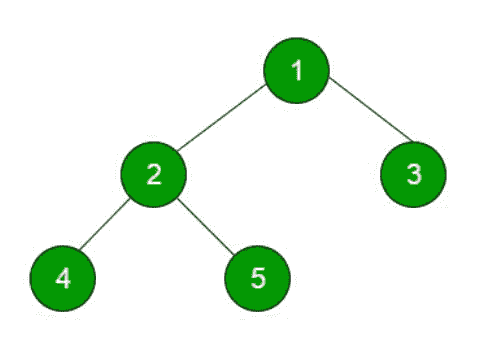

# 在 Java 中使用堆栈实现订单、订单前、订单后

> 原文:[https://www . geeksforgeeks . org/impering-in order-preorder-post order-use-stack-in-Java/](https://www.geeksforgeeks.org/implementing-inorder-preorder-postorder-using-stack-in-java/)

两种类型的数据结构[线性数据结构](https://www.geeksforgeeks.org/overview-of-data-structures-set-1-linear-data-structures/)和第二种是[非线性数据结构](https://www.geeksforgeeks.org/overview-of-data-structures-set-2-binary-tree-bst-heap-and-hash/)这些数据结构之间的主要区别是这些数据结构元素的横向方式。线性数据结构在一次运行中跨越所有元素，而非线性数据结构以层次方式跨越所有元素。


在本文中，我们将使用[栈](https://www.geeksforgeeks.org/stack-data-structure/)数据结构在非线性数据结构的二叉树中实现不同类型的深度优先遍历。

**输入二叉树:**



**深度第一次穿越:**

1.  中间(左，根，右):4 2 5 1 3
2.  前序(根，左，右):1 2 4 5 3
3.  后序(左、右、根):4 5 2 3 1

### A.有序遍历

**1。**创建一个空栈 s。

**2。**将当前节点初始化为根节点。

**3。**将当前节点推至 S，向左设置 current = current- >直到电流为空。

**4。**如果当前为空，并且堆栈不为空，则

*   从堆栈中弹出顶部项目。
*   打印弹出项，设置当前=弹出项->右
*   转到步骤 3。

**5。**如果当前为空，堆栈为空，那么我们就完成了。

下面是上述方法的实现:

## Java 语言(一种计算机语言，尤用于创建网站)

```
// Non-Recursive Java program for inorder traversal
import java.util.Stack;

// Class containing left and right child of
// current node and key value
class Node {
    int data;
    Node left, right;

    public Node(int item)
    {
        data = item;
        left = right = null;
    }
}

// Class to print the inorder traversal
class BinaryTree {
    Node root;
    void inorder()
    {
        if (root == null)
            return;

        Stack<Node> s = new Stack<Node>();
        Node curr = root;

        // traverse the tree
        while (curr != null || s.size() > 0) {

            // Reach the left most
            // Node of the current Node
            while (curr != null) {
                // place pointer to a tree node on
                // the stack before traversing
                // the node's left subtree
                s.push(curr);
                curr = curr.left;
            }

            // Current must be NULL at this point
            curr = s.pop();

            System.out.print(curr.data + " ");

            // we have visited the node and its
            // left subtree. Now, it's right
            // subtree's turn
            curr = curr.right;
        }
    }

    public static void main(String args[])
    {

        // Creating a binary tree and
        // entering the nodes
        BinaryTree tree = new BinaryTree();
        tree.root = new Node(1);
        tree.root.left = new Node(2);
        tree.root.right = new Node(3);
        tree.root.left.left = new Node(4);
        tree.root.left.right = new Node(5);
        tree.inorder();
    }
}
```

**Output**

```
4 2 5 1 3
```

*   **时间复杂度:**0(n)
*   **空间复杂度:** O(n)

### B.前序遍历

使用堆栈数据结构对二叉树进行预排序横向有两种方法:

**方法 1:** 这种方法与上述横向讨论的方法完全相同。

1.  创建一个空堆栈 s。
2.  将当前节点初始化为根节点。
3.  将当前节点推至 S，设置 current = current->left 打印堆栈中的 peek 元素，直到当前为 NULL。
4.  如果当前为空且堆栈不为空，则
    a)从堆栈中弹出顶部项目。
    b)设置电流= popled _ item->右。
    c)转到步骤 3。
5.  如果当前为空，并且堆栈为空，那么我们就完成了。

下面是上述方法的实现:

## Java 语言(一种计算机语言，尤用于创建网站)

```
// Java Program for Pre order Traversal
import java.util.*;
import java.io.*;
class Node {
    int data;
    Node left, right;

    public Node(int item)
    {
        data = item;
        left = right = null;
    }
}

// Class to print the preorder traversal
class BinaryTree {
    Node root;
    void preorder()
    {
        if (root == null)
            return;

        Stack<Node> s = new Stack<Node>();
        Node curr = root;

        // traverse the tree
        while (curr != null || s.size() > 0) {

            // Reach the left most
            // Node of the curr Node
            while (curr != null) {
                // place pointer to a tree node on
                // the stack before traversing
                // the node's left subtree
                s.push(curr);
                // print the peak element
                System.out.print(s.peek().data + " ");

                curr = curr.left;
            }

            // Current must be NULL at this point
            curr = s.pop();

            // we have visited the node and its
            // left subtree. Now, it's right
            // subtree's turn
            curr = curr.right;
        }
    }

    public static void main(String args[])
    {

        // creating a binary tree and
        // entering the nodes
        BinaryTree tree = new BinaryTree();
        tree.root = new Node(1);
        tree.root.left = new Node(2);
        tree.root.right = new Node(3);
        tree.root.left.left = new Node(4);
        tree.root.left.right = new Node(5);
        tree.preorder();
    }
}
```

**Output**

```
1 2 4 5 3
```

*   **时间复杂度:** O(n)
*   **空间复杂度:** O(n)

**方法 2:** 在 Preorder Transversal 中，首先打印根元素，然后是左子树，然后是右子树。我们知道 stack 数据结构遵循 LIFO(后进先出)，所以我们利用这个堆栈的这个特性，我们首先推当前树的右边部分，然后在当前树的左边部分之后，在每次迭代中，我们从 Stack 中弹出 peak 元素并打印，然后再次推 pop 元素的右边部分和 pop 元素的左边部分，直到堆栈的大小不等于 1，因为我们已经打印了第一个元素。

**算法:**

*   创建一个空堆栈 s。
*   打印根元素。
*   将右子树推入堆栈。
*   将左边的子树推到堆栈中。
*   如果堆栈大小不是 1，那么
    *   从堆栈中弹出顶部项目。
    *   打印元素
    *   将弹出元素的右子树推入堆栈。
    *   将 pop 元素的左子树推入堆栈。
*   如果堆栈的大小为 1，则返回主方法

下面是上述方法的实现:

## Java 语言(一种计算机语言，尤用于创建网站)

```
// Non-Recursive Java Program for preorder traversal
import java.util.Stack;
// Class containing left and right child of
// current node and key value
class Node {
    int data;
    Node left, right;

    public Node(int item)
    {
        data = item;
        left = right = null;
    }
}

// Class to print the preorder traversal
class BinaryTree {
    Node root;
    void preorder()
    {
        if (root == null) {
            return;
        }
        Stack<Node> S = new Stack<>();

        // Push root element in the stack
        S.add(root);

        // print the root element
        System.out.print(root.data + " ");

        // Push right subtree to the stack
        if (root.right != null) {
            S.add(root.right);
        }
        // Push left subtree to the stack
        if (root.left != null) {
            S.add(root.left);
        }
        // Iterate till Size of the Stack not equal to 1
        while (S.size() != 1) {
            // Peek element of the stack
            Node temp = S.peek();
            // pop the element from the stack
            S.pop();

            if (temp != null) {
                // print the pop element
                System.out.print(temp.data + " ");

                // Push right subtree of the pop element
                if (temp.right != null) {
                    S.add(temp.right);
                }
                // Push left subtree of the pop element
                if (temp.left != null) {
                    S.add(temp.left);
                }
            }
        }
    }

    public static void main(String args[])
    {

        // creating a binary tree and
        // entering the nodes
        BinaryTree tree = new BinaryTree();
        tree.root = new Node(1);
        tree.root.left = new Node(2);
        tree.root.right = new Node(3);
        tree.root.left.left = new Node(4);
        tree.root.left.right = new Node(5);
        tree.preorder();
    }
}
```

**Output**

```
1 2 4 5 3
```

*   **时间复杂度:**0(n)
*   **空间复杂度:** O(n)

### C.后序遍历

**1。**创建一个空堆栈

**2。**当根不为空时，执行以下操作

*   推动根的右子级，然后推动根进行堆叠。
*   将 root 设置为 root 的左子级。

**3。**从堆栈中弹出一个项目，并将其设置为根。

*   如果弹出的项有一个右子项，并且右子项在堆栈顶部，则从堆栈中移除右子项，将根推回，并将根设置为根的右子项。
*   否则打印根的数据，并将根设置为空。

**4。**当堆栈不为空时，重复步骤 2 和 3。

下面是上述方法的实现:

## Java 语言(一种计算机语言，尤用于创建网站)

```
// Java program for iterative postorder
// traversal using stack

import java.util.ArrayList;
import java.util.Stack;

// A binary tree node
class Node {
    int data;
    Node left, right;

    Node(int item)
    {
        data = item;
        left = right;
    }
}

class BinaryTree {
    Node root;

    // An iterative function to do postorder traversal
    // of a given binary tree
    void postOrder(Node node)
    {
        Stack<Node> S = new Stack<Node>();

        // Check for empty tree
        if (node == null)
            return;
        S.push(node);
        Node prev = null;
        while (!S.isEmpty()) {
            Node current = S.peek();

            // go down the tree in search of a leaf an if so
            // process it and pop stack otherwise move down
            if (prev == null || prev.left == current
                || prev.right == current) {
                if (current.left != null)
                    S.push(current.left);
                else if (current.right != null)
                    S.push(current.right);
                else {
                    S.pop();
                    System.out.print(current.data + " ");
                }

                // go up the tree from left node, if the
                // child is right push it onto stack
                // otherwise process parent and pop
            }
            else if (current.left == prev) {
                if (current.right != null)
                    S.push(current.right);
                else {
                    S.pop();
                    System.out.print(current.data + " ");
                }

                // go up the tree from right node and after
                // coming back from right node process parent
                // and pop stack
            }
            else if (current.right == prev) {
                S.pop();
                System.out.print(current.data + " ");
            }

            prev = current;
        }
    }

    // Driver program to test above functions
    public static void main(String args[])
    {
        BinaryTree tree = new BinaryTree();

        // Let us create trees shown in above diagram
        tree.root = new Node(1);
        tree.root.left = new Node(2);
        tree.root.right = new Node(3);
        tree.root.left.left = new Node(4);
        tree.root.left.right = new Node(5);

        tree.postOrder(tree.root);
    }
}
```

**Output**

```
4 5 2 3 1
```

*   **时间复杂度:** O(n)
*   **空间复杂度:** O(n)