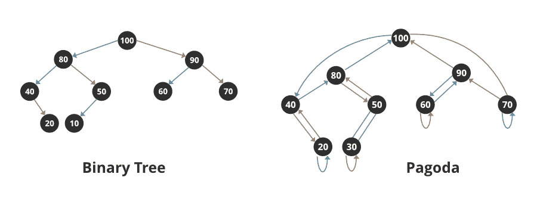

# 在 Java 中实现宝塔

> 原文:[https://www.geeksforgeeks.org/implementing-pagoda-in-java/](https://www.geeksforgeeks.org/implementing-pagoda-in-java/)

在 Java 中，宝塔是一个优先级队列，通过修改二叉树来实现。二叉树被限制为具有优先级队列排序，即父树应该大于其子树。详细的分析表明，宝塔提供了一个高效的优先级队列实现，其效率通过平均运行时间来衡量。

宝塔与堆非常相似，因为宝塔用于不可渗透的优先级队列，而堆用于不可合并的优先级队列。

宝塔的根指向它的孩子，类似于一棵二叉树。每隔一个节点都指向它的父节点，并一直向下指向它最左边的(如果它是右子节点)或最右边的(如果它是左子节点)后代叶子。关键操作是 merge 或 meld，它支持堆属性。

通过将节点合并为单个节点来插入节点。通过合并它的两个子节点(左和右)来移除根节点。合并是一种自下而上的方法，将一个的最左边与另一个的最右边合并。

> 有两个指针左(节点)和右(节点)，定义如下
> 
> *   *根*
>     *   如果 R 是树的根 T **—** 右(R)指向 T 的右枝底部，左(R)指向 T 的左枝底部
> *   *左侧儿童*
>     *   如果 K 是 T 中的左子代 **—** 左(K)指向 K 的父代，右(K)指向 T 右分支的底部
> *   *天子*
>     *   如果 K 是 T 中的右子代 **—** 右(K)指向 K 的父代，左(K)指向 T 左分支的底部

**宝塔内主要操作如下:**

1.  联合:宝塔 Q’的所有元素都添加到宝塔 Q 中，Q’被丢弃。
    *   *【q+q】*
2.  插入:元素 k 被添加到宝塔 Q 中
    *   *【q+k】*
3.  删除:元素 k 从宝塔 Q 中移除(这个操作只有在 k 属于 Q 的情况下才有意义)
    *   *Q < -Q/k*

**图解:**二叉树和宝塔表示的区别

> 橙色箭头代表左侧子指针，绿色箭头代表右侧子指针。请注意，叶节点指向它们自己，因为它们没有分支。



**程序:**

1.  INSERT–通过将单个键 p 视为宝塔，我们可以将 INSERT 视为 UNION 的特例。
2.  将一个项目插入宝塔的最好和最有效的方法是简单地将它附加在最后。
3.  这保证了维护完整的树属性。但是，这将意味着违反堆属性，即宝塔中的父节点总是大于其子节点。
4.  使用下面讨论的方法对宝塔执行操作
    *   *删除()*
        *   删除密钥 k 在宝塔中是可能的，而不需要使用额外的链接。要删除 k，只需找到以 k 为根的子树的左右分支的链接即可。一旦找到了这些指针，我们继续按照这个顺序进行 D 和 G 的并运算。
    *   [*【isempty()*](https://www.geeksforgeeks.org/list-isempty-method-in-java-with-examples/)
        *   如果根等于空，则返回真。否则返回 false。
    *   [*晴()*](https://www.geeksforgeeks.org/list-clear-method-in-java-with-examples/)
        *   使根为空，宝塔为空。

**示例:**

## Java 语言(一种计算机语言，尤用于创建网站)

```
// Java Program to implement Pagoda

// Pagoda is simply a priority queue
// which includes variations of binary tree

// Class for creating a single node
class GFG {
    GFG left, right;
    int data;

    // Constructor of this class
    public GFG(int val)
    {

        // Node stores the value as data
        data = val;

        // Left pointer is initially set as NULL
        left = null;

        // Right pointer initially set as NULL
        right = null;
    }
}

// Helper class
// Pagoda class
class Pagoda {

    // Member variable of this class
    private GFG root;

    // Constructor of this class
    public Pagoda()
    {

        // Initializing the root in the Pagoda as NULL
        root = null;
    }

    // Method 1
    // To check if Pagoda is empty
    public boolean isEmpty()
    {

        // Returns true if root is equal to null
        // else returns false
        return root == null;
    }

    // Method 2
    // To clear the entire Pagoda
    public void clear()
    {

        // Clears or Empties the entire Pagoda
        root = null;
    }
    // Method 3
    // To insert node into the Pagoda
    public void insert(int val)
    {

        // Creates a new node with data as val
        GFG node = new GFG(val);

        // Inserts into Pagoda
        root = insert(node, root);
    }

    private GFG insert(GFG node, GFG queue)
    {

        // Initially the new node has no left child
        // so the left pointer points to itself
        node.left = node;

        // Initially the new node has no right child
        // so the right pointer points to itself
        node.right = node;

        // Calling merge to attach new node to Pagoda
        return (merge(queue, node));
    }

    // Method 4
    // To merge new node to Pagoda

    // New node is inserted as a leaf node
    // and to maintain the heap property
    // if the new node is greater than its parent
    // both nodes are swapped and this continues till
    // all parents are greater than its children

    private GFG merge(GFG root, GFG newnode)
    {
        GFG botroot, botnew, r, temp;
        if (root == null)

            // If root is null, after merge - only newnode
            return newnode;

        else if (newnode == null)

            // If newnode is null, after merge - only root
            return root;

        else {

            // Bottom of root's rightmost edge
            botroot = root.right;

            root.right = null;

            // bottom of newnode's leftmost edge - mostly
            // itself
            botnew = newnode.left;

            newnode.left = null;

            r = null;

            // Iterating via loop for merging
            while (botroot != null && botnew != null) {

                // // Comparing parent and child
                if (botroot.data < botnew.data) {
                    temp = botroot.right;

                    if (r == null)
                        botroot.right = botroot;
                    else {

                        botroot.right = r.right;
                        r.right = botroot;
                    }

                    r = botroot;
                    botroot = temp;
                }
                else {

                    // Comparing parent and child
                    temp = botnew.left;
                    if (r == null)
                        botnew.left = botnew;
                    else {

                        // Swapping of child and parent
                        botnew.left = r.left;
                        r.left = botnew;
                    }

                    r = botnew;
                    botnew = temp;
                }
            }

            // Merging stops after either
            // botnew or botroot becomes null

            // Condition check when
            // node(botnew) is null
            if (botnew == null) {
                root.right = r.right;
                r.right = botroot;
                return (root);
            }
            else {
                // botroot is null
                newnode.left = r.left;
                r.left = botnew;
                return (newnode);
            }
        }
    }
    // Methods 5
    // To delete a particular node
    public void delete() { root = delete(root); }
    private GFG delete(GFG queue)
    {
        GFG l, r;

        // Deleting when Pagoda is already empty
        if (queue == null) {
            // Display message
            System.out.println("Empty");
            return null;
        }

        // Deleting a left child
        else {
            if (queue.left == queue)
                l = null;
            else {
                l = queue.left;
                while (l.left != queue)
                    l = l.left;
                l.left = queue.left;
            }

            // Deleting a right child
            if (queue.right == queue)
                r = null;
            else {
                r = queue.right;
                while (r.right != queue)
                    r = r.right;
                r.right = queue.right;
            }

            // Merging Pagoda after deletion
            return merge(l, r);
        }
    }

    // Method 6
    // To print root of Pagoda
    public void printRoot()
    {
        if (root != null)

            // Display and print the data of the root
            System.out.println(root.data);
        else

            // Display message when root doesn't exist
            // This implies Pagoda is empty
            System.out.println("Empty");
    }
}

// Main class
public class GFG2 {

    // Main driver method
    public static void main(String[] args)
    {

        // Creating an object of Pagoda type
        // Object is created of user defined type
        Pagoda p = new Pagoda();

        // Adding elements to the object created above
        // Custom inputs - 10,30,20,50,40.

        // Operation 1 on Pagoda
        // Input 1
        // Inserting element - 10
        p.insert(10);

        // Display message
        System.out.print("Root Element : ");

        // Printing Root
        p.printRoot();

        // Operation 2 on Pagoda
        // Input 2
        // Inserting element - 30
        p.insert(30);

        // Display message
        System.out.print("Root Element : ");

        // Printing Root
        p.printRoot();

        // Operation 3 on Pagoda
        // Input 3
        // Inserting element - 20
        p.insert(20);

        // Display message
        System.out.print("Root Element : ");

        // Printing Root
        p.printRoot();

        // Operation 4 on Pagoda
        // Input 4
        // Inserting element - 50
        p.insert(50);

        // Display message
        System.out.print("Root Element : ");

        // Printing Root
        p.printRoot();

        // Operation 5 on Pagoda
        // Input 5
        // Inserting element - 40
        p.insert(40);

        // Display message
        System.out.print("Root Element : ");

        // Printing Root
        p.printRoot();

        // Operation 6 on Pagoda
        // Now, deleting an element from above
        // inserted elements
        p.delete();

        // Display message
        System.out.print("Root Element : ");

        // Printing Root
        p.printRoot();

        // Operation 7 on Pagoda
        // Again deleting an element from above
        // inserted elements using delete() method
        p.delete();

        // Display message
        System.out.print("Root Element : ");

        // Printing the Root
        p.printRoot();

        // Operation 8 on Pagoda
        // Condition check using isEmpty()
        // Checking whether the Pagoda is empty or not
        // by calling isEmpty() over Pagoda
        System.out.println("Empty status: " + p.isEmpty());

        // Emptying out the Pagoda
        // using clear() method
        p.clear();

        // Again checking if Pagoda is empty
        // using the isEmpty() method
        System.out.println("Empty status: " + p.isEmpty());
    }
}
```

**Output**

```
Root Element : 10
Root Element : 30
Root Element : 30
Root Element : 50
Root Element : 50
Root Element : 40
Root Element : 30
Empty status: false
Empty status: true
```