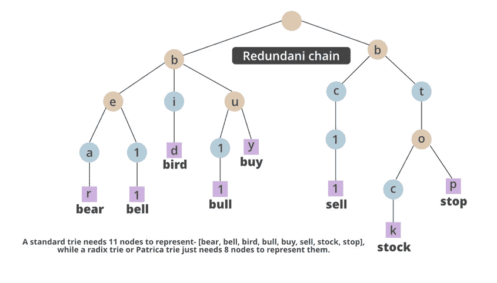
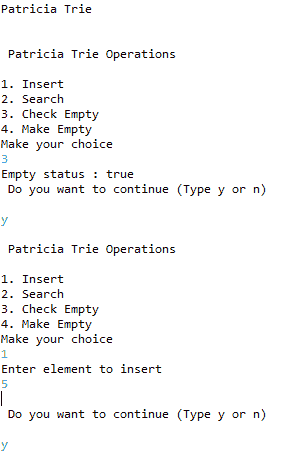
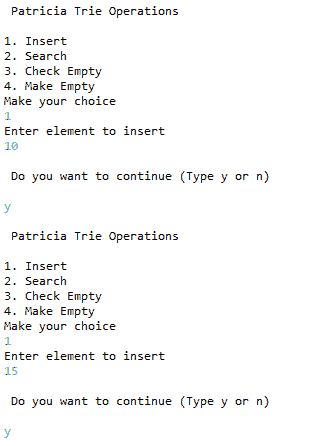
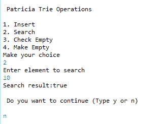
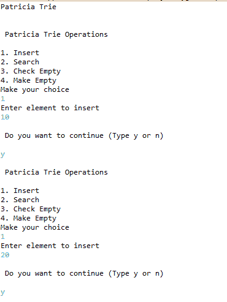
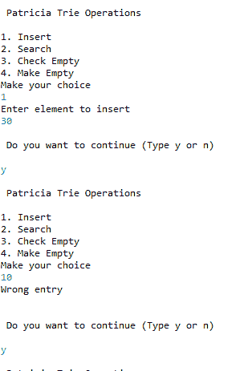
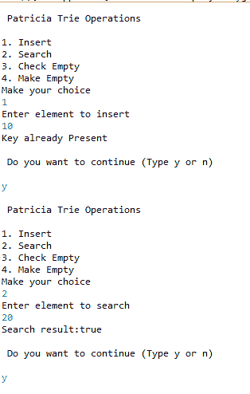
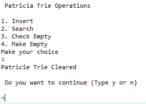

# 在 Java 中实现 Patricia Trie

> 原文:[https://www . geesforgeks . org/impering-Patricia-trie-in-Java/](https://www.geeksforgeeks.org/implementing-patricia-trie-in-java/)

Patricia [Trie](https://www.geeksforgeeks.org/trie-insert-and-search/) 或前缀树或基数树是一种有序的结构树，它通常利用它存储的数据。节点在树中的位置定义了与该节点相关联的键，这使得尝试与二分搜索法树不同，在树中，节点存储仅对应于该节点的键。

每个节点有一个前缀是字符串，而另一个是空字符串。

帕特丽夏特里的一般操作是-

*   插入
*   搜索
*   删除



**进场:**

1.  首先，我们简单地创建一个类 PatriciaTrieNode，在这个类中我们声明了这个类的所有变量。
2.  现在我们声明另一个父类，在这里我们构建父类构造函数
3.  我们声明类似 *makeEmpty()* 或[T3】isEmpty()](https://www.geeksforgeeks.org/java-string-isempty-method-example/)的函数来检查节点的状态。
4.  我们将声明函数位，这将帮助我们在节点中存储元素。
    *   我们将首先检查它的长度是否不等于最大位数。
    *   然后我们编写代码，从左边得到密钥 k 的第 I 位
5.  现在，我们将编写一个布尔搜索函数，它将有助于发现元素是否在节点中。
    *   布尔搜索将采用一个数字，这将有助于我们搜索根节点
    *   父节点节点搜索将搜索给定的数据元素是否存在
    *   如果存在，返回是，否则返回否。
6.  PatriciaTrieNode 搜索是一个搜索元素的函数。
    *   它将有两个元素当前节点和下一个节点。
    *   下一个节点将保留在元素 t 的左子元素，而当前节点是 t
    *   借助 while 循环，我们将检查下一个节点是否大于当前节点
    *   如果满意，我们将检查当前节点是否等于下一个“节点”
    *   返回下一个节点。
7.  现在我们将创建一个插入 PatriciaTrieNode 的函数
    *   在这里，我们将声明当前节点、父节点、“最后节点”、“新节点”。
    *   我们会相应地设置数据、左子对象和右子对象等参数。
    *   如果我们已经输入了相同的密钥，我们还会检查条件
    *   如果我们还没有输入它，我们会将密钥存储在不同的变量中
    *   在这里，我们将它设置为数据、右子级、左子级等等
    *   如果父节点与左边的子节点匹配，它就是新节点，或者右边的子节点成为新节点
8.  现在我们将声明主类
    *   我们会宣布扫描仪
    *   我们还会为 PatriciaTest 创建一个对象
    *   我们会宣布一个角色
    *   现在我们将声明 switch 关键字
    *   这个开关关键字可以用一个字符来访问。
    *   我们可以选择插入、搜索、清空，或者检查它是否为空
    *   我们可以根据满足 while 的给定输入继续循环。

**实施:**

**案例 1**

```java
Patricia Trie
Patricia Trie Operations
1\. Insert
2\. Search
3\. Check Empty
4\. Make Empty
Make your choice
1
Enter element to insert
10
Do you want to continue (Type y or n)
y
Patricia Trie Operations
1\. Insert
2\. Search
3\. Check Empty
4\. Make Empty
Make your choice
1
Enter element to insert
20
Do you want to continue (Type y or n)
y
Patricia Trie Operations
1\. Insert
2\. Search
3\. Check Empty
4\. Make Empty
Make your choice
1
Enter element to insert
30
Do you want to continue (Type y or n)
y
Patricia Trie Operations
1\. Insert
2\. Search
3\. Check Empty
4\. Make Empty
Make your choice
1
Enter element to insert
10
Key already Present
Do you want to continue (Type y or n)
y
Patricia Trie Operations
1\. Insert
2\. Search
3\. Check Empty
4\. Make Empty
Make your choice
2
Enter element to search
20
Search result : true
Do you want to continue (Type y or n)
y
Patricia Trie Operations
1\. Insert
2\. Search
3\. Check Empty
4\. Make Empty
Make your choice
4
Patricia Trie Cleared
Do you want to continue (Type y or n)
n
```

**案例 2**

```java
Patricia Trie
Patricia Trie Operations
1\. Insert
2\. Search
3\. Check Empty
4\. Make Empty
Make your choice
3
Empty status : true
Do you want to continue (Type y or n)
y
Patricia Trie Operations
1\. Insert
2\. Search
3\. Check Empty
4\. Make Empty
Make your choice
1
Enter element to insert
5
Do you want to continue (Type y or n)
y
Patricia Trie Operations
1\. Insert
2\. Search
3\. Check Empty
4\. Make Empty
Make your choice
1
Enter element to insert
10
Do you want to continue (Type y or n)
y
Patricia Trie Operations
1\. Insert
2\. Search
3\. Check Empty
4\. Make Empty
Make your choice
1
Enter element to insert
15
Do you want to continue (Type y or n)
y
Patricia Trie Operations
1\. Insert
2\. Search
3\. Check Empty
4\. Make Empty
Make your choice
2
Enter element to search
10
Search result : true
Do you want to continue (Type y or n)
n
```

**例**

## Java 语言(一种计算机语言，尤用于创建网站)

```java
// Java Program to  implement Patrica trie

// Importing input output classes
import java.io.*;
// Importing Scanner class to display menu
// or simply to takke input from user
import java.util.Scanner;

// Class 1
// class PatriciaTrieNode is created
// to obtained its elements
class PatriciaTrieNode {
    // Member variables of this class
    // Declaring elements, number and data.
    int number;
    int data;

    // Two nodes are considered into action
    // node1 -> left child and
    // node2 -> right child
    PatriciaTrieNode leftChild, rightChild;
}

class PraticiaTest {

    // Member variable of this class
    // Declaring two elements
    // Maxbits can help us to store elements in the Trie
    // The root helps us to fix a global value.
    private PatriciaTrieNode root;
    private static final int MaxBits = 10;

    // Method 1
    // PatriciaTrie where initially
    // the root equals NULL
    public PraticiaTest() { root = null; }

    // Method 2 - isEmpty()
    // Method used to check if the function is empty as
    // it returns true or false basing on the condition
    public boolean isEmpty() { return root == null; }

    // Method 3 - makeEmpty()
    // Method  used to help in emptying the root
    // of the Patricia Node
    public void makeEmpty() { root = null; }

    // Method 4 - bit()
    // Declaring the function bit which performs a search
    // operation in finding the bit which should be matched
    // as input
    private boolean bit(int k, int i)
    {
        // Step 1 : Binary input is first converted to
        // string as in strings its easy to match its
        // corporate values
        String binary = Integer.toString(k, 2);

        // Step2: Condition check while input length
        // is not equal to the length of the maxbits
        while (binary.length() != MaxBits)

            // Step 3: Keep adding the binary value
            // until it gets the last number
            binary = "0" + binary;

        // Step 4: If the binary matches the desired value
        //  needed, true will be returned
        if (binary.charAt(i - 1) == '1')
            return true;

        // else we return false
        return false;
    }

    // Method 5 - search()
    public boolean search(int k)
    {
        // Taking int num , as the half value of
        // the of entered elements
        int num = (int)(Math.log(k) / Math.log(2));

        // Condition check whether number
        // is greater than maxBits
        if (num > MaxBits) {
            // Display message
            // Print number has exceeded the limit
            System.out.println("Exceeded the limit");

            // And return false
            return false;
        }

        // Now when an element is created for the class
        // named as 'searchNode'

        // This searches Node will go to the next
        // search function
        PatriciaTrieNode searchNode = search(root, k);

        // Now we will search the data element whether
        // k is present in our node or not.

        // If it is present print true
        // else print false
        if (searchNode.data == k)
            return true;
        else
            return false;
    }

    // By now, search operation of
    // PatriciaTrieNode class is declared
    private PatriciaTrieNode search(PatriciaTrieNode t,
                                    int k)
    {

        // Now these are the currentNode and nextNode
        PatriciaTrieNode currentNode, nextNode;

        // Step 1 : Now if the elemenents present in the t
        // mode
        //  are NULL,then NULL will be returned
        if (t == null) {
            return null;
        }

        // Step 2: Now, considering the next node value to
        // be the left child of the present variable t
        nextNode = t.leftChild;

        // Step 3:  Next we keep the current node value
        // to be "t"
        currentNode = t;

        // Condition check
        // Step 4: If the next node bitnumber is greater
        // than the current numbers bitcode
        while (nextNode.number > currentNode.number) {
            // Step 5: Making the current Node as the next
            // node

            // It is more like checking each
            // as the next node becomes the current node
            // Each time desired output won't be obtained
            currentNode = nextNode;

            // Step 6: Putting this nextNode in the bitwise
            // operator This method helps us to find whether
            // it is LeftChild or Right Child
            nextNode = (bit(k, nextNode.number))
                           ? nextNode.rightChild
                           : nextNode.leftChild;
        }
        // Step 7: Now we return the next Node..
        return nextNode;
    }

    // Method 6 - insert()
    // Inserting the value element inside PatriciaTrieNode
    public void insert(int element)
    {
        // Num is the variable where the value entered by
        // the user will be stored. This value will be
        // helpful to calculate the serahc index as well
        int num
            = (int)(Math.log(element) / Math.log(2)) + 1;

        // Now taking num greater than maxBits, it can be
        // said
        //  that the PatriciaTrieNode is full
        if (num > MaxBits) {
            // This will print the statement that we are
            // full

            // Display message
            System.out.println(
                "We are full, The number is too large");

            return;
        }

        // Now the root value becomes the value
        // where the element gets inserted
        root = insert(root, element);
    }

    // Now defining a function insert of the class
    // PraticiaTrieNode
    private PatriciaTrieNode insert(PatriciaTrieNode t,
                                    int element)
    {

        // Here the praticiaNode will have current , parent
        // It will also have lastNode and newNode
        PatriciaTrieNode current = null, parent, lastNode,
                         newNode;
        int i;

        // Here t equals null

        // Condition check
        // If it equals null simply declare
        // the following attributes
        if (t == null) {
            t = new PatriciaTrieNode();

            // Number is initialized to be 0
            t.number = 0;

            // Data of the t node should be
            // the element number
            t.data = element;

            // where as the child will be t and
            t.leftChild = t;

            // Right child of the t will be made empty
            // or be equal to null
            t.rightChild = null;

            // Return the data t
            return t;
        }

        // Now declaring the lastNode to be search
        lastNode = search(t, element);

        // If we declare the last node to be
        // a part of the search function.

        // Now  we can compare it with the data
        // already present in the PatriciaTrieNode
        // If we have the key already Present
        if (element == lastNode.data) {
            // Print the display message
            System.out.println("Key already Present");

            // Return t
            return t;
        }

        // Iterating variable variable from
        // first element to last element
        for (i = 1;
             bit(element, i) == bit(lastNode.data, i); i++)

            // Keep current to the left Child
            current = t.leftChild;

        // Parent is equal to t
        parent = t;

        // Condition check
        // Current number is greater than parent number
        // And if current number is less than i
        while (current.number > parent.number
               && current.number < i) {
            // If parent is current
            parent = current;

            // Now we will see whether the new node
            // is more flexible to the rightChild
            // or is it ore available to the left child
            // using scope resolution operator
            current = (bit(element, current.number))
                          ? current.rightChild
                          : current.leftChild;
        }

        // Now we are taking this as newnode
        newNode = new PatriciaTrieNode();

        // If we take newnode of number as i
        newNode.number = i;

        // Now taking data as element
        newNode.data = element;

        // Now taking the leftchild as depending onn the
        // condition
        // we fix it either to be current or newNode
        newNode.leftChild
            = bit(element, i) ? current : newNode;

        // Now again taking the condition we fix
        // The right child either to be newNode or
        // curentNode
        newNode.rightChild
            = bit(element, i) ? newNode : current;

        // If we take current and parent as left child are
        // same We fix them to be newNode
        if (current == parent.leftChild) {
            parent.leftChild = newNode;
        }
        else {
            // else we take the right child to be the
            // newNode
            parent.rightChild = newNode;
        }
        // we return the value to t
        return t;
    }
}

// Main Class
public class GFG {

    // Main driver method
    public static void main(String[] args)
    {
        // Scanner class to take input choices from user
        Scanner sc = new Scanner(System.in);

        // Declare the object of the PracticiaTest class
        PraticiaTest pt = new PraticiaTest();

        // Display message
        System.out.println("Patricia Trie\n");

        // Declaring a variable 'ch' of character with help
        // of this character we will be able to make choiced
        char ch;

        // Do-while is used for switching operations
        // using switch case

        // Do loop includes execution in the body
        // which will execute once atleast as
        // condition is checked at last
        do {
            // Display Messages
            // Heading would be patricia Trie Operations
            System.out.println(
                "\n Patricia Trie Operations\n");

            // Menu
            // These are the following options
            // that we would keep in a Patricia Trie

            // (1) Inserting the element
            System.out.println("1\. Insert");

            // (2) earching the element
            System.out.println("2\. Search");

            // (3) Checking for The Trie to be empty
            System.out.println("3\. Check Empty");

            // (4) Making it empty
            System.out.println("4\. Make Empty");

            // Display message
            // Reading the choice of the user
            System.out.println("Make your choice");

            // Switch variable
            int choice = sc.nextInt();

            // Switch case keyboard enables to decide the
            // choice
            switch (choice) {
                // Case 1 : Insertion
                // We would simply call the insert function
                // And set the data
            case 1:
                System.out.println(
                    "Enter element to insert");
                pt.insert(sc.nextInt());
                break;

                // Case 2: Enter the element to search
            case 2:

                // If we would find the data we would give
                // necessary output If not we would return
                // false Print and display
                System.out.println(
                    "Enter element to search");
                System.out.println(
                    "Search result:"
                    + pt.search(sc.nextInt()));
                break;

                // Case: 3
            case 3:

                // This is to check if the Trie is empty
                // Print and display
                System.out.print("Empty status : "
                                 + pt.isEmpty());
                break;

                // Case 4  : Empty the patricia Trie

            case 4:

                // Print and display
                System.out.println("Patricie Trie Cleared");

                //  Calling makeEmpty() to empty the Trie
                pt.makeEmpty();
                break;

                // Default case for invalid entry
            default:

                // Print and display
                System.out.println("Wrong entry\n");
                break;
            }

            // Now if we wish to continue
            // Then we would press y and continue
            // If not we would simply exit from the blocks
            System.out.println(
                "\n Do you want to continue (Type y or n)\n");
            ch = sc.next().charAt(0);
        }

        // Condition in do-while loop
        while (ch == 'Y' || ch == 'y');
    }
}
```

**输出:**

**案例 1**

  

**案例 2**

   