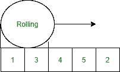

# 在 Java 中使用滚动哈希实现拉宾卡普算法

> 原文:[https://www . geesforgeks . org/impering-rabin-Karp-algorithm-use-rolling-hash-in-Java/](https://www.geeksforgeeks.org/implementing-rabin-karp-algorithm-using-rolling-hash-in-java/)

字符串有很多模式搜索算法。KMP 算法、Z 算法、拉宾卡普算法等这些算法都是对朴素模式搜索算法的优化。

**朴素模式搜索算法:**

```java
Input   :  "AABACACAACAC"
Pattern :  "CAC"
Output  :  [4,9]

AABACACAACAC
```

**实施:**

## Java 语言(一种计算机语言，尤用于创建网站)

```java
// Java Program to Search for a Pattern String in the Input
// String returning the indicies

// Importing input java classes
import java.io.*;

// Main class
public class GFG {

    // Method 1
    // To find pattern in the string
    static void search(String s, String pattern)
    {
        // Iterating over the string in which to be searched
        // for using the length() method
        for (int i = 0; i <= s.length() - pattern.length();
             ++i) {

            int check = 1;

            // Iterating over the string for which is to be
            // searched using the length() method
            for (int j = 0; j < pattern.length(); ++j) {

                // Now, checking the elements of pattern
                // with the given string using the charAt()
                // method
                if (s.charAt(i + j) != pattern.charAt(j)) {

                    // Setting check to zero as pattern is
                    // not detected here
                    check = 0;

                    // Break statement to hault
                    // execution of code
                    break;
                }
            }

            // Now if the check remains same as declared
            // then pattern is detected at least once
            if (check == 1) {

                // Printing the position(index) of the
                // pattern string in the input string
                System.out.print(i + " , ");
            }
        }
    }

    // Method 2
    // Main driver method
    public static void main(String[] args)
    {
        // Given custom input string
        String s = "AABACACAACAC";

        // Pattern to be looked after in
        // the above input string
        String pattern = "CAC";

        // Display message for interpreting the indicies
        // ai where if the pattern exists
        System.out.print(
            "Pattern is found at the indicies : ");

        // Calling the above search() method
        // in the main() method
        search(s, pattern);
    }
}
```

**Output**

```java
Pattern is found at the indicies : 4 , 9 , 
```

输出解释:

> 上述模式搜索算法是最差的基本算法，因为该算法的平均时间复杂度是 **O(n×m)** ，其中 n 是模式，m 是给定的字符串。

**如何降低这个算法的复杂度？**

借助滚动散列**是可能的。** Rabin Karp 算法是朴素算法的优化算法之一，通过滚动字符串并搜索模式来执行搜索。



插图:

```java
Input:  txt[] = "THIS IS A TEST TEXT"
        pat[] = "TEST"
Output: Pattern found at index 10

Input:  txt[] =  "AABAACAADAAB<u>AABA</u>"
        pat[] =  "AABA"
Output: Pattern found at index 0
        Pattern found at index 9
        Pattern found at index 12
```

**程序:**

*   计算模式的哈希值(通过创建自己的哈希函数或等式来确定每个字符的单个哈希值)
*   遍历字符串检查根据模式大小生成的每个子字符串的哈希值，如果匹配，则检查模式的每个字符，如果匹配，则检查字符串，如果匹配，则打印字符串的起始索引。
*   如果不匹配，通过跳过第一个字符并添加下一个字符的哈希值来移动到下一个字符，我们不计算字符串中下一个子字符串的哈希值，我们只滑动窗口跳过第一个字符并通过计算其哈希值添加窗口中的最后一个字符，即滚动哈希。

**实施:**

假设模式长度为 2 的简单滚动算法

1.  初始化温度=4(1+3)
2.  将哈希值滚动到下一个元素。
3.  迭代循环“I”< = array . length-pattern . length
4.  从 temp 变量中移除第一个元素，并在 temp 变量中添加下一个元素。*温度=温度-数组[I]+数组[i.pattern.length()]*

## Java 语言(一种计算机语言，尤用于创建网站)

```java
// Java Program to illustrating Simple Rolling Hashing

// Importing input output classes
import java.io.*;

// Main class
class GFG {

    // Method 1
    // To search the pattern
    static void search(String S, String pattern)
    {
        // Declaring and initializing the hash values
        int hash1 = 0;
        int hash2 = 0;

        // Iterating over the pattern string to be matched
        // over
        for (int i = 0; i < pattern.length(); ++i) {

            // Storing the hash value of the pattern
            hash1 += pattern.charAt(i) - 'A';

            // Storing First hash value of the string
            hash2 += S.charAt(i) - 'A';
        }

        // Initially declaring with zero
        int j = 0;

        // Iterating over the pattern string to checkout
        // hash values
        for (int i = 0; i <= S.length() - pattern.length();
             ++i) {

            // Checking the hash value
            if (hash2 == hash1) {

                // Checking the value
                for (j = 0; j < pattern.length(); ++j) {

                    // Checking for detection of pattern in a
                    // pattern
                    if (pattern.charAt(j)
                        != S.charAt(i + j)) {

                        // Break statement to hault the
                        // execution of program as no
                        // pattern found
                        break;
                    }
                }
            }

            // If execution is not stopped means
            // pattern(sub-string) is present

            // So now simply detecting for one or more
            // occurrences inbetween pattern string using the
            // length() method
            if (j == pattern.length()) {

                // Pattern is detected so printing the index
                System.out.println(i);
            }
            // for last case of loop, have to check,
            // otherwise,
            // S.charAt(i + pattern.length()) below will
            // throw error
            if (i == S.length() - pattern.length())
                break;

            // Roll the hash value over the string detected
            hash2 = (int)((hash2) - (S.charAt(i) - 'A'))
                    + S.charAt(i + pattern.length()) - 'A';
        }
    }

    // Method 2
    // Main driver method
    public static void main(String[] args)
    {

        // Input string to be traversed
        String S = "AABAACAADAABAABA";

        // Pattern string to be checked
        String pattern = "AABA";

        // Calling the above search() method(Method1)
        // in the main() method
        search(S, pattern);
    }
}
```

**Output**

```java
0
9
12
```