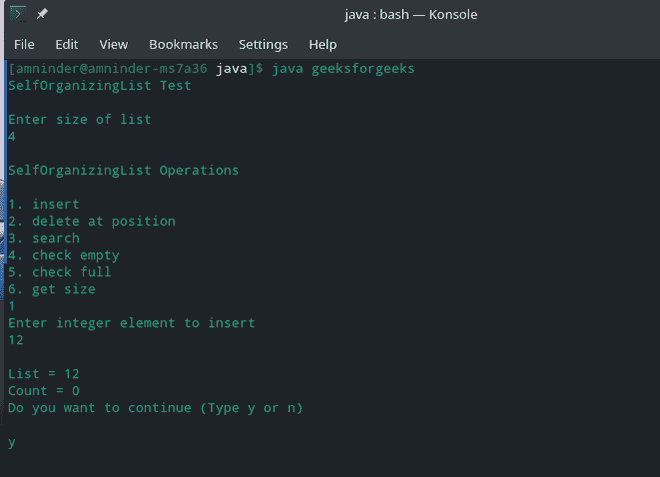
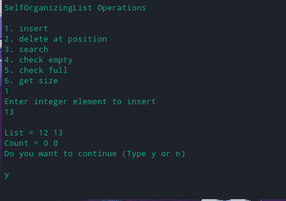
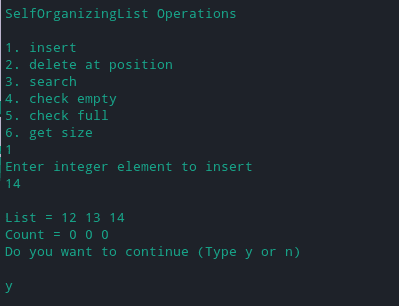

# 在 Java 中实现自组织列表

> 原文:[https://www . geesforgeks . org/impering-自组织-java 中的列表/](https://www.geeksforgeeks.org/implementing-self-organizing-list-in-java/)

[自组织列表](https://www.geeksforgeeks.org/self-organizing-list-set-1-introduction/)是根据实际或预期的访问模式修改元素存储顺序的列表。目标是实现一个排序，保持最频繁寻找的元素最接近，以提高平均访问时间。此属性也称为引用位置，它将最常用的项放在列表的最前面。这增加了在列表开头找到项目的可能性，并且那些很少使用的元素被推到列表的后面。

**重新排列节点的技术**

在对列表中的元素进行排序时，元素的访问概率通常是事先不知道的。这导致了各种近似最优行为的启发式方法的发展。用于对列表中的元素重新排序的基本试探法是，

**1。移到前面方法**

这种技术将被评估的元素移动到列表的头部。

> 在第 t 项选择中:
> 
> 如果选择了项目 I:
> 
> 将项目 I 移到列表的顶部

**2。计数方法**

在这种技术中，每个节点被搜索的次数被计数，即每个节点保持一个单独的计数器变量，该变量在每次被调用时递增。

> init:每个项目 I 的计数(i) = 0
> 
> 第 t 项选择:
> 
> 如果搜索了项目 I:
> 
> 计数(i) =计数(i) + 1

**3。转置法**

这种技术包括将被访问的节点与其前身交换。

> 在第 t 项选择中:
> 
> 如果选择了项目 I:
> 
> 如果我不是列表的头:
> 
> 用项目(I–1)替换项目 I

## Java 语言(一种计算机语言，尤用于创建网站)

```java
// Java Program to Implement Self organizing List
import java.util.Scanner;

class SelfOrganizingList {
    private int[] list;
    private int[] count;
    private int size;

    // Constructor
    public SelfOrganizingList(int listSize)
    {
        list = new int[listSize];
        count = new int[listSize];
        size = 0;
    }

    // checks if list is empty
    public boolean isEmpty() { return size == 0; }

    // checks if list is full
    public boolean isFull() { return size == list.length; }

    // Makes list empty
    public void makeEmpty()
    {
        int l = list.length;
        list = new int[l];
        count = new int[l];
        size = 0;
    }

    // returns the size of list
    public int getSize() { return size; }

    // Function to insert element
    public void insert(int val)
    {
        if (isFull()) {
            System.out.println("Error : List full!");
            return;
        }
        list[size] = val;
        count[size] = 0;
        size++;
    }

    // Function to remove element
    public void remove(int pos)
    {
        pos--;
        if (pos < 0 || pos >= size) {
            System.out.println("Invalid position ");
            return;
        }
        for (int i = pos; i < size - 1; i++) {
            list[i] = list[i + 1];
            count[i] = count[i + 1];
        }
        size--;
    }

    // Function to search for an element
    public boolean search(int x)
    {
        boolean searchResult = false;
        int pos = -1;
        for (int i = 0; i < size; i++) {
            if (list[i] == x) {
                searchResult = true;
                pos = i;
                break;
            }
        }
        if (searchResult) {
            count[pos]++;
            int c = count[pos];
            for (int i = 0; i < pos; i++) {
                if (count[pos] > count[i]) {
                    for (int j = pos; j > i; j--) {
                        list[j] = list[j - 1];
                        count[j] = count[j - 1];
                    }
                    list[i] = x;
                    count[i] = c;
                    break;
                }
            }
        }
        return searchResult;
    }

    // prints list
    public void printList()
    {
        System.out.print("\nList = ");
        for (int i = 0; i < size; i++)
            System.out.print(list[i] + " ");
        System.out.print("\nCount = ");
        for (int i = 0; i < size; i++)
            System.out.print(count[i] + " ");
    }
}

public class SelfOrganizingListTest {
    public static void main(String[] args)
    {
        Scanner scan = new Scanner(System.in);
        System.out.println("SelfOrganizingList Test\n");

        // Creating object of class SelfOrganizingList
        System.out.println("Enter size of list ");
        SelfOrganizingList list
            = new SelfOrganizingList(scan.nextInt());

        char ch;

        //  Perform list operations
        do {
            System.out.println(
                "\nSelfOrganizingList Operations\n");
            System.out.println("1\. insert ");
            System.out.println("2\. delete at position");
            System.out.println("3\. search");
            System.out.println("4\. check empty");
            System.out.println("5\. check full");
            System.out.println("6\. get size");
            int choice = scan.nextInt();
            switch (choice) {
            case 1:
                System.out.println(
                    "Enter integer element to insert");
                list.insert(scan.nextInt());
                break;
            case 2:
                System.out.println(
                    "Enter position to delete");
                list.remove(scan.nextInt());
                break;
            case 3:
                System.out.println(
                    "Enter integer element to search");
                System.out.println(
                    "Search Result : "
                    + list.search(scan.nextInt()));
                break;
            case 4:
                System.out.println("Empty status = "
                                   + list.isEmpty());
                break;
            case 5:
                System.out.println("Full status = "
                                   + list.isFull());
                break;
            case 6:
                System.out.println(
                    "Size = " + list.getSize() + " \n");
                break;
            default:
                System.out.println("Wrong Entry \n ");
                break;
            }

            //  Display List
            list.printList();

            System.out.println(
                "\nDo you want to continue (Type y or n) \n");
            ch = scan.next().charAt(0);
        } while (ch == 'Y' || ch == 'y');
    }
}
```

**输出**



1.1 插入元件

*在列表中插入元素:* **12**



1.2 插入元件

*列表中插入元素:* **13**



搜索元素

***搜索元素=*** **13**