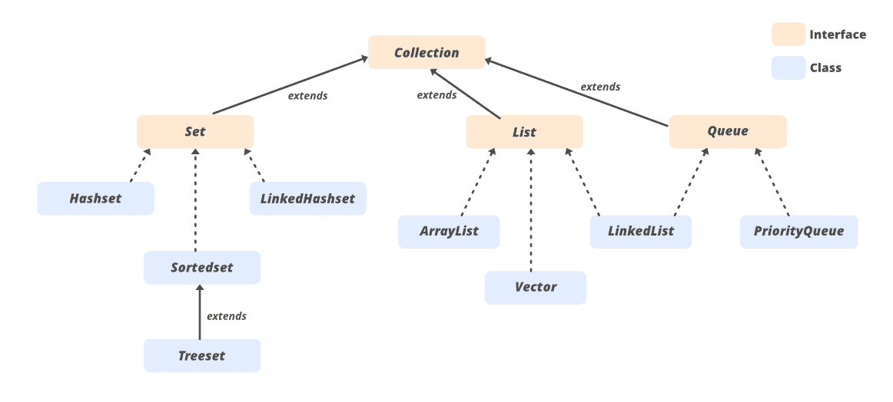

# 在 Java 中实现排序向量

> 原文:[https://www . geesforgeks . org/implementing-sorted-vector-in-Java/](https://www.geeksforgeeks.org/implementing-sorted-vector-in-java/)

Vector 是一个实现 List 接口的类。这是一种动态数组，意味着向量的大小可以在程序执行过程中增长或收缩。向量的初始大小是 10，如果我们插入超过 10 个元素，那么向量的大小将增加 100%，或者我们可以说它的大小增加了一倍。比如，最初向量的大小是 10，如果我们插入超过 10 个元素，向量的大小是 20，在向量中插入 20 个元素后，向量的大小将是 40。

**采集接口**如下图

其中有一个接口名集合，由集合、列表和队列接口扩展，列表接口由“向量”类扩展。



**方法:降序排序的实现**

**用于实现排序向量**

1.  扩展向量。(此处演示)
2.  扩展数组列表。
3.  延伸连结清单
4.  直接实现 List 接口。

**算法:**

1.  扩展向量类以实现 SortedVector。
2.  用于在 SortedVector 中存储数据的私有数据成员。
3.  为了创建 SortedVector 的对象，我们必须定义所有的构造函数。
4.  为了在 SortedVector 中添加元素，我们创建了一个方法“adding elements”。
    1.  添加元素。
    2.  如果数据成员的大小小于或等于 1，则不需要排序。
    3.  如果大小大于 1，则进行排序。
    4.  如果用户输入了字符串，则引发错误。
5.  最后，在排序的向量中添加元素。
6.  清除 SortedVector，然后按排序顺序添加所有数据。

下面是上述方法的实现:

## Java 语言(一种计算机语言，尤用于创建网站)

```java
// We are going to implement sorted vector
// from inbuilt Vector class.
import java.util.*;

class SortedVector extends Vector<Object> {

    private final Vector<Object> list = new Vector<>();
    private final Comparator<? super Object> comparator
        = Collections.reverseOrder();

    public SortedVector() {}

    // method for adding elements in data
    // member of 'SortedVector'

    public void addingElement(Object obj)
    {

        list.add(obj);

        // if list size is less than or equal to one
        // element then there is no need of sorting.
        // here we are sorting elements

        if (list.size() > 1) {

            // If we are getting character as input then
            // Exceptions occurs in 'Collections.sort'.
            // So, we are type casting character to int.
            // and sorting character as integer.

            try {

                list.sort(comparator);
            }
            catch (Exception e) {

                Object recent = list.lastElement();

                list.removeElementAt(list.size() - 1);

                int val;

                // If we are getting string as input then
                // we are handling this exception here.

                try {

                    val = (char)recent;

                    list.add(val);

                    list.sort(comparator);
                }
                catch (Exception e1) {

                    System.out.println(
                        "You entered Strings");
                }
            }
        }

        addingElementsInSortedVector();
    }

    // adding element in object of 'SortedVector'

    private void addingElementsInSortedVector()
    {

        // clear all values of "SortedVector's" object

        clear();

        // adding values in object of 'SortedVector'

        addAll(list);
    }
}

// ours code starts from here

public class Main {

    public static void main(String[] args)
    {

        // creating an object of Sorted vector

        SortedVector sorted_vector = new SortedVector();

        // we have a method for adding object in
        //'SortedVector' class called 'addingElement'.
        // adding element in object of 'SortedVector'

        sorted_vector.addingElement(1);
        System.out.println("After 1st element Insertion:");
        for (Object i : sorted_vector) {
            System.out.println(i);
        }
        sorted_vector.addingElement(99);

        System.out.println("After 2nd element Insertion:");
        for (Object i : sorted_vector) {
            System.out.println(i);
        }

        System.out.println("After 3rd element Insertion:");
        sorted_vector.addingElement(2);
        for (Object i : sorted_vector) {
            System.out.println(i);
        }
        sorted_vector.addingElement(0);

        System.out.println("After 4th element Insertion:");
        for (Object i : sorted_vector) {
            System.out.println(i);
        }
    }
}
```

**Output**

```java
After 1nd element Insertion:
After 1st element Insertion:
1
After 2nd element Insertion:
99
1
After 3rd element Insertion:
99
2
1
After 4th element Insertion:
99
2
1
0

```

**时间复杂度:** O(n <sup>2</sup> log n)