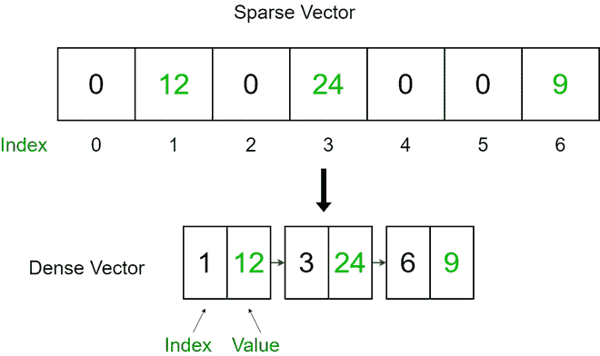
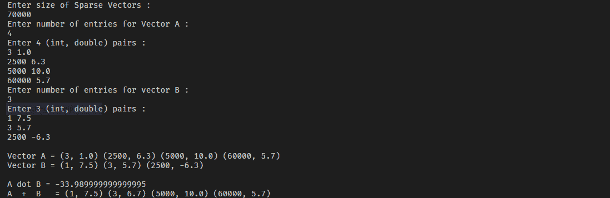

# 在 Java 中实现稀疏向量

> 原文:[https://www . geesforgeks . org/impering-sparse-vector-in-Java/](https://www.geeksforgeeks.org/implementing-sparse-vector-in-java/)

一个[向量](https://www.geeksforgeeks.org/java-util-vector-class-java/)或者[数组列表](https://www.geeksforgeeks.org/arraylist-in-java/)是一个一维的元素数组。稀疏向量的元素大多为零值。使用一维数组存储稀疏向量是低效的。在形成稀疏向量的和时，添加值为零的元素也是低效的。我们将一维向量转换成(索引，值)对的向量。



**示例**

```
Input: 
Enter size of Sparse Vectors : 
100
Enter number of entries for Vector A :
5
Enter 5 (int, double) pairs
2 20.0
5 12.2
19 23.1
4 66.0
11 100.0
Enter number of entries for vector B :
5
Enter 5 (int, double) pairs
9 21.0
10 44.5
6 13.22
71 30.0
63 99.0

Output:
Vector A = (2, 20.0) (4, 66.0) (5, 12.2) (11, 100.0) (19, 23.1)
Vector B = (6, 13.22) (9, 21.0) (10, 44.5) (63, 99.0) (71, 30.0)
A dot B = 0.0
A  +  B   = (2, 20.0) (4, 66.0) (5, 12.2) (6, 13.22) (9, 21.0) (10, 44.5) (11, 100.0) (19, 23.1) (63, 99.0) (71, 30.0)
```

**接近**

为了有效地存储稀疏向量，我们只存储向量的非零值和索引。对的第一个元素将是稀疏向量元素(非零)的索引，第二个元素将是实际元素。

我们使用树形图作为索引值对的向量。使用 [TreeMap](https://www.geeksforgeeks.org/treemap-in-java/) 的好处是，地图按照其关键点的自然顺序进行排序。这被证明是排序和存储键值对的有效方式。

**实施**

## Java 语言(一种计算机语言，尤用于创建网站)

```
// importing generic packages
import java.util.Scanner;
import java.util.TreeMap;
import java.util.Map;

public class SparseVector {

    // TreeMap is used to maintain sorted order
    private TreeMap<Integer, Double> st;
    private int size;

    // Constructor
    public SparseVector(int size)
    {
        this.size = size;

        // assigning empty TreeMap
        st = new TreeMap<Integer, Double>();
    }

    // Function to insert a (index, value) pair
    public void put(int i, double value)
    {
        // checking if index(i) is out of bounds
        if (i < 0 || i >= size)
            throw new RuntimeException(
                "\nError : Out of Bounds\n");

        // if value is zero, don't add to that index &
        // remove any previously held value
        if (value == 0.0)
            st.remove(i);

        // if value is non-zero add index-value pair to
        // TreeMap
        else
            st.put(i, value);
    }

    // Function to get value for an index
    public double get(int i)
    {
        // checking if index(i) is out of bounds
        if (i < 0 || i >= size)
            throw new RuntimeException(
                "\nError : Out of Bounds\n");

        // if index is valid, return value at index
        if (st.containsKey(i))
            return st.get(i);

        // if index not found, it means the value is zero as
        // only non-zero entries are added to the Map
        else
            return 0.0;
    }

    // Function to get size of the vector
    public int size() { return size; }

    // Function to get dot product of two vectors
    public double dot(SparseVector b)
    {
        SparseVector a = this;

        // Dot product of Sparse Vectors whose lengths are
        // different is not possible
        if (a.size != b.size)
            throw new RuntimeException(
                "Error : Vector lengths are not same");

        double sum = 0.0;

        // Traversing each sorted vector and getting
        // product of consequent entries of the vectors
        if (a.st.size() <= b.st.size()) {
            for (Map.Entry<Integer, Double> entry :
                 a.st.entrySet())
                if (b.st.containsKey(entry.getKey()))
                    sum += a.get(entry.getKey())
                           * b.get(entry.getKey());
        }

        // Traversing each sorted vector and getting
        // product of consequent entries of the vectors
        else {
            for (Map.Entry<Integer, Double> entry :
                 b.st.entrySet())
                if (a.st.containsKey(entry.getKey()))
                    sum += a.get(entry.getKey())
                           * b.get(entry.getKey());
        }
        return sum;
    }

    // Function to get sum of two vectors
    public SparseVector plus(SparseVector b)
    {
        SparseVector a = this;

        // Addition of Sparse Vectors whose lengths are
        // different is not possible
        if (a.size != b.size)
            throw new RuntimeException(
                "Error : Vector lengths are not same");

        // creating new empty Sparse Vector object
        SparseVector c = new SparseVector(size);

        // Traversing and adding the two vectors a & b and
        // constructing resultant Sparse Vector c
        for (Map.Entry<Integer, Double> entry :
             a.st.entrySet())
            c.put(entry.getKey(), a.get(entry.getKey()));

        for (Map.Entry<Integer, Double> entry :
             b.st.entrySet())
            c.put(entry.getKey(),
                  b.get(entry.getKey())
                      + c.get(entry.getKey()));

        return c;
    }

    // Function toString() for printing vector
    public String toString()
    {
        String s = "";
        for (Map.Entry<Integer, Double> entry :
             st.entrySet())
            s += "(" + entry.getKey() + ", "
                 + st.get(entry.getKey()) + ") ";

        return s;
    }

    public static void main(String[] args)
    {
        Scanner scan = new Scanner(System.in);
        System.out.println(
            "Enter size of Sparse Vectors : ");

        // Size of the two Sparse Vector
        int n = scan.nextInt();

        // sparse vector a and b
        SparseVector A = new SparseVector(n);
        SparseVector B = new SparseVector(n);

        // store key, value pairs
        System.out.println(
            "Enter number of entries for Vector A :");
        int n1 = scan.nextInt();
        System.out.println("Enter " + n1
                           + " (int, double) pairs :");
        for (int i = 0; i < n1; i++)
            A.put(scan.nextInt(), scan.nextDouble());

        System.out.println(
            "Enter number of entries for vector B :");
        int n2 = scan.nextInt();
        System.out.println("Enter " + n2
                           + " (int, double) pairs :");
        for (int i = 0; i < n2; i++)
            B.put(scan.nextInt(), scan.nextDouble());

        System.out.println("\nVector A = " + A);
        System.out.println("Vector B = " + B);
        System.out.println("\nA dot B = " + A.dot(B));
        System.out.println("A  +  B   = " + A.plus(B));
    }
}
```

**输出**

