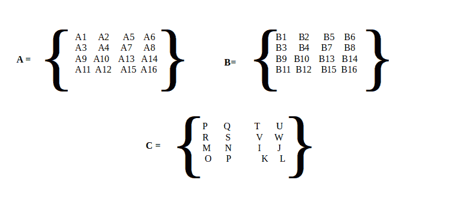
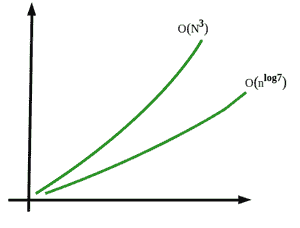

# 在 Java 中实现斯特拉森算法

> 原文:[https://www . geeksforgeeks . org/impering-strassens-algorithm-in-Java/](https://www.geeksforgeeks.org/implementing-strassens-algorithm-in-java/)

[Strassen 算法](https://www.geeksforgeeks.org/easy-way-remember-strassens-matrix-equation/)用于方阵的乘法，即矩阵的阶数应为(N×N)。斯特拉森的算法基于[分治技术](https://www.geeksforgeeks.org/divide-and-conquer-algorithm-introduction/)。简单来说，它用于矩阵乘法。Strassen 的矩阵乘法是典型的分治算法。但是，让我们再来看一下分治法背后的内容，并考虑如下示例来实现它:例如，假设 A 和 B 是两个矩阵，那么结果矩阵 C 是这样的

> 矩阵 C =矩阵 A *矩阵 B

现在考虑矩阵的数学计算，它可以总结出为什么斯特拉森矩阵的实现开始发挥作用。假设两个矩阵相乘，那么方法是

1.  取两个矩阵的输入。
2.  检查矩阵乘法的兼容性，只有当第一个矩阵的行数等于第二个矩阵的列数时，矩阵乘法才成立。
3.  将矩阵相乘，并将两个矩阵的乘积赋给另一个称为结果矩阵的矩阵。
4.  打印结果矩阵。

在上面的方法中，得出了两个假设，这两个假设说明了为什么需要使用 Strassen 的算法

*   首先，算法的时间复杂度为 O(n <sup>3</sup> ，太高了。
*   其次，两个以上矩阵相乘不仅会增加程序的混乱和复杂度，还会相应增加时间复杂度。

**目的:**

沃尔克·斯特拉森是一个发表了他的算法来证明一般矩阵乘法的时间复杂度 O(n <sup>3</sup> )不是最优的名字。于是发表了 Strassen 的矩阵链乘法，降低了时间复杂度。这种算法比标准矩阵乘法更快，在日常计算大量大型矩阵乘法时非常有用。

**斯特拉森矩阵乘法算法**

**第一步:**取三个矩阵，假设 A、B、C，其中 C 是结果矩阵，A 和 B 是用斯特拉森方法相乘的矩阵。



**第二步:**将 A、B、C 矩阵分为四个 *(n/2)×(n/2)* 矩阵，取*各矩阵的*第一部分，如下图

**第三步:**使用以下公式求解矩阵的第一部分

```
M1:=(A1+A3)×(B1+B2)
M2:=(A2+A4)×(B3+B4)
M3:=(A1−A4)×(B1+A4)
M4:=A1×(B2−B4)
M5:=(A3+A4)×(B1)
M6:=(A1+A2)×(B4)
M7:=A4×(B3−B1)

Then,

P:=M2+M3−M6−M7
Q:=M4+M6
R:=M5+M7
S:=M1−M3−M4−M5
```

**第四步:**求解第一部分后，计算第二、第三和第四部分，以及最终输出，生成一个相乘的矩阵作为结果，如上图所示。

**第 5 步:**打印结果矩阵。

**实施:**

**例**

## Java 语言(一种计算机语言，尤用于创建网站)

```
// Java Program to Implement Strassen Algorithm

// Class Strassen matrix multiplication
public class GFG {

    // Method 1
    // Function to multiply matrices
    public int[][] multiply(int[][] A, int[][] B)
    {
        // Order of matrix
        int n = A.length;

        // Creating a 2D square matrix with size n
        // n is input from the user
        int[][] R = new int[n][n];

        // Base case
        // If there is only single element
        if (n == 1)

            // Returning the simple multiplication of
            // two elements in matrices
            R[0][0] = A[0][0] * B[0][0];

        // Matrix
        else {
            // Step 1: Dividing Matrix into parts
            // by storing sub-parts to variables
            int[][] A11 = new int[n / 2][n / 2];
            int[][] A12 = new int[n / 2][n / 2];
            int[][] A21 = new int[n / 2][n / 2];
            int[][] A22 = new int[n / 2][n / 2];
            int[][] B11 = new int[n / 2][n / 2];
            int[][] B12 = new int[n / 2][n / 2];
            int[][] B21 = new int[n / 2][n / 2];
            int[][] B22 = new int[n / 2][n / 2];

            // Step 2: Dividing matrix A into 4 halves
            split(A, A11, 0, 0);
            split(A, A12, 0, n / 2);
            split(A, A21, n / 2, 0);
            split(A, A22, n / 2, n / 2);

            // Step 2: Dividing matrix B into 4 halves
            split(B, B11, 0, 0);
            split(B, B12, 0, n / 2);
            split(B, B21, n / 2, 0);
            split(B, B22, n / 2, n / 2);

            // Using Formulas as described in algorithm

            // M1:=(A1+A3)×(B1+B2)
            int[][] M1
                = multiply(add(A11, A22), add(B11, B22));

            // M2:=(A2+A4)×(B3+B4)
            int[][] M2 = multiply(add(A21, A22), B11);

            // M3:=(A1−A4)×(B1+A4)
            int[][] M3 = multiply(A11, sub(B12, B22));

            // M4:=A1×(B2−B4)
            int[][] M4 = multiply(A22, sub(B21, B11));

            // M5:=(A3+A4)×(B1)
            int[][] M5 = multiply(add(A11, A12), B22);

            // M6:=(A1+A2)×(B4)
            int[][] M6
                = multiply(sub(A21, A11), add(B11, B12));

            // M7:=A4×(B3−B1)
            int[][] M7
                = multiply(sub(A12, A22), add(B21, B22));

            // P:=M2+M3−M6−M7
            int[][] C11 = add(sub(add(M1, M4), M5), M7);

            // Q:=M4+M6
            int[][] C12 = add(M3, M5);

            // R:=M5+M7
            int[][] C21 = add(M2, M4);

            // S:=M1−M3−M4−M5
            int[][] C22 = add(sub(add(M1, M3), M2), M6);

            // Step 3: Join 4 halves into one result matrix
            join(C11, R, 0, 0);
            join(C12, R, 0, n / 2);
            join(C21, R, n / 2, 0);
            join(C22, R, n / 2, n / 2);
        }

        // Step 4: Return result
        return R;
    }

    // Method 2
    // Function to subtract two matrices
    public int[][] sub(int[][] A, int[][] B)
    {
        //
        int n = A.length;

        //
        int[][] C = new int[n][n];

        // Iterating over elements of 2D matrix
        // using nested for loops

        // Outer loop for rows
        for (int i = 0; i < n; i++)

            // Inner loop for columns
            for (int j = 0; j < n; j++)

                // Subtracting corresponding elements
                // from matrices
                C[i][j] = A[i][j] - B[i][j];

        // Returning the resultant matrix
        return C;
    }

    // Method 3
    // Function to add two matrices
    public int[][] add(int[][] A, int[][] B)
    {

        //
        int n = A.length;

        // Creating a 2D square matrix
        int[][] C = new int[n][n];

        // Iterating over elements of 2D matrix
        // using nested for loops

        // Outer loop for rows
        for (int i = 0; i < n; i++)

            // Inner loop for columns
            for (int j = 0; j < n; j++)

                // Adding corresponding elements
                // of matrices
                C[i][j] = A[i][j] + B[i][j];

        // Returning the resultant matrix
        return C;
    }

    // Method 4
    // Function to split parent matrix
    // into child matrices
    public void split(int[][] P, int[][] C, int iB, int jB)
    {
        // Iterating over elements of 2D matrix
        // using nested for loops

        // Outer loop for rows
        for (int i1 = 0, i2 = iB; i1 < C.length; i1++, i2++)

            // Inner loop for columns
            for (int j1 = 0, j2 = jB; j1 < C.length;
                 j1++, j2++)

                C[i1][j1] = P[i2][j2];
    }

    // Method 5
    // Function to join child matrices
    // into (to) parent matrix
    public void join(int[][] C, int[][] P, int iB, int jB)

    {
        // Iterating over elements of 2D matrix
        // using nested for loops

        // Outer loop for rows
        for (int i1 = 0, i2 = iB; i1 < C.length; i1++, i2++)

            // Inner loop for columns
            for (int j1 = 0, j2 = jB; j1 < C.length;
                 j1++, j2++)

                P[i2][j2] = C[i1][j1];
    }

    // Method 5
    // Main driver method
    public static void main(String[] args)
    {
        // Display message
        System.out.println(
            "Strassen Multiplication Algorithm Implementation For Matrix Multiplication :\n");

        // Create an object of Strassen class
        // in he main function
        GFG s = new GFG();

        // Size of matrix
        // Considering size as 4 in order to illustrate
        int N = 4;

        // Matrix A
        // Custom input to matrix
        int[][] A = { { 1, 2, 3, 4 },
                      { 4, 3, 0, 1 },
                      { 5, 6, 1, 1 },
                      { 0, 2, 5, 6 } };

        // Matrix B
        // Custom input to matrix
        int[][] B = { { 1, 0, 5, 1 },
                      { 1, 2, 0, 2 },
                      { 0, 3, 2, 3 },
                      { 1, 2, 1, 2 } };

        // Matrix C computations

        // Matrix C calling method to get Result
        int[][] C = s.multiply(A, B);

        // Display message
        System.out.println(
            "\nProduct of matrices A and  B : ");

        // Iterating over elements of 2D matrix
        // using nested for loops

        // Outer loop for rows
        for (int i = 0; i < N; i++) {
            // Inner loop for columns
            for (int j = 0; j < N; j++)

                // Printing elements of resultant matrix
                // with whitespaces in between
                System.out.print(C[i][j] + " ");

            // New line once the all elements
            // are printed for specific row
            System.out.println();
        }
    }
}
```

**Output**

```
Strassen Multiplication Algorithm Implementation For Matrix Multiplication :

Product of matrices A and  B : 
7 21 15 22 
8 8 21 12 
12 17 28 22 
8 31 16 31 
```

斯特拉森方法的时间复杂性



通过分析，时间复杂度函数可以写成:

```
T(N) = 7T(N/2) +  O(N2)
```

通过使用主定理解决这个问题，我们得到:

```
T(n)=O(nlog7)
```

因此，斯特拉森矩阵乘法算法的时间复杂度推导如下:

```
O(nlog7) = O (n2.81)
```

**O(n<sup>3</sup>)Vs O(n<sup>2.81)</sup>**