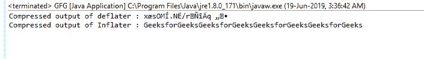
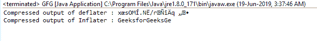

# Java 中的打气筒充气()函数，示例

> 原文:[https://www . geeksforgeeks . org/充气机-充气-java 中的函数-示例/](https://www.geeksforgeeks.org/inflater-inflate-function-in-java-with-examples/)

**充气器类**的**充气()**功能用于解压缩输入数据，并用未压缩的数据填充给定的缓冲区。该函数返回未压缩数据的字节数。

**功能签名:**

```
public int inflate(byte[] b)
public int inflate(byte[] b, int offset, int length)

```

**语法:**

```
i.inflate(byte[])
i.inflate(byte[], int, int )

```

**参数:**这些重载函数接受的各种参数有:

*   **字节【】b** :这是要膨胀的输入数组
*   **int offset** :这是给定数组中读取值的起始偏移量
*   **int length** :这是从起始偏移量开始压缩的最大长度。

**返回类型:**该函数返回一个**整数值**，即未压缩数据的大小。
**异常:**如果压缩数据格式无效，函数抛出数据格式异常

**示例 1:** 充气(字节[] b)功能的使用

```
// Java program to describe the use
// of inflate function

import java.util.zip.*;
import java.io.UnsupportedEncodingException;

class GFG {
    public static void main(String args[])
        throws UnsupportedEncodingException,
               DataFormatException
    {

        // compress the data

        // deflater
        Deflater d = new Deflater();

        // get the text
        String pattern = "GeeksforGeeks", text = "";

        // generate the text
        for (int i = 0; i < 4; i++)
            text += pattern;

        // set the input for deflator
        d.setInput(text.getBytes("UTF-8"));

        // finish
        d.finish();

        // output bytes
        byte output[] = new byte[1024];

        // compress the data
        int size = d.deflate(output);

        // end
        d.end();

        // end of compression

        // use Inflater to get back the original data

        // Inflater
        Inflater i = new Inflater();

        // set the input for inflator
        i.setInput(output);

        // output bytes
        byte inflater_output[] = new byte[1024];

        // uncompress the data
        int org_size = i.inflate(inflater_output);

        // output of inflater and deflater
        System.out.println("Compressed output of deflater : "
                           + new String(output));
        System.out.println("Compressed output of Inflater : "
                           + new String(inflater_output, "UTF-8"));

        // end
        i.end();
    }
}
```

**输出:**


**示例 2:** 使用膨胀(字节[] b，int 偏移量，int 长度)函数

```
// Java program to describe the use
// of inflate function

import java.util.zip.*;
import java.io.UnsupportedEncodingException;

class GFG {
    public static void main(String args[])
        throws UnsupportedEncodingException,
               DataFormatException
    {

        // compress the data

        // deflater
        Deflater d = new Deflater();

        // get the text
        String pattern = "GeeksforGeeks", text = "";

        // generate the text
        for (int i = 0; i < 4; i++)
            text += pattern;

        // set the input for deflator
        d.setInput(text.getBytes("UTF-8"));

        // finish
        d.finish();

        // output bytes
        byte output[] = new byte[1024];

        // compress the data
        int size = d.deflate(output);

        // end
        d.end();

        // end of compression

        // use Inflater to get back the original data

        // Inflater
        Inflater i = new Inflater();

        // set the input for inflator
        i.setInput(output);

        // output bytes
        byte inflater_output[] = new byte[1024];

        // uncompress the data
        int org_size = i.inflate(inflater_output, 0, 15);

        // output of inflater and deflater
        System.out.println("Compressed output of deflater : "
                           + new String(output));
        System.out.println("Compressed output of Inflater : "
                           + new String(inflater_output, "UTF-8"));

        // end
        i.end();
    }
}
```

**输出:**


**参考:**[https://docs . Oracle . com/javase/7/docs/API/Java/util/zip/Fluger . html #充气(byte[])](https://docs.oracle.com/javase/7/docs/api/java/util/zip/Inflater.html#inflate(byte[]))