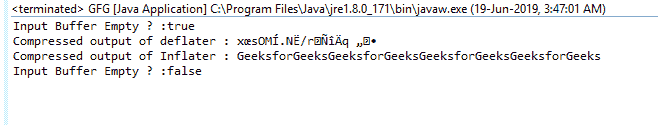

# 打气筒需要 Java 中的 put()函数，示例

> 原文:[https://www . geeksforgeeks . org/dugger-needsinput-function-in-Java-with-examples/](https://www.geeksforgeeks.org/inflater-needsinput-function-in-java-with-examples/)

如果输入数据缓冲区为空，则**充气器类**的 **needsInput()** 函数返回真，否则返回假，如果输入数据缓冲区为空，则调用 setInput()函数提供输入

**功能签名:**

```
public boolean needsInput()

```

**语法:**

```
i.needsInput();

```

**参数:**函数不需要参数

**返回类型:**函数返回布尔值，即如果输入缓冲区为空则返回真，否则返回假。

**异常:**函数不抛出任何异常

**示例 1:**needsInput()函数的使用

```
// Java program to describe the use
// of needsInput() function

import java.util.zip.*;
import java.io.UnsupportedEncodingException;

class GFG {
    public static void main(String args[])
        throws UnsupportedEncodingException,
               DataFormatException
    {

        // compress the data

        // deflater
        Deflater d = new Deflater();

        // get the text
        String pattern = "GeeksforGeeks", text = "";

        // generate the text
        for (int i = 0; i < 4; i++)
            text += pattern;

        // set the input for deflator
        d.setInput(text.getBytes("UTF-8"));

        // finish
        d.finish();

        // output bytes
        byte output[] = new byte[1024];

        // compress the data
        int size = d.deflate(output);

        // end
        d.end();

        // end of compression

        // use Inflater to get back the original data

        // Inflater
        Inflater i = new Inflater();

        // does the Inflater need input
        System.out.println("Input Buffer Empty ? :"
                           + i.needsInput());

        // set the input for inflator
        i.setInput(output);

        // output bytes
        byte inflater_output[] = new byte[1024];

        // uncompress the data
        int org_size = i.inflate(inflater_output);

        // output of inflater and deflater
        System.out.println("Compressed output of deflater : "
                           + new String(output));
        System.out.println("Compressed output of Inflater : "
                           + new String(inflater_output, "UTF-8"));

        // does the Inflater need input
        System.out.println("Input Buffer Empty ? :"
                           + i.needsInput());

        // end
        i.end();
    }
}
```

**输出:**


**参考:**[https://docs . Oracle . com/javase/7/docs/API/Java/util/zip/fluger . html # needsInput()](https://docs.oracle.com/javase/7/docs/api/java/util/zip/Inflater.html#needsInput())