# 在 Windows 上以独立模式安装 Apache Spark

> 原文:[https://www . geesforgeks . org/install-Apache-spark-in-a-standally-mode-on-windows/](https://www.geeksforgeeks.org/install-apache-spark-in-a-standalone-mode-on-windows/)

**Apache Spark** 是一款闪电般快速的统一分析引擎，用于 BigData 和 Hadoop 等大型数据集的集群计算，旨在跨多个节点并行运行程序。它是多个堆栈库的组合，如 SQL 和数据帧、GraphX、MLlib 和 Spark Streaming。

Spark 以 4 种不同的模式运行:

1.  **独立模式:**这里所有进程都在同一个 JVM 进程内运行。
2.  **独立集群模式:**在这种模式下，它使用 Spark 内置的作业调度框架。
3.  **Apache Mesos:** 在这种模式下，工作节点在各种机器上运行，但驱动程序只在主节点上运行。
4.  **Hadoop 纱:**在这种模式下，驱动程序在应用程序的主节点内部运行，并由集群上的纱处理。

在本文中，我们将探讨 Apache Spark 在独立模式下的安装。Apache Spark 是用 Scala 编程语言开发的，运行在 JVM 上。Java 安装是 spark 中必不可少的事情之一。所以让我们从 Java 安装开始。

### 安装 Java:

**第一步:** [下载](https://www.oracle.com/in/java/technologies/javase-jdk15-downloads.html)爪哇 JDK。

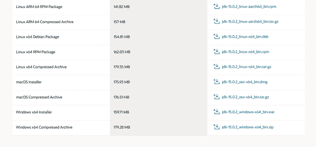

**步骤 2:** 打开下载的 Java SE 开发工具包，按照说明进行安装。

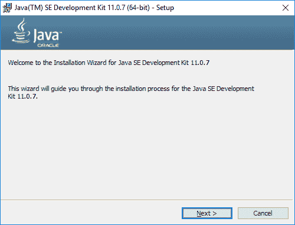 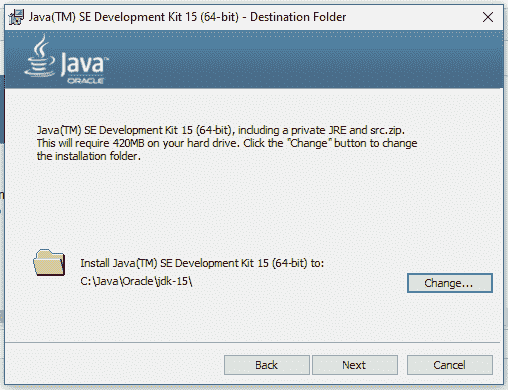 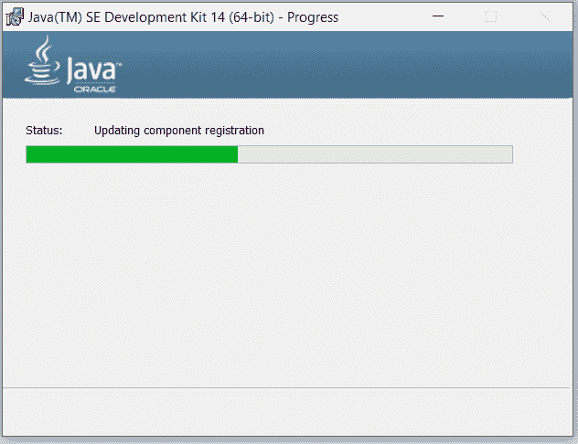

**步骤 3:** 在 windows 搜索栏中键入环境变量，打开笔记本电脑上的环境变量。

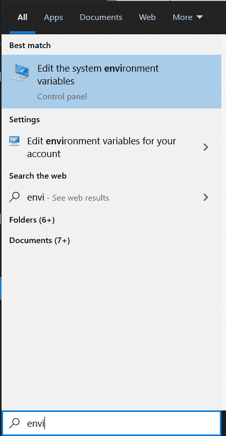

### **设置 JAVA_HOME 变量:**

要设置 JAVA_HOME 变量，请执行以下步骤:

*   单击用户变量将 JAVA_HOME 添加到路径，值为:C:\程序文件\Java\jdk1.8.0_261。
*   单击系统变量将 C:\程序文件\ Java \ JDK 1 . 8 . 0 _ 261 \绑定到路径变量。
*   打开命令提示符，输入“java–版本”，将显示如下所示&验证 Java 安装。

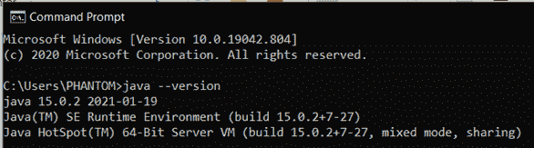

### 安装 Scala:

要在本地计算机上安装 Scala，请执行以下步骤:

**第一步:** [下载](http://downloads.lightbend.com/scala/2.11.8/scala- 2.11.8.msi) Scala。

**第二步:**点击。并按照说明根据您的需要自定义设置。


**第三步:**接受协议，点击下一步按钮。

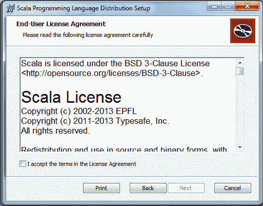

### 设置环境变量:

*   在用户变量中，用值 C:\Program Files (x86)\scala 将 SCALA_HOME 添加到路径中。
*   在系统变量中，将 C:\ Program file(x86)\ Scala \ bin 添加到 PATH 变量中。

### 验证 Scala 安装:

在命令提示符下，使用以下命令验证 Scala 安装:

```java
scala
```

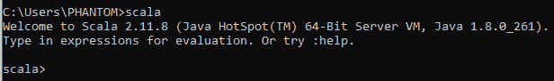

### 安装火花:

[下载](http://spark.apache.org/downloads.html)一个预建版本的 Spark，解压到 c 盘，比如 C:\Spark。然后单击安装文件，并按照说明设置 Spark。

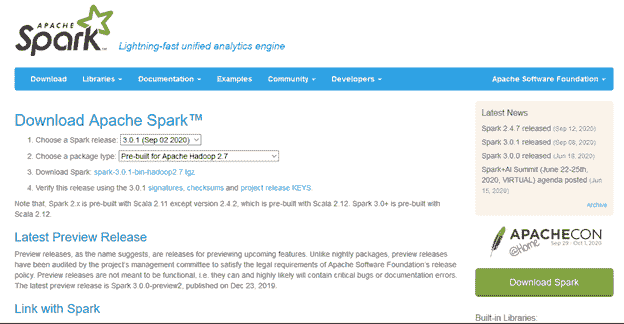
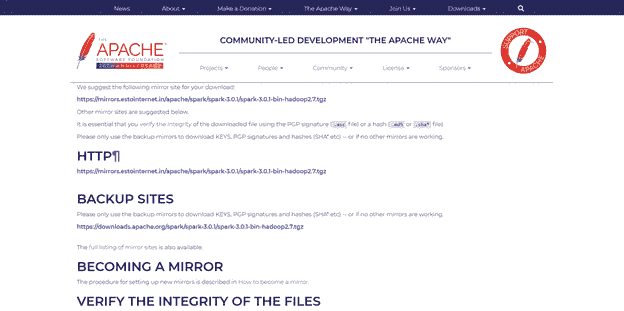

### 设置环境变量:

*   在用户变量中，用值 C 将 SPARK_HOME 添加到路径中:\ SPARK \ SPARK-2 . 4 . 6-bin-Hadoop 2.7。
*   在系统变量中，向路径变量添加%SPARK_HOME%\bin。

### 下载窗口实用程序:

如果您希望对 Hadoop 数据进行操作，请按照以下步骤下载 Hadoop 实用程序:

**第一步:** [下载](https://github.com/stonefl/winutils/raw/master/hadoop-2.7.1/bin/winutils.exe)winutils.exe 文件。

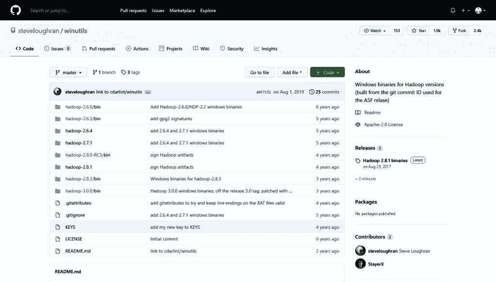

**第二步:**将文件复制到 C:\ spark \ spark-1 . 6 . 1-bin-Hadoop 2.6 \ bin。

**步骤 3:** 现在在 cmd 上执行“火花外壳”以验证火花安装，如下所示:

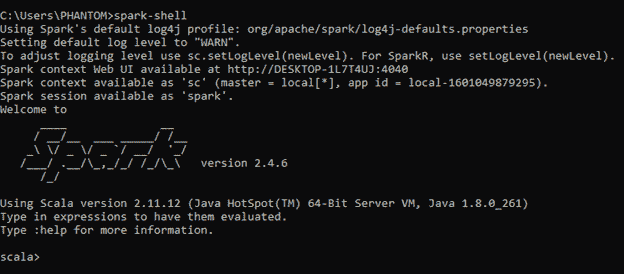